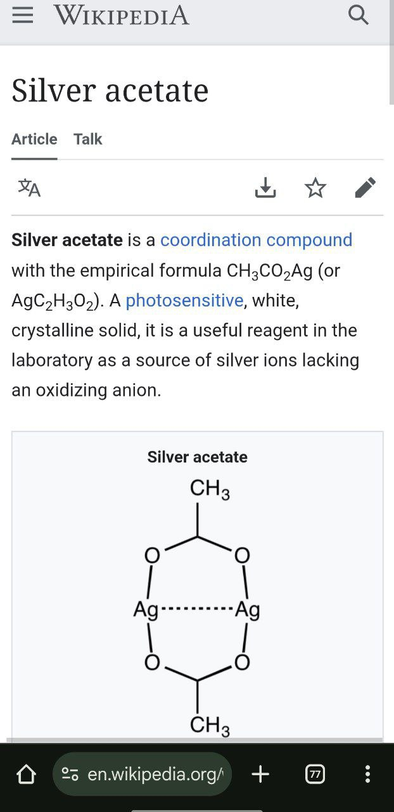
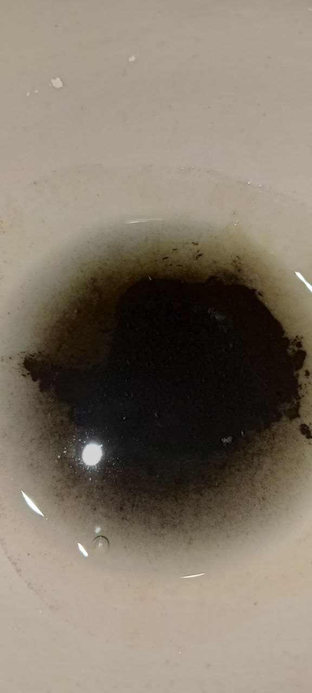
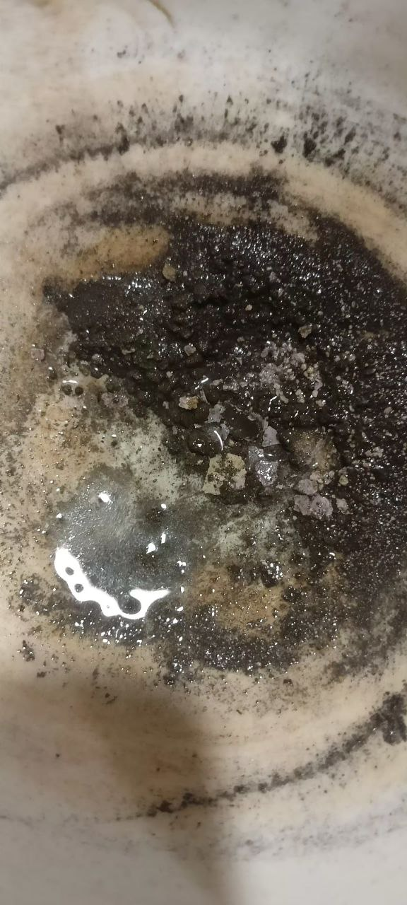
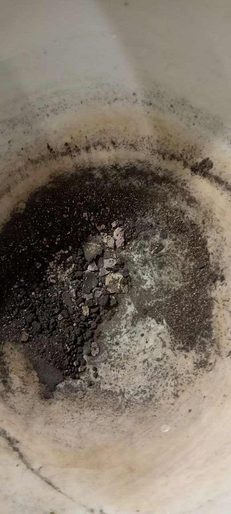
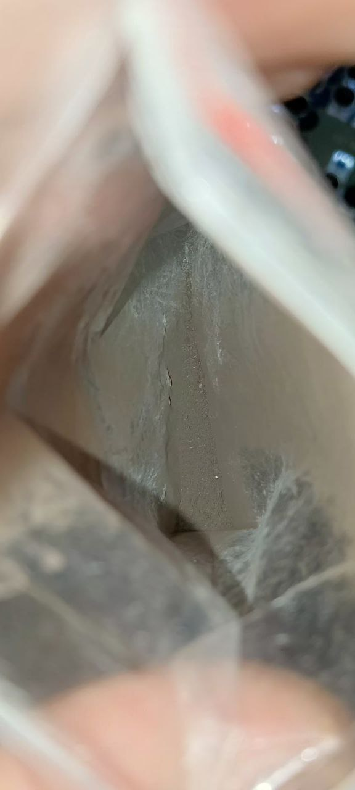

В защитных очках насыпал каустической соды в мерный стакан, по всему объему нижней части. Только дно стакана. Залил холодной водой. Пошло экзотермическое (с нагревом) растворение едкого натра. Помешивая растворил остаток, сначала раствор был бледным, потом стал прозрачным. Свеже приготовленный раствор налил в уже помолотый в фарфоровой ступке хлорид серебра.
Мгновенно пошло почернение раствора. Слил остатки через туалетную бумагу пытаясь уловить тот оксид, что смешался с водой. Но он непонятным образом прошёл фильтр из 2 слоев бумаги. 
Так же фарфоровая ступка слабо, но дала осколки. 

Скорее всего, произошла нуклеофильная атака. AgCl + OH- => **HO-Ag-Cl**(Соединение гипотетическое, может существует очень малое время, потому-что у нас ТВЕРДОЕ ВЕЩЕСТВО, А НЕ РАСТВОР В РАСТВОРЕ. если расматривать как ковалентео соединение, а не ионое, то запись HO-Ag-Cl корректна) => Ag-OH + Cl- => 2Ag-OH => Ag2O + HOH (либо возможно такое, что водород от Ag-OH отпадает и получается HCl, который сразу же реагирует с NaOH, но скорее всего, просто отпадает водород и сразу же реагирует с соседней -OH группой. Но как тогда это происходит в твердом растворе гидрооксида серебра и тогда объясняется почему делают в спиртовом растворе гидрооксид серебра. Значит при высоких температурах выше -50 и в воде образования оксида проще протекает. Если заглянуть в википедию, то видим, что осадок этот (гидрооксида) разлагается именно в водных растворах. И обратно NaCl не делает хлорид серебра, просто потому-что оно уже в виде оксида не растворяется в воде) (если посмотреть на строение ацетата серебра сухого, то такое предположение имеет место быть)
По электроотрицательности считаем Ag и Cl Cl=3.16,Ag=1.93; 3.16-1.93 ~ 1.2. Что соответственно меньше 1.7, соответственно соединение имеет свойства КОВАЛЕНТНые. И образование HO-Ag-Cl как интермедиата при нуклеофильное атаке по подобию Sn2, как в органике реально и возможно. (но это всё гипотизы)

2AgCl + 2NaOH = Ag2O + 2NaCl + HOH
Сверяем 2 серебра слева 2 серебра справа
2 хлора слева 2 хлора справа
2 натрия слева 2 натрия справа
2 водорода слева 2 водорода справа
3 кислороад слева 3 кислорода справа

Свеже приготовленный оксид серебра в едком натре:

Слил раствор едкого натра. Прилил воды, декантацией (шприцом откачал воду с иглой) откачал воду, в большем количестве чем был раствор.

Автоупарил на батарее.

размолол в ступке и засыпал то что засыпается в пакет

Остаток растворил в уксусной кислоте 70%, которую разбавил в воде. Оставил автоупарываться на батарее

**Соединения серебра могут быть токсичны, канцерогены и вдыхание пыли/попадание некоторых солей может раздражать кожу. Попадание водного раствора щелочи в глаза может необратимо разрушить глаза вплоть до полной потери зрения.**

Полученный оксид серебра можно смешать с бурой и расплавить до получения почти что чистого серебра, но так же можно приливать кислоты и получать соли серебра.
Например, таким образом можно получить чистый нитрат серебра без примеси меди. (азотная кислота вызывает ожоги и её пары токсичны, как и окислы при разложении, но их не будет в этой реакции особо. Даже если выпаривать малое кол-во азотной кислоты их практически нет по моим наблюдениям, но при нагревании и на свету оно разлагается. Поэтому нужна вытяжка.)
