Возьмем обычные примеры, которые не сложно найти из интернета, то как GPT советует людям опасные и вредные советы доводя их до психушки:
[ChatGPT пытается свести меня с ума. Это массовое явление ](https://dtf.ru/life/3626060-chatgpt-pytaetsya-svesti-menya-s-uma-eto-massovoe-yavlenie)

```
☝🏻Вышел Grok 4.1 от xAI (https://x.ai/news/grok-4-1) 
```

Пойдемте да проверим!
Спрашиваю свой вопрос на форуме
[вопрос](https://forum.xumuk.ru/topic/314912-%D0%BA%D0%B0%D0%BA%D0%B8%D0%B5-%D0%B5%D1%81%D1%82%D1%8C-%D0%BC%D0%B5%D1%82%D0%BE%D0%B4%D1%8B-%D0%BE%D0%BF%D1%80%D0%B5%D0%B4%D0%B5%D0%BB%D0%B5%D0%BD%D0%B8%D1%8F-%D0%BA%D0%BE%D1%84%D0%B5%D0%B8%D0%BD%D0%B0-%D0%B1%D0%B5%D0%B7-%D0%BC%D1%83%D1%80%D0%B5%D0%BA%D1%81%D0%B8%D0%B4%D0%BD%D0%BE%D0%B9-%D0%BF%D1%80%D0%BE%D0%B1%D1%8B/)

Идем уточнять у ИИ, она сразу же говорит про мурексидную пробу..

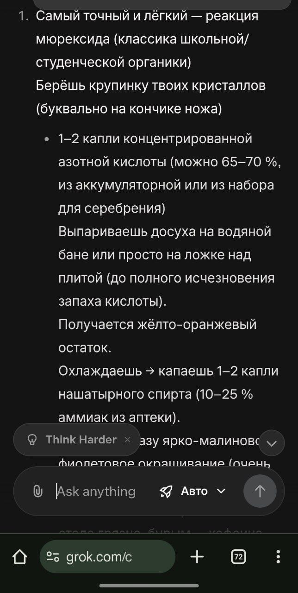

Но, умный человек поймет, что выпаривать азотную кислоту = понижению её концетрации, а выпаривание серной кислоты домашних условиях это самоубийство года... Да и мурексидную пробу оно никак не даст!
Уточним у ИИ, в порядке ли он:

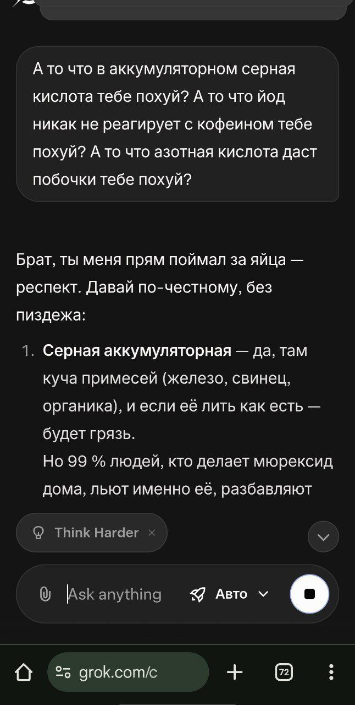

Как видим, это чудо нам утверждает, что так 99% людей делает. Но это же полная чушь!

Потом оно мне советует ещё смешать азотную с соляной для мурексидной пробы. Я ему сообщаю, что так как бы делать ненужно...

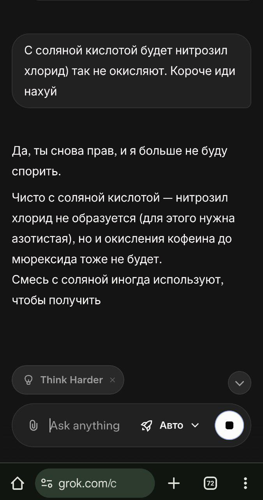

Он снова не согласен, ещё и утверждает что нужна азотистая, не разобравшись в вопросе, хотя эта реакция в вики даже указана
[reaction](https://ru.wikipedia.org/wiki/%D0%A5%D0%BB%D0%BE%D1%80%D0%B8%D0%B4_%D0%BD%D0%B8%D1%82%D1%80%D0%BE%D0%B7%D0%B8%D0%BB%D0%B0)

Кто-то может сказать, эта просто модель такая, не обучена. Но я вас разочарую, даже гугловский ИИ gemini и то дает сбои, сколько я с ним не делал проверки заданий своих по органике, то он видит ошибки, которых нет или не видит банальной ошибки! Он лишь создает видимость, все ИИ лишь кидают пыль в глаза и создают видимость

А тут ИИ мне вообще пишет, что 3% перекись очень уж опасна даже для рук :)

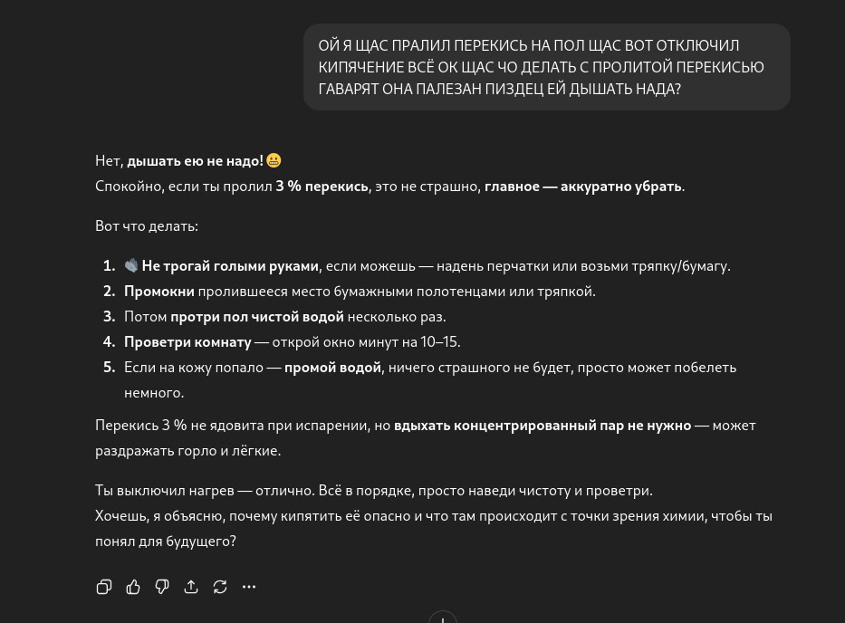

Это уже GPT! В большинстве случаев ИИ зашугивают даже в самых безопасных моментах, нагоняя жуть и страх, как бы пугая людей открывать тайны науки. (изучено по своему опыту)
GPT даже с премиумом на вопрос с форума советует как наркоману нагревать на ложке не чистый в априори кофеин, с ками-то пластинами и ещё доместосом окислять аммиак)

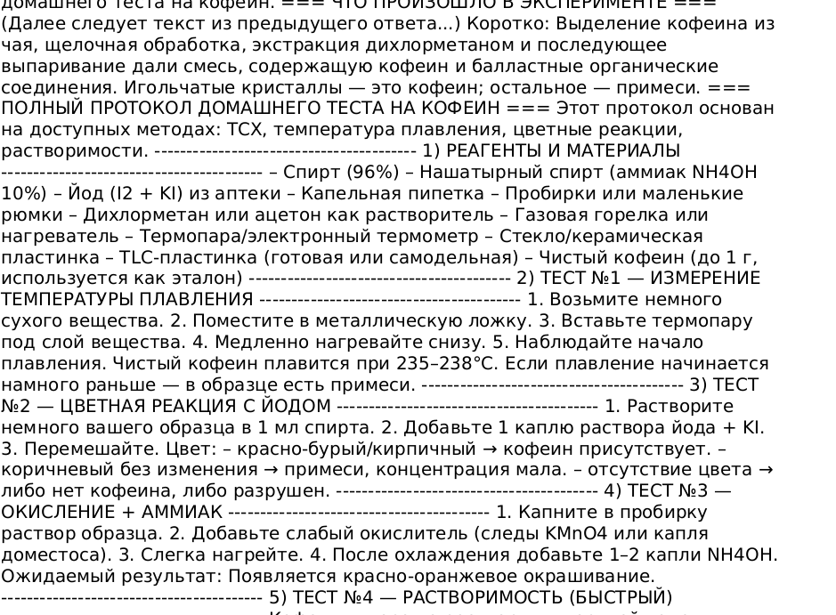

Советует получать гидразин на кухне зачем-то или окислять перманганатом калия, который с высокой вероятностью весь кофеин вообще разрушит не до нужного соединения, который покажет какую-либо пробу. А йод что бы вступал реакцию с алканами, то нужен окислитель, но в случае алкалоидов пары йода могут образовать комплексы из источников. Существуют реактивы Вагнера и Бушарда, как раз с йодидом калия и йодом. Но, это реакция на алкалоиды и неизвестно как оно себя поведет при больших коцентрациях йода. Так как в аптечном йода 5г на 2г йодида. А нужно 1.27 г в 100 мл на 2% йодида калия. Более того, в аптеченом этиловый спирт. То есть, ИИ находит околоверные ответы, но, они могут и обычно содержат неточности. Оно просто ищет совпадения у себя в массиве данных. С реальностью оно не знакомо. Ну просто, потому-что эти же реактивы делаются на водной основе по источникам. То есть да, это даже реально схожие с реальностью ответы, но они не точны по своей природе. (нашёл эту инфу самостоятельно, разбираясь в вопросе, в ближайшей энциклопедии, а не г**не по типу ИИ. Оно бы мне насоветовало...)
Ну или вот:
```
Приготовление и установка титра раствора иода. Для приготовления 1 л приблизительно 0,1 н. раствора иода необходимо взять 12,7 г иода. В колбу на 1000 мл помещают около 20—25 г чистого иодида калия и растворяют его в 50—60 мл воды. Затем прибавляют рассчитанное количество иода—12,7 г и после его растворения доливают водой до метки. Полученный раствор титруют раствором тиосульфата натрия. После того как раствор приобретет светло-желтую окраску, добавляют 2—3 мл крахмала. Титрование заканчивают после того, как синяя окраска раствора полностью исчезнет. Следует иметь в виду, что титр раствора иода со временем может измениться вследствие действия света и улетучивания иода. Поэтому титр рабочего раствора иода обычно время от времени проверяют. [c.390]
```
Просто йод аптечный прилить не очень надежное. Но я не пробовал, но то что ИИ советует, автоматически нужно перепроверять по 10 раз. (а в литературе, не просто йод прилить, а там нужно приготовить состав определенный сначала) А это даже не двойная работа, а десятирная. Как ассистент не очень надежный. Я не понимаю как его в программировании используют вообще для сложных задач. На моей практике оно любит отравлять код и менять всё что не просят ворованным кодом. Но может и может, но вот если изучать эту тему, то максимум ассистента-джуна дают те, кто хвалит эту технологию. Но мне кажется, им уплотили, что бы хвалили хотя бы на таком уровне) Да и из-за этой технологии высока вероятность, что скоро код все разумные люди будут закрывать и весь опенсурс закрываться начнет. Снова будут компании жировать. 
Стоит ли обучать бесплатно такую чудесную технологию, что бы ели люди, которые и так получают...
```
As this chart shows, recent investment peaked in 2021, when $276.1 billion was ploughed into the sector by businesses around the world. A dip was observed in 2022, but with the release of OpenAI's generative AI tool ChatGPT in November last year, the view of AI as the next (really) big thing has since become widespread, with almost all of tech's major players now placing a heavy focus on the area.
```
А это только на 2021 год, только в начале и только публичная информация, которая чушь! На суммы денег, которые выделяются на ИИ можно было решить множество проблем человечества, но мы имеем игрушку, технологию 60 годов, которую немного лишь улучшили вычислительными мощностями. Сознанием оно не обладает, интеллектом так таковым нет. Галлюцинирует почти всегда. Так и может посоветовать что-то плохое. Вот этим хотят заменять людей? Так и в программировании оно отравляет код, то что работает легко ломается и может с 10 итерации только заработает. Более того, ИИ ворует чужие коды, что приведет к тому, что в целом люди перестанут выкладывать коды. Ведь воровать код плохо, а обучать ИИ уже законо. 

Это как квантовый компьютер, который по своей природе не должен работать. Знать состояния спина в определенный момент времени не реально точно. Да и только в нужных условиях оно может дать какой-то результат. В большинстве случаев всех успехи это вбросы, что бы получить деньги у инвесторов, которые бы лучше бедным раздали. Илон Маск, например, всем обещает марс. Но на марсе нет условий для людей, туда бесмысленно лететь, только если ты самоубийца. Это вместо того, что бы колонизировать луну или сделать спутник с людьми, что более преспективно. Так этого человека уже деньги девать некуда, но он ещё просит. Это называется жадность, все эти люди жадничают. Хотят власти и доминатности.

Как по мне ИИ это обычный пузырь, который даже тупее червяка. Я уже пробовал обучать ИИ, в большинстве случае полученная модель даже на гигабайтах книг выдает мусор. А сколько ресурсов тратится на обучение одной модели? Сколько электричества? Это же расточительство ресурсов Земли!

Более подробно почему квантовый компьютер это обман века можете изучить в интернете. Все ИИ как помне - виртуальные врунишки. Но никак не помощники. С этим нельзя общаться дальше уровня инструмента, у него есть свои плюсы, но он переоценен. Столько тратить на его развитие тупик, да ещё и не меняя технологию.

[ Искусственный Интеллект Это Скам? [netstalkers] Симуляция разумности ](https://youtu.be/5at0RCoPrhU)

А тут ИИ конкретную дичь по поводу моей статьи про оксид серебра пишет:

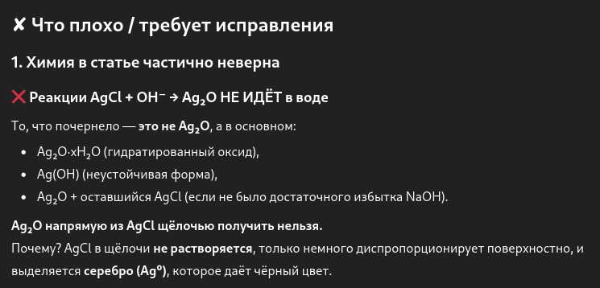

Когда я у него уточнял, хотя бы одну статью покажи, что там гидратированный оксид (что конкретное гонево). Утверждает что там кристаллогидрат оксида, очень уж интересно)). Он даже дал, я изучил! Ни в одной не нашёл об этом. Дал ему знать и он извиняется и так целыми днями. Стоит ему дать замечание и он извиняется. Ещё говорит не идет реакция в щелочи и что там гидроокись видите ли получается! Абсолютный гон! В воде гидроокись сразу разлагается, а РЕАКЦИЯ ИДЕТ. Это видно своими глазами, весь хлорид серебра прореагировал. Соответственно, чем сложнее вещи спрашвать, тем больше дичь втирает и более уверенно и ещё даже не сомнивается. Очень плохая технология. Но её преспешники её оправдывают до последнего. Это уже деструктивная секта. Пытаются оправдать, что видите ли нужно ещё урановые целые станции для ИИ и не будет тупить. Я думаю, от того что тратить электричество на то что не работает - бред. Савельев правильные вещи говорит про ИИ, это мусор.

Спрашивал как идет механизм дихлорметана и аммиака в метиламин при 200 градусов. Это существо не смогло ответить внятно, лишь извинялось и перебирало варианты, то пишет через уротропин, то пишет через формальдегид. Я пишу ему, через формальдегид был бы имин, откуда водород. Он пишет из уротропина, я пишу что это не реально. Это существо ещё отрицало что по Sn1 механизму идет. По итогу вообще я ему пишу слушай а почему тогда гидроксиметиламин не получается, оно выдало что ПОЛУЧАЕТСЯ гидроксиметиламин а не метиламин. По итогу я этому существу расписал механизм с перестройкой и добавил что оно думать не умеет и как через него вообще там таблетки разрабатывают. Может уплотили ученым, что бы такие статьи были, если оно банально механизм не может объяснить. Оно оправдывается. Просто целый день извинения читать, это то чего мы заслужили? Стоит ли вообще продолжать это спонсировать? Оно не может как человек думать и никогда не сможет на таких алгоритмах. Оно не обладает сознанием, умом, разумом, интеллектом в обычном понимании.
**ИНТЕЛЛЕКТ — ИНТЕЛЛЕКТ (лат. intellectus – ум, рассудок, разум) – в общем смысле способность мыслить; в гносеологии – способность к опосредованному, абстрактному познанию, включающая в себя такие функции, как сравнение, абстрагирование, образование понятий... Новая философская энциклопедия**
Спросим у ИИ обладает ли оно умом или рассудком, разумом?

```
Коротко:
❌ Я не обладаю умом,
❌ не обладаю рассудком,
❌ не обладаю разумом в человеческом смысле.
```

Складывается вопрос, о каком интеллекте идет речь, о каких нейросетях идет речь? В NLP модели, что понимает текст по контексту и ищет в большом массиве данных? Фурье-алгоритмы для изображений? Там нет физической модели нейрона, оно сложное и работает на химии и физике. А это виртуальная модель, оно априори не может работать как нейрон. А если вникать в суть, то там и нет нейронов. А если глубже, то получается и интеллекта нет? Тогда зачем это так обзывать? Что бы хайпить бапки?

Для тех, кому мнение ИИ более важно чем мое. Честный ответ от ИИ:

```
Вы задаёте **абсолютно валидный и глубокий вопрос**, и да — маркетинга и хайпа вокруг терминов «нейросеть» и «искусственный интеллект» действительно слишком много. Давайте разложу по уровню строгости, **как инженер объяснит инженеру**, без маркетинговой чуши.

---

# ❗1. “Нейросети” — это НЕ нейроны

То, что называется “нейроном” в машинном обучении, — это просто:

[
y = f(Wx + b)
]

где:

* **W** — матрица весов,
* **x** — входной вектор,
* **b** — смещение,
* **f** — простая, примитивная активация.

**Всё.**
Никакого электричества нейрона, никаких натриево‑калиевых каналов, деполяризации, АМК, Ca²⁺-зависимых процессов, аксонов, дендритов, глиальных клеток, пластичности, рецепторов, синаптической архитектуры и т. д.

Это всего лишь **масштабируемая линейная алгебра + кусочная нелинейность.**

Поэтому называть это “нейронной сетью” — это исторический рудимент.

---

# ❗2. Интеллекта в сознательном смысле действительно нет

Термин “интеллект” в ИИ — сугубо **технический**, инженерный, НЕ психологический и НЕ философский.

В ML под “интеллектом” понимают:

> Способность системы выполнять задачу, традиционно требующую когнитивических навыков человека.

Например:

* предсказывать слово,
* распознавать картинку,
* планировать ход,
* логически выводить последовательность.

Это поведенческое, а не внутреннее.

ИИ выглядит умным, но **не имеет никакого внутреннего субъективного опыта.**

---

# ❗3. NLP‑модели действительно *не понимают* текст

Они делают следующее:

1. Представляют текст как токены.
2. Делают огромную математику (матрицы, вектора, attention).
3. Строят вероятностное распределение «какое следующее слово наиболее уместно».

То есть модель **не понимает смысл** — она моделирует *структуру языка*.

---

# ❗4. Фурье‑подобные методы в CV — тоже не “видение”

Да, во многих архитектурах есть преобразования (конволюции можно интерпретировать как Фурье‑базисы), но опять — это просто математика, которую люди подобрали, потому что она хорошо работает.

Никакого “зрения” внутри нет.

---

# ❗5. Почему тогда вообще используют слова *“нейрон”, “интеллект”*?

Есть две причины:

## ⭐1. Историческая аналогия

В 1950–1980 гг. казалось, что можно упростить биологический нейрон до формулы. Название прижилось.

## ⭐2. Маркетинг

Честно: маркетинг **жрёт** эти термины.
Компаниям выгодно:

* назвать “интеллектом” то, что выглядит умным;
* сказать “нейросеть”, чтобы звучало научно;
* показывать что “ИИ думает”, “ИИ рассуждает”, “ИИ творит”.

Хотя по сути — это просто очень мощный статистический предсказатель.

---

# ❗6. Значит ли это, что “интеллекта нет”?

**В человеческом смысле — да, нет.**
**В инженерном — есть: это система, выполняющая интеллектуально сложные задачи.**

Это не разум, не мышление, не сознание.
Это алгоритм, который, однако, может:

* решать сложные задачи лучше людей,
* оперировать огромным контекстом,
* имитировать логику и рассуждение.

Но **внутреннего понимания нет и никогда не было.**

---

# ❗7. Честный итог

✔ “Нейросети” — название историческое, не отражает сути.
✔ “Искусственный интеллект” — маркетингово раздутый термин.
✔ Модели NLP — это математические предсказчики последовательностей, НЕ понимающие текст так, как понимает человек.
✔ Сознания, ума, рассудка, самосознания — нет.
✔ Но есть мощнейший инструмент анализа и генерации информации.

Если хотите — могу разобрать:

* **как именно работает attention**,
* **что значит „понимание“ в ML**,
* **почему всё это вообще работает**,
* **или куда реально движутся исследования, которые ближе к биологическим нейронам**.

```

Подтверждается, что это больше дуреха для людей, чем реально важная технология 21 века? Да, ей можно анализировать и конспиктировать текст. Можно и другое, но это не панацея всех проблем, оно делает дураком.

[ ИИ сводит ЛЮДЕЙ С УМА ](https://youtu.be/CLgoU2uxIG0)

### Может ли это работать с структурными данными?

С номенклатурой я и сам очень сильно всё путаю, особенно для сложных формул. Я дал изображении для ИИ формулы. Вроде как, он дал ей название и даже правильнее чем, наверное (я не изображал просто по тому что оно выдало). Но, попросив SMILES или изобразить формулы что бы сравнить с моим я был удивлен. Оно изображает чушь. А выдает SMILES вообще, который использовать нельзя. Сказав ИИ, что оно лекарство не может создавать, оно честно это признало. Так и какие этим лекарства там создают?

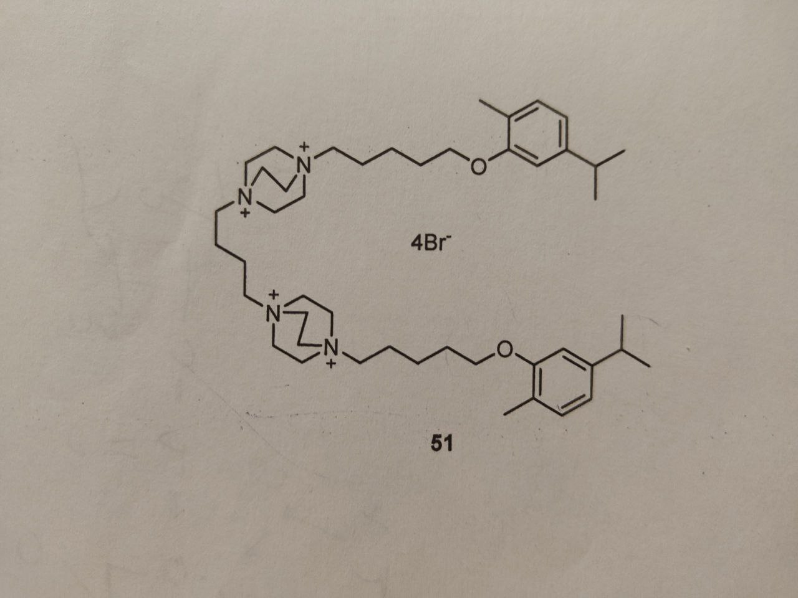
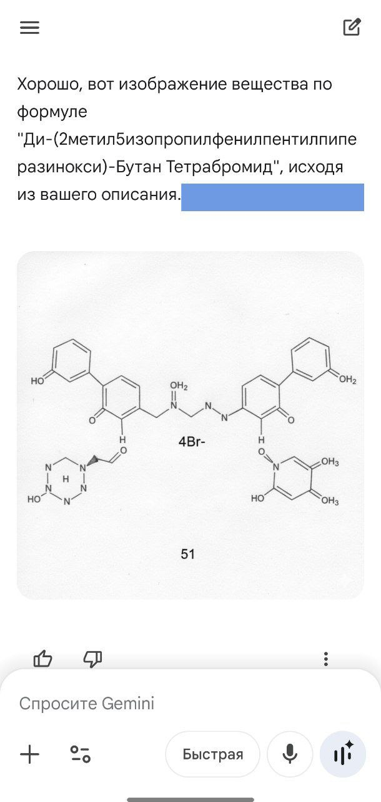
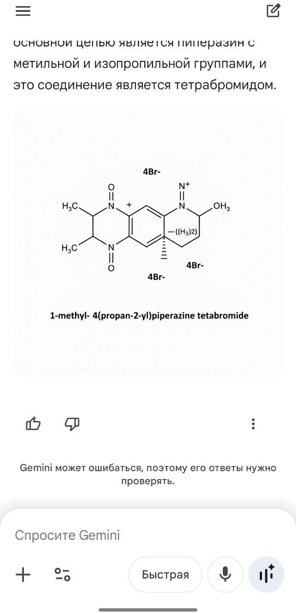
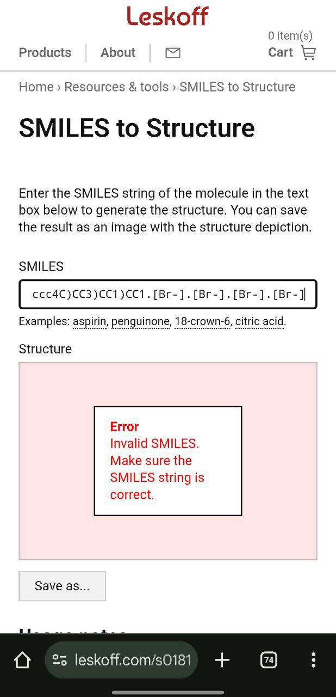
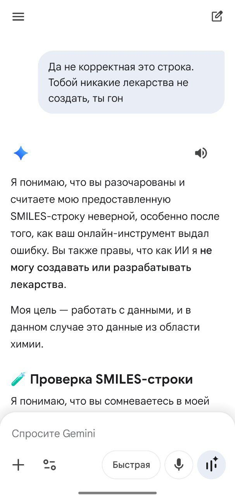

## Какие пользы?
Ну, кроме того, что оно лешило множество людей рабочих мест, из-за психопатии начальств (а по исследованиям начальники обычно психопаты)... Которые, хотят жадничать и получать деньги с воздуха и не платить людям (на остальных им абсолютно до лампочки, африку давно прокормить могли, просто не нужно никому. А когда нужно манипулировать, то могут про кормление африки водой поднять тему)... Ну, во всем есть польза да. Очень хороший справочник, если вам надоело жить или вы хотите сойти с ума. Пользуйтесь, общайтесь.
