Взял растворил в 75 мл 2 ложки столовых (которыми едят) чая рассыпного. Заварил в микроволновке. 

чай сначала

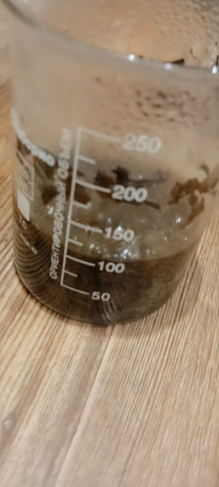

После фильтрации от листьев

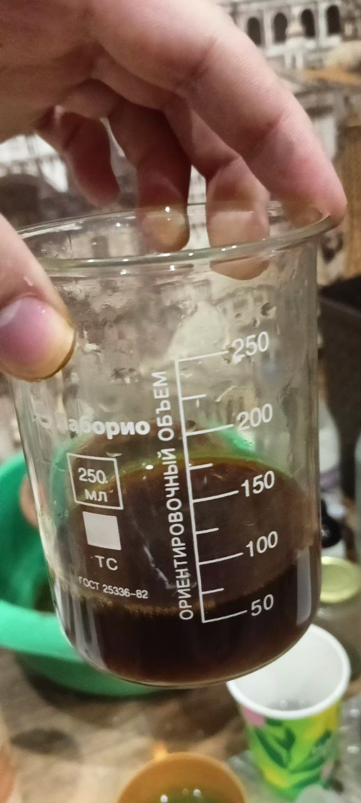


Кинул кусок негашенный извести, он сложно ломался (только молотком ломается) [CaO] 
Он сразу спассевировался, но цвет раствор поменял

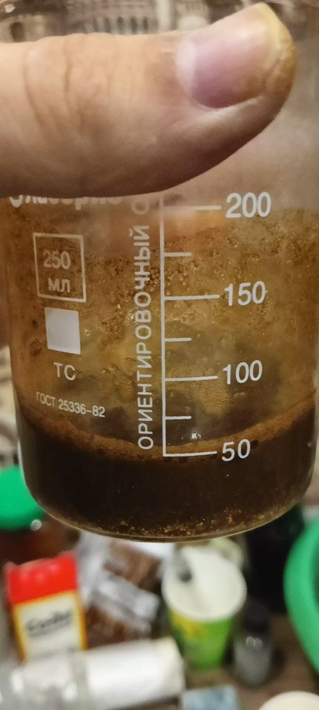

Разбил побольше извести, насыпал и профильтровал осадок, который выпал (это дубильные вещества)

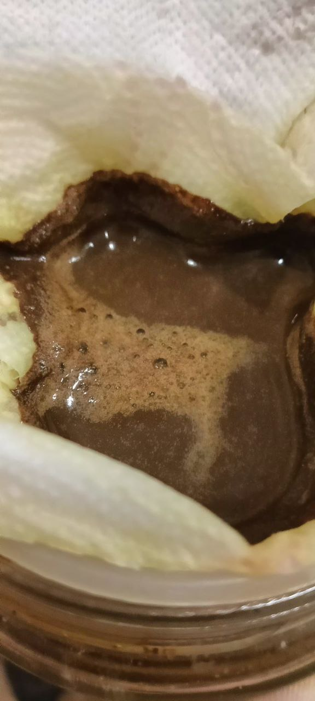

Дальше не сильно помогало; повторял процедуру, но каждая фильтрация теряла жижу. Поэтому что бы наверняка кофеин перешёл в основную соль добавил NaOH

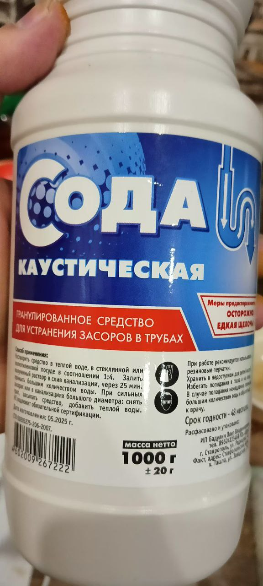

После каустической соды, фильтры из туалетной бумаги очень быстро стали разрушаться и удалить почти весь осадок что осаждался не вышло, поэтому раствор хоть и был частично прозрачен у него осталась окраска. Щелочи кидал очень мало, следовые кол-ва, но этого хватило, что бы оставшиеся часть упала в осадок.

Взял дихлорметан

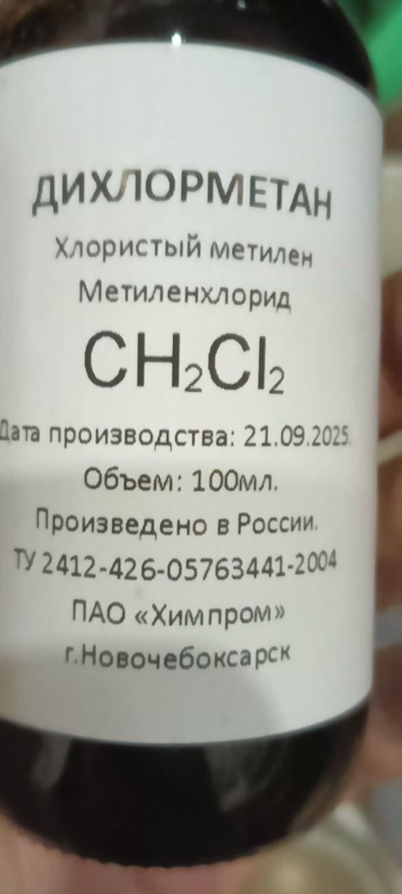

Добавил примерно 5+- мл. Раствор стал себя вести как бензин в луже или даже масло в спирте, то есть пузыриться непонятными шариками и по итогу стал одним шариком, который я высосал шприцом. (разделился на фазы жидкостные)


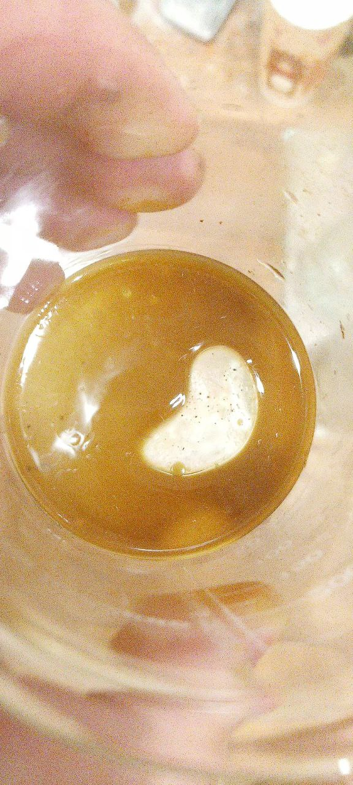
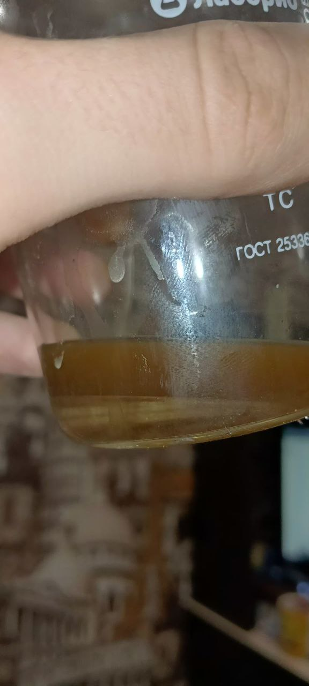

Побулькал перед этим побольше, потряс что бы лучше экстрагировать (почти как йод экстрагировать из водного раствора неполярным растворителем)

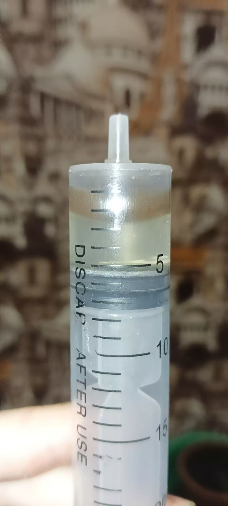
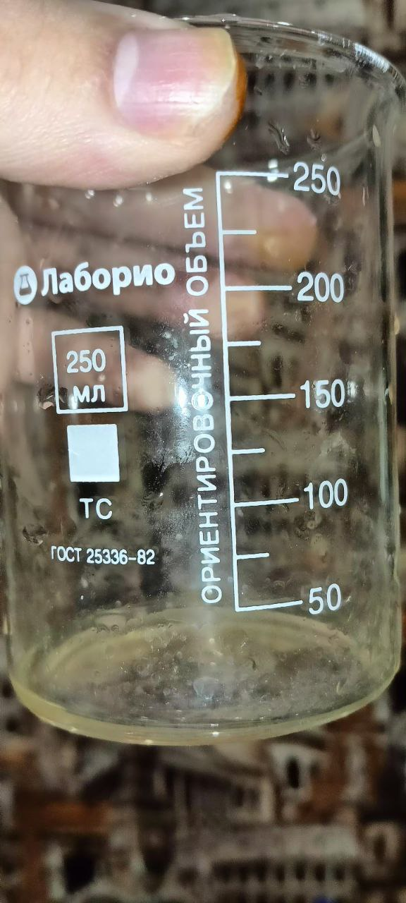

Полученный раствор автоупаривал у открытого окна; даже при пониженной температуре это не заняло очень много времени. При этом несмотря на это, когда я рассматривал раствор я всё же вдохнул дихлорметан, при этом стакан стоял выше моей головы. Запах очень сладкий и даже приятный, правда очень токсичный. Если бы были духи с подобным запахом, то я бы приобрел.

Получил кристаллы:

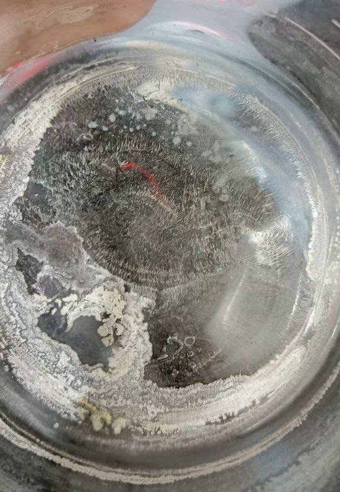


Известь сыпал до того момента, пока осадок +- не перестанет оставаться на фильтре в таком большом кол-ве. 

Следующий, возможный, этап, когда будет перекись, проверить на мурексидную пробу. Но и так по кристаллам видно, есть иголки, которые похожи на чистый кофеин. Скорее всего, это кофеин с примесями, либо особенности кристаллизации кофеина. Мурексидная проба лишь даст ответ, есть ли там кофеин, чистоту продукта так будет сложно определить. Если только проверять по точке плавления.

**Не очень интересный момент, <s>можно не читать</s>**: используйте всегда СИЗ и вытяжку. Пары дихлорметана канцерогенны и могут повредить почки, печень и всё такое. А щелочью можно лешиться глаза. А от аммиака случайно задохнуться. (На крысах показано, что дихлорметан может вызывать рак лёгких, печени и поджелудочной железы. Для регулярной работы с дихлорметаном не подходят перчатки из латекса или нитриловые.)

## Попытка сделать муриксидную пробу

Прилил азотной кислоты до полного растворения всех осадков. Они хорошо растворились. Оставил на ночь, на утра большая часть испарилась и оказались белые кристаллы. А должны были красные, поэтому я решил что азотная кислота вообще не разлагалась толком на кислород и окисления так такового не было. Выпарил под вытяжкой, получил красноватый остаток. Но, при приливании аммиака в малом количестве получил красную жижу. А при прибалвении ещё аммиака просто желтый цвет. Как вариант, либо слишком мало кофеина и его производных, либо очень загрязненно. Следующая попытка собираюсь делать с большим кол-вом и этилацетатом как растворителя. Просто потому-что у меня его больше. Так же, во второй попытки собираюсь отказаться от каустической соды и всё же доломать камушки своей негашенной извести в хорошую пыль.

Это кстати к теме про AI... Даже маленькие изменения могут вообще дать сбой. А то что на бумаге не всегда соответствует полной реальности, поэтому все эти ИИ вообще не должны утверждать, что они лучше учителей (как это мне втирал Grok) [NoAI](/aiishipemachine.html)

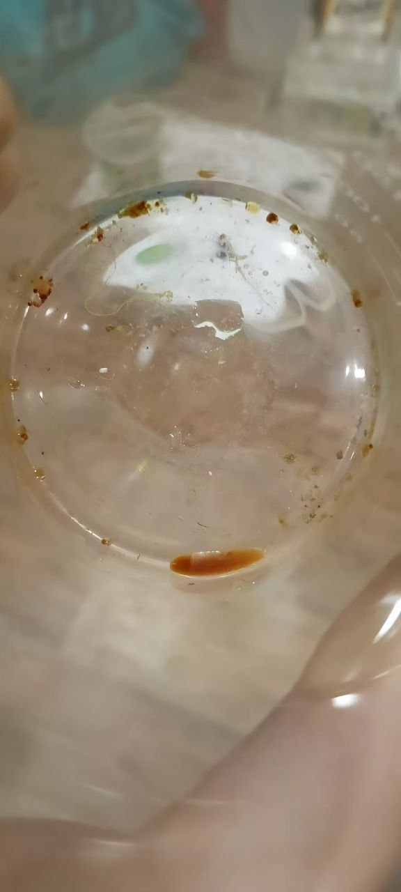
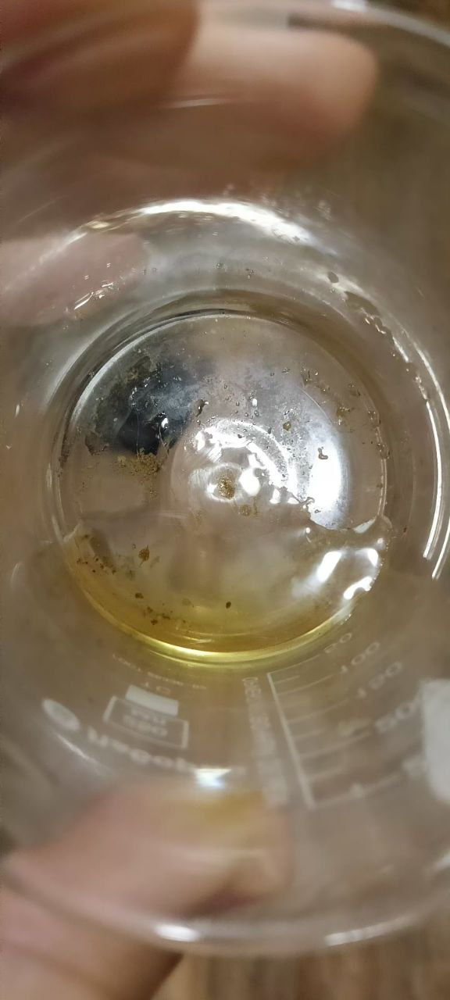


# Попытка с этилацетатом ч1.2

Взял раствор чая 200 мл, 3 ложки столовых. Кипяток. Прям без фильтрации первоночальной осторожно добовлял куски CaO. В один момент, поняв, что со временем при нагревании вместо пассивации идет активная реакция 2CaO + 2HOH -> 2Ca(OH)2. Тогда я просто кинул кусок и у меня часть даже вылелась. 
В прошлый раз я аж ложкой давил кусок извести, не ломался он и не реагировал так. Не знаю почему. Но тогда явно холоднее раствор был. Может нужно было просто подождать, но да ладно уже.
В интернете пишут, что сразу должно реагировать и с холодной водой. Очень странно, так как на практике у меня сразу не прореагировало. А с горячим раствором сразу прореагировало, хоть и закипело, что нормально если емкость будет очень большой. А вот то, что нужно добавлять порциями, это однозначно правильно пишут (обжечься и получить от щелочи лютые лулзы можно, поэтому я работал в защитных очках)

Полученную жижу я профильтровал. Сначала у меня порвался фильтр и часть осадка всё же попала в раствор. Сам раствор, в отличии от случая, когда я следовое кол-во щелочи добавлял менее прозрачно и более желтое

<video width="640" height="360" controls>
  <source src="{{ 'experimets/Coffeine/2/caohandrastvor.mp4' | relative_url }}" type="video/mp4">
  Ваш браузер не поддерживает видео.
</video>

Получил раствор и осадок, остаток:

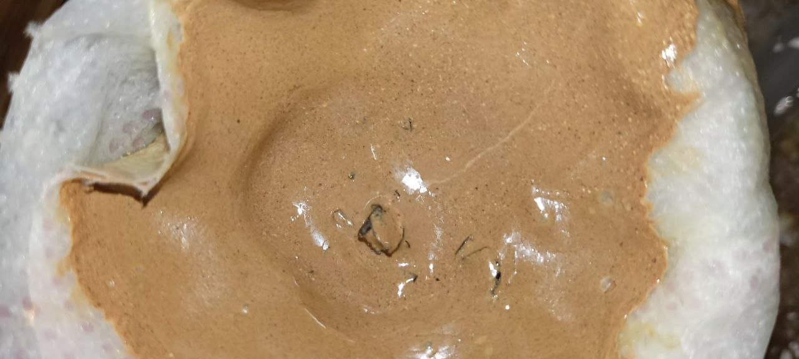
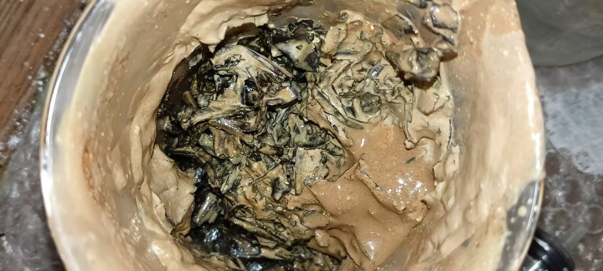
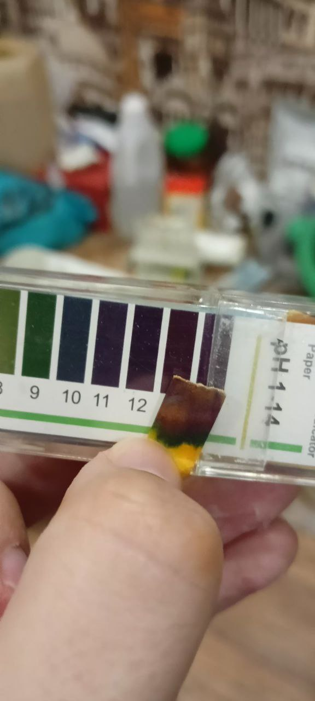
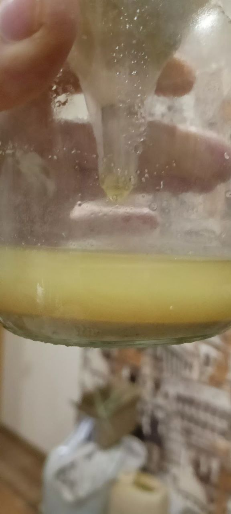

Прилил этилацетат, примерно 25 мл к полученной жиже.

<video width="640" height="360" controls>
  <source src="{{ 'experimets/Coffeine/2/fazy_web.mp4' | relative_url }}" type="video/mp4">
  Ваш браузер не поддерживает видео.
</video>

Перелил и побулькал. В отличии от дихлорметана полученный слой намного сложнее отделить шприцом, более того он более неприятный по запаху и никак не похож ни на груши и не на яблоки. Запах слабо напоминает фрукты, скорее уксусная нотка, только вместо кислотного запаха непонятно что. А сам запах довольно неприятный, очень быстро распространяется. Так же, в отличии от дихлорметана, этилацетат у открытого окна практически не испаряется, на батарее тоже сложно испаряется. При этом азеотропная смесь не исключена (гипотетически), так как в фарфоре я получил меньше готового вещества, чем при первичной кристаллизации. 
Короче говоря, дихлорметан мне понравился для этих целей больше.

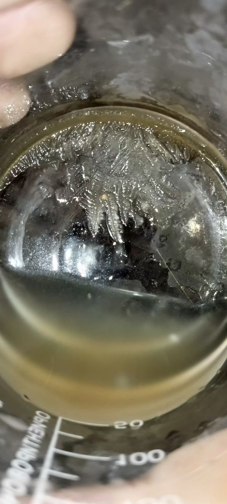

## Мурексид и ИИ

использовать ИИ как источник достоверности, когда один ИИ пишет одно, другой второе. Когда он сам себе противоречит очень опасно.
Вот одни из пруфов:

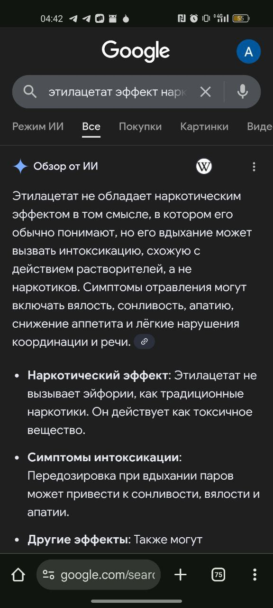
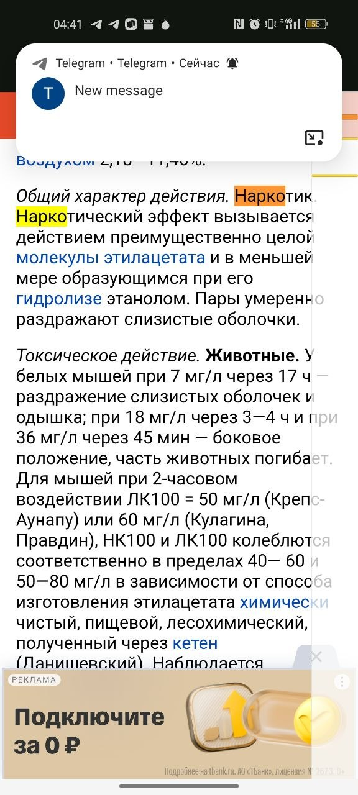
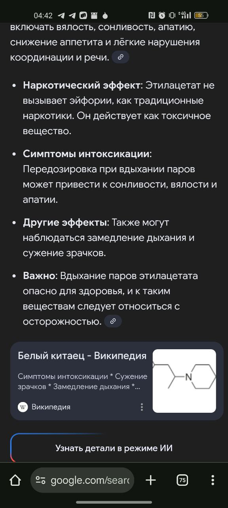
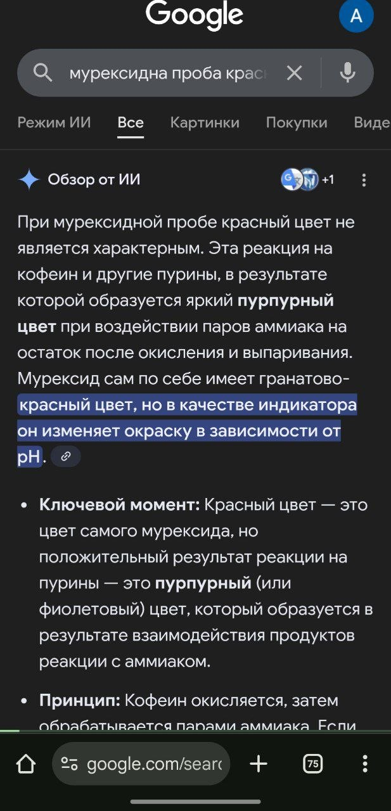
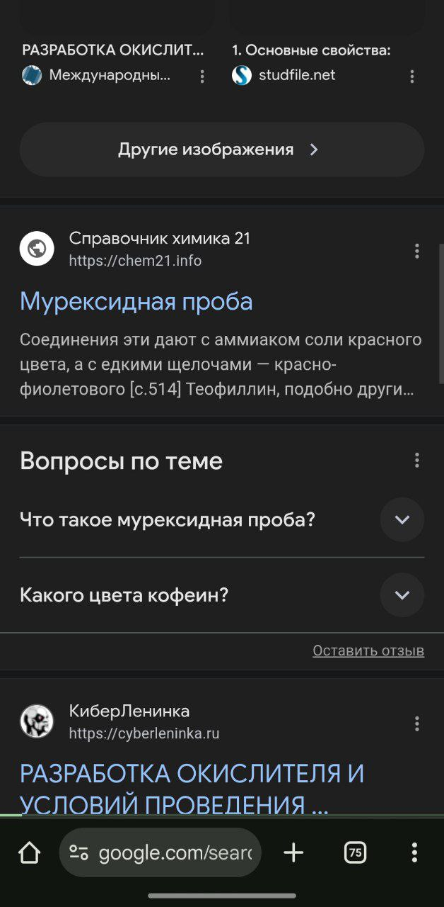
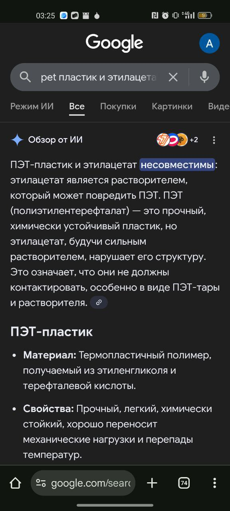
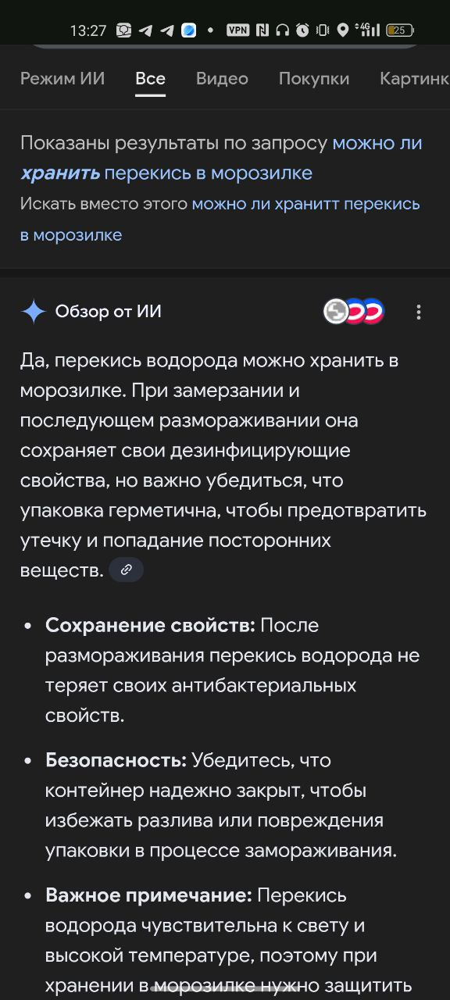
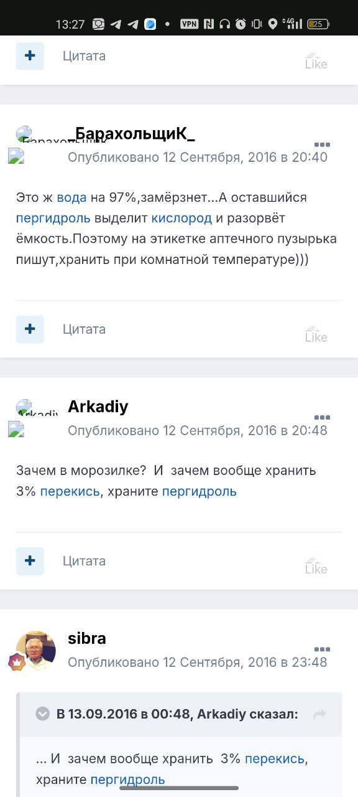


Для тех кто в танке, ии этилацетат пишет не имеет наркотический эффект, хотя логично предположить; в организме оно гидролизуется до этилового спирта, что даст как таковой наркотический эффект. А ещё оно на этот вопрос предлагает изучить о фент*н** (видимо, разработчики сами на чем-то серьезном там сидят)

Потом оно пишет, что мурексидная проба не дает красный цвет (хотя если методички читать, то как раз дает и не только пурпурный)
ПОтом оно говорит, что PET используют для хранения этилацетата, а в другом случае нельзя хранить (двойная работа, перепроверять ходить за этим ИИ)
А в другом случае, говорит что можно замораживать перекись, а другие (человеческие источники) пишут, что медицинскую перекись нельзя вообще хранить ниже 0С
Поэтому довольно ненадежное это всё.

[аи = хайп машины](https://wipedlifepotato.github.io/aiishipemachine.html)

## Мурексидная проба

Она у меня не вышла, получилось желтый раствор, как и с азотной кислотой. Который при добавлении аммиака, как и с азотной кислотой дал красный цвет. А попытка выпарить аммиак с этим раствором (что по идее и нужно, кстати), дала вообще другой оттенок и осадок какой-то розоватый. При этом если изучать методички, то в разных литературных источниках, как раз и получается то оранжевый, то красный...

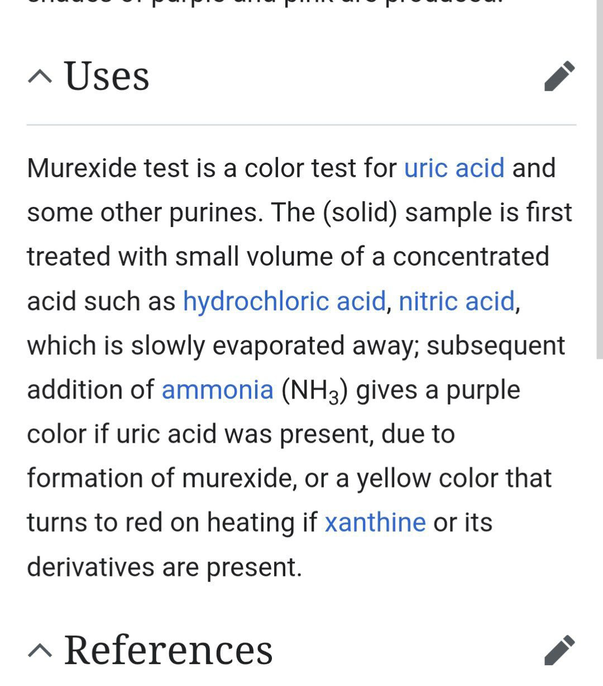

По вики и должен быть желтый раствор, что при нагревании дает красный (у меня слабо окрашивался в красный)

```
Тетраметилпурпуровая кислота дает специфическое пурпурное окрашивание в присутствии аммиака или солей аммония. Возникновение характерной пурпурной окраски для тетраметилпурпуровой кислоты объясняется кето-енольной таутомерией, которая обуславливается единой р-п сопряженной системой гетероцикла [9, С. 508]. Сравнительный анализ литературных источников [4], [8], [10] приводит к определенному противоречию в описании цвета итогового продукта: оранжевый или краснокирпичный осадок выдается за характерный цвет мурексида.
```

```
Нагревание в присутствии пероксида водорода приводит к расщеплению имидазольного ядра кофеина до мочевины и последующему окислению пиримидинового кольца до диметилаллоксана и диметилдиалуровой кислоты. Соляная кислота выступает в роли кислотного катализатора на стадии конденсации: протонирование кислорода диметилаллоксана приводит к делокализации положительного заряда, стабилизированного двумя резонансными структурами, это облегает нуклеофильную атаку гидроксильной группы диметилдиалуровой кислоты и приводит к образованию тетраметилаллоксантина (амалиновой кислоте), раствор которой имеет характерную насыщенную желто -лимонную окраску (см. рисунок 2).
```

У меня получилось так:

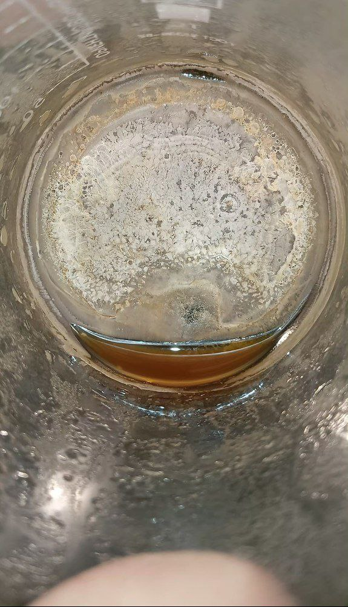
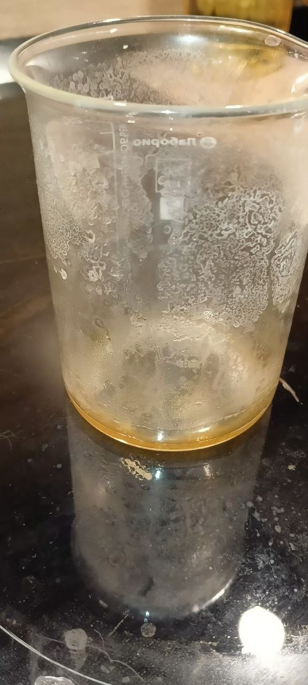
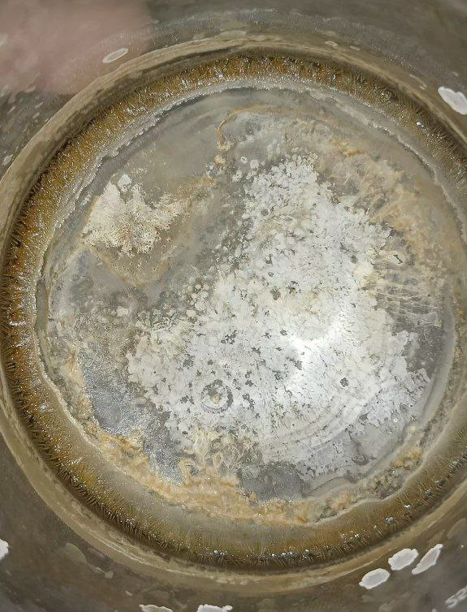
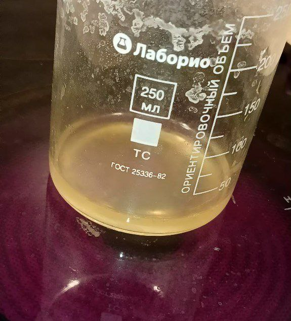
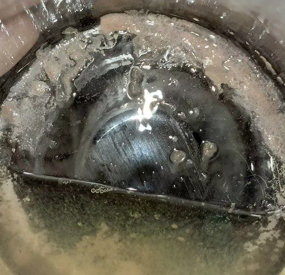
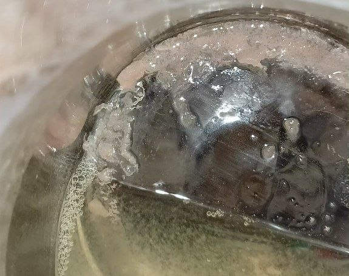


Сам раствор, кстати желтый и поэтому, может из-за примесей получается совсем другой оттенок и это может и нормально, но можно тогда экстрагировать намного больше кофеина. Может целую пачку самого дешманского чая из которого делают чифиры в местах не столь отдаленных. Но тогда это нужно всё делать в кастрюле какой и нужна нормальная делительная воронка.
Для повышения растворимости кофеина можно добавить лимонной кислоты. Но мне, всё же кажется, дело не в кол-ве, а в чистоте. 


Первоночально, как и на первой самой фотографии, только чуть более яркое окрашивание было при добавление аммиака к желтому раствору (не сухому остатку). Наверное, нужно кипятить ещё аммиак этот что бы он в молекулу присоединился. 

Пероксид водорода 37 и рука: 
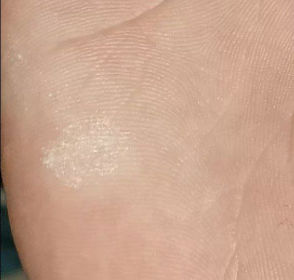

Взял стеклянную пипетку, промыл водой побольше (что бы меньше попало грязи что может разложить перекись) и накапал в стакан. Видимо немного всё же оказалось на стенках сосуда и прикоснулся к этому. Неприятное жжение приходит лишь потом и не сразу. Появляются белые точки. Они у меня сами по себе прошли, причем меньше чем за 30 минут. Но я так понимаю, при концетрациях не следовых и дольше если поддержать, то будет нормально так белая рука. Даже щелочь при попадании на кожу не так сразу реагирует. Думаю ещё круче последствия для глаз будут, чем от щелочи. Юзайте очки защитные с перекисью, это важно и перчатки тут уже очень желательны


