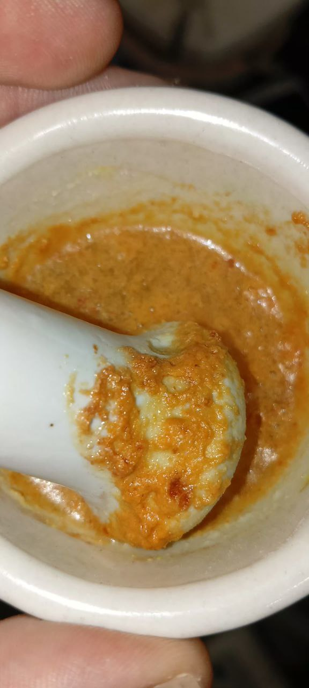
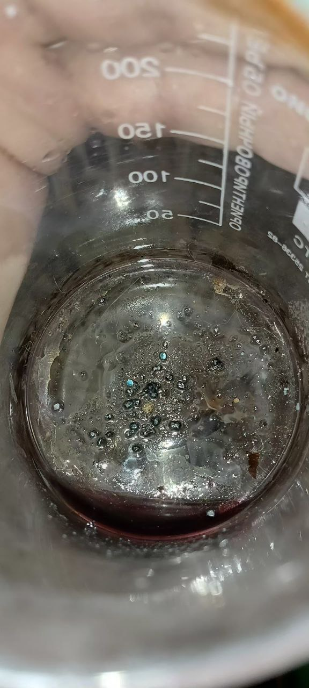

Взял растворил в 75 мл 2 ложки столовых (которыми едят) чая рассыпного. Заварил в микроволновке. 

чай сначала


После фильтрации от листьев


Кинул кусок негашенный извести, он сложно ломался (только молотком ломается) [CaO] 
Он сразу спассевировался, но цвет раствор поменял


Разбил побольше извести, насыпал и профильтровал осадок, который выпал (это дубильные вещества)


Дальше не сильно помогало; повторял процедуру, но каждая фильтрация теряла жижу. Поэтому что бы наверняка кофеин перешёл в основную соль добавил NaOH


После каустической соды, фильтры из туалетной бумаги очень быстро стали разрушаться и удалить почти весь осадок что осаждался не вышло, поэтому раствор хоть и был частично прозрачен у него осталась окраска. Щелочи кидал очень мало, следовые кол-ва, но этого хватило, что бы оставшиеся часть упала в осадок.

Взял дихлорметан


Добавил примерно 5+- мл. Раствор стал себя вести как бензин в луже или даже масло в спирте, то есть пузыриться непонятными шариками и по итогу стал одним шариком, который я высосал шприцом. (разделился на фазы жидкостные)


Побулькал перед этим побольше, потряс что бы лучше экстрагировать (почти как йод экстрагировать из водного раствора неполярным растворителем)


Полученный раствор автоупаривал у открытого окна; даже при пониженной температуре это не заняло очень много времени. При этом несмотря на это, когда я рассматривал раствор я всё же вдохнул дихлорметан, при этом стакан стоял выше моей головы. Запах очень сладкий и даже приятный, правда очень токсичный. Если бы были духи с подобным запахом, то я бы приобрел.

Получил кристаллы:


Известь сыпал до того момента, пока осадок +- не перестанет оставаться на фильтре в таком большом кол-ве. 

Следующий, возможный, этап, когда будет перекись, проверить на мурексидную пробу. Но и так по кристаллам видно, есть иголки, которые похожи на чистый кофеин. Скорее всего, это кофеин с примесями, либо особенности кристаллизации кофеина. Мурексидная проба лишь даст ответ, есть ли там кофеин, чистоту продукта так будет сложно определить. Если только проверять по точке плавления.

**Не очень интересный момент, <s>можно не читать</s>**: используйте всегда СИЗ и вытяжку. Пары дихлорметана канцерогенны и могут повредить почки, печень и всё такое. А щелочью можно лешиться глаза. А от аммиака случайно задохнуться. (На крысах показано, что дихлорметан может вызывать рак лёгких, печени и поджелудочной железы. Для регулярной работы с дихлорметаном не подходят перчатки из латекса или нитриловые.)

## Попытка сделать муриксидную пробу

Прилил азотной кислоты до полного растворения всех осадков. Они хорошо растворились. Оставил на ночь, на утра большая часть испарилась и оказались белые кристаллы. А должны были красные, поэтому я решил что азотная кислота вообще не разлагалась толком на кислород и окисления так такового не было. Выпарил под вытяжкой, получил красноватый остаток. Но, при приливании аммиака в малом количестве получил красную жижу. А при прибалвении ещё аммиака просто желтый цвет. Как вариант, либо слишком мало кофеина и его производных, либо очень загрязненно. Следующая попытка собираюсь делать с большим кол-вом и этилацетатом как растворителя. Просто потому-что у меня его больше. Так же, во второй попытки собираюсь отказаться от каустической соды и всё же доломать камушки своей негашенной извести в хорошую пыль.

Это кстати к теме про AI... Даже маленькие изменения могут вообще дать сбой. А то что на бумаге не всегда соответствует полной реальности, поэтому все эти ИИ вообще не должны утверждать, что они лучше учителей (как это мне втирал Grok) [NoAI](/aiishipemachine.html)


# Попытка с этилацетатом ч1.2

Взял раствор чая 200 мл, 3 ложки столовых. Кипяток. Прям без фильтрации первоночальной осторожно добовлял куски CaO. В один момент, поняв, что со временем при нагревании вместо пассивации идет активная реакция 2CaO + 2HOH -> 2Ca(OH)2. Тогда я просто кинул кусок и у меня часть даже вылелась. 
В прошлый раз я аж ложкой давил кусок извести, не ломался он и не реагировал так. Не знаю почему. Но тогда явно холоднее раствор был. Может нужно было просто подождать, но да ладно уже.
В интернете пишут, что сразу должно реагировать и с холодной водой. Очень странно, так как на практике у меня сразу не прореагировало. А с горячим раствором сразу прореагировало, хоть и закипело, что нормально если емкость будет очень большой. А вот то, что нужно добавлять порциями, это однозначно правильно пишут (обжечься и получить от щелочи лютые лулзы можно, поэтому я работал в защитных очках)

Полученную жижу я профильтровал. Сначала у меня порвался фильтр и часть осадка всё же попала в раствор. Сам раствор, в отличии от случая, когда я следовое кол-во щелочи добавлял менее прозрачно и более желтое

<video width="640" height="360" controls>
  <source src="{{ 'experimets/Coffeine/2/caohandrastvor.mp4' | relative_url }}" type="video/mp4">
  Ваш браузер не поддерживает видео.
</video>

Получил раствор и осадок, остаток:


Прилил этилацетат, примерно 25 мл к полученной жиже.

<video width="640" height="360" controls>
  <source src="{{ 'experimets/Coffeine/2/fazy_web.mp4' | relative_url }}" type="video/mp4">
  Ваш браузер не поддерживает видео.
</video>

Перелил и побулькал. В отличии от дихлорметана полученный слой намного сложнее отделить шприцом, более того он более неприятный по запаху и никак не похож ни на груши и не на яблоки. Запах слабо напоминает фрукты, скорее уксусная нотка, только вместо кислотного запаха непонятно что. А сам запах довольно неприятный, очень быстро распространяется. Так же, в отличии от дихлорметана, этилацетат у открытого окна практически не испаряется, на батарее тоже сложно испаряется. При этом азеотропная смесь не исключена (гипотетически), так как в фарфоре я получил меньше готового вещества, чем при первичной кристаллизации. 
Короче говоря, дихлорметан мне понравился для этих целей больше.


## Мурексид и ИИ

использовать ИИ как источник достоверности, когда один ИИ пишет одно, другой второе. Когда он сам себе противоречит очень опасно.
Вот одни из пруфов:


Для тех кто в танке, ии этилацетат пишет не имеет наркотический эффект, хотя логично предположить; в организме оно гидролизуется до этилового спирта, что даст как таковой наркотический эффект. А ещё оно на этот вопрос предлагает изучить о фент*н** (видимо, разработчики сами на чем-то серьезном там сидят)

Потом оно пишет, что мурексидная проба не дает красный цвет (хотя если методички читать, то как раз дает и не только пурпурный)
ПОтом оно говорит, что PET используют для хранения этилацетата, а в другом случае нельзя хранить (двойная работа, перепроверять ходить за этим ИИ)
А в другом случае, говорит что можно замораживать перекись, а другие (человеческие источники) пишут, что медицинскую перекись нельзя вообще хранить ниже 0С
Поэтому довольно ненадежное это всё.

[аи = хайп машины](https://wipedlifepotato.github.io/aiishipemachine.html)

## Мурексидная проба

Она у меня не вышла, получилось желтый раствор, как и с азотной кислотой. Который при добавлении аммиака, как и с азотной кислотой дал красный цвет. А попытка выпарить аммиак с этим раствором (что по идее и нужно, кстати), дала вообще другой оттенок и осадок какой-то розоватый. При этом если изучать методички, то в разных литературных источниках, как раз и получается то оранжевый, то красный...


По вики и должен быть желтый раствор, что при нагревании дает красный (у меня слабо окрашивался в красный)

```
Тетраметилпурпуровая кислота дает специфическое пурпурное окрашивание в присутствии аммиака или солей аммония. Возникновение характерной пурпурной окраски для тетраметилпурпуровой кислоты объясняется кето-енольной таутомерией, которая обуславливается единой р-п сопряженной системой гетероцикла [9, С. 508]. Сравнительный анализ литературных источников [4], [8], [10] приводит к определенному противоречию в описании цвета итогового продукта: оранжевый или краснокирпичный осадок выдается за характерный цвет мурексида.
```

```
Нагревание в присутствии пероксида водорода приводит к расщеплению имидазольного ядра кофеина до мочевины и последующему окислению пиримидинового кольца до диметилаллоксана и диметилдиалуровой кислоты. Соляная кислота выступает в роли кислотного катализатора на стадии конденсации: протонирование кислорода диметилаллоксана приводит к делокализации положительного заряда, стабилизированного двумя резонансными структурами, это облегает нуклеофильную атаку гидроксильной группы диметилдиалуровой кислоты и приводит к образованию тетраметилаллоксантина (амалиновой кислоте), раствор которой имеет характерную насыщенную желто -лимонную окраску (см. рисунок 2).
```

У меня получилось так:


Сам раствор, кстати желтый и поэтому, может из-за примесей получается совсем другой оттенок и это может и нормально, но можно тогда экстрагировать намного больше кофеина. Может целую пачку самого дешманского чая из которого делают чифиры в местах не столь отдаленных. Но тогда это нужно всё делать в кастрюле какой и нужна нормальная делительная воронка.
Для повышения растворимости кофеина можно добавить лимонной кислоты. Но мне, всё же кажется, дело не в кол-ве, а в чистоте. 


Первоночально, как и на первой самой фотографии, только чуть более яркое окрашивание было при добавление аммиака к желтому раствору (не сухому остатку). Наверное, нужно кипятить ещё аммиак этот что бы он в молекулу присоединился. 

Пероксид водорода 37 и рука: 


Взял стеклянную пипетку, промыл водой побольше (что бы меньше попало грязи что может разложить перекись) и накапал в стакан. Видимо немного всё же оказалось на стенках сосуда и прикоснулся к этому. Неприятное жжение приходит лишь потом и не сразу. Появляются белые точки. Они у меня сами по себе прошли, причем меньше чем за 30 минут. Но я так понимаю, при концетрациях не следовых и дольше если поддержать, то будет нормально так белая рука. Даже щелочь при попадании на кожу не так сразу реагирует. Думаю ещё круче последствия для глаз будут, чем от щелочи. Юзайте очки защитные с перекисью, это важно и перчатки тут уже очень желательны


Авак пишет:

```
Глянул Вашу страницу про КОФЕИН. Пакостно то, что в чае, кофе и т.п. кофеина достаточно мало, и при этом есть мириады других соединений. Я сам выделять (осаждать) кофеин не пробовал. ПИШУТ:
https://www.chem21.info/pic1/130026168223234123181188232190039042147048224216.png
, что кофеин образует бурый осадок перйодида «с раствором иода в кислой среде»; и ещё, что кофеин образует белый осадок с раствором танина, растворимый в избытке танина. НО какая концентрация кофеина может быть определена этими способами? Одно дело, если у Вас готовый кристаллический кофеин, подлинность которого нужно подтвердить качественными реакциями, и совсем другое дело, когда нужно осадить кофеин из растительных продуктов, в которых его мало. Про ВЫПАРИВАНИЕ (у Вас) — выпаривание водных растворов большинства органических продуктов даёт ОСМОЛЕНИЕ. Так что «потемнение» при выпаривании — это в первую очередь результат разложения (осмоления). Выпаривание применяется при МУРЕКСИДНОЙ ПРОБЕ, НО только на водяной бане (потому что водяная баня НЕ даёт нагреться выше 100°C)! Про образование мурексида, — если действие азотной кислоты и затем аммиака даёт красный цвет — это оно и есть. «Для проведения реакции препа­рат нагревают на водяной бане до полного упаривания с окислите­лем (Н2O2, Вг2, HNO3) в кислой среде. Затем добавляют раствор аммиака; появляется пурпурно–красное окрашивание.» https://studfile.net/preview/3977582/
В этой цитате я бы исключил бром, потому что с бромом куча побочных явлений будет. Растворимость мурексида в воде плохая, НО чтобы он выпал в осадок — его должно быть достаточно не мало, а ведь кофеина в чае и кофе весьма мало. Так что «красное окрашивание» будет, а осадок — навряд ли.

Про красную кровяную соль как окислитель. ВОЗМОЖНО! Надо попробовать (ацетон и изопропанола).
...
Для теста на кофеин нужно НА ВОДЯНОЙ БАНЕ кипятить с РАЗБАВЛЕННОЙ азотной кислотой. Разбавленная HNO3 не нитрует, а просто ОКИСЛЯЕТ, что и оказывается нужным процессом (после чего аммиак образует мурексид).
```

Нужно пробовать, получается, разбавленную и не греть напрямую от плиты. Сначала буду пробовать на препарате, который явно содержит кофеин.

Почтовые отправления
1,2 (от меня). 
```
Аскофен взял таблетку, размолол. Кинул в стакан. Прилил почти что 10-25 мл может даже больше воды и несколько капель кислоты азотной. Мл может ± 
Поставил на водяную баню, пока запах кислоты совсем не перестал чувствоваться. Раствор пожелтел. Я налил туда аммиака. От аммиака падал осадок, красноватого/коричневого оттенка. Прилил ещё и оттенок стал коричневым. Такой же, как с веществом из чая
Если вглядываться, то коричневый это то ли смесь зеленого, то ли смесь бледно-красноватого чего-то. Но это всё не точно. То есть, если не выпаривать до конца, то другой оттенок совсем получается или вообще мало кипятил на водяной бане. Но минут 30 точно. 

Нашёл на форуме и на сайте лабораторную работу, где окись магния берут и чай. А потом возгоняют на холодную поверхность кристаллы кофеина. К которым приливают конц. раствор азотной кислоты (неск капель) и выпаривают насухо. А потом 10 капель аммиака и получают красную/пурпурную соль - https://studfile.net/preview/9820379/page:11/ (неизвестно, сами ли они пробуют это делать или нет. но выглядит реалистично)
Вот ещё нашёл:
"
    Возгонка кофеина из сухого чая. Небольшое количество растертого чая помещают на часовое стекло и накрывают его вторым часовым стеклом. Осторожно нагревая, наблюдают возгонку кофеина. Он оседает на верхнем стекле в виде длинных, слегка окрашенных игл. [c.203]
"
То есть, можно и не экстрагировать, а просто возгнать. А окись нужна чтобы связать полифенолы и остальное. Мне кажется, при высокой температуре аддукт кислоты и кофеина сам может разделиться. Так вот, у меня в общем не получается это пурпурное окрашивание. А даже с аскофеном получается коричневое/красновато-зеленое окрашивание. Я может в цветах не разбираюсь просто, но этот метод определения кофеина в загрязненных системах очень сложный. Нужно соблюдать точные пропорции. А если кофеин не чистый, то пропорции уже меняются. Получается не пурпурный, а совсем другой цвет. Буду дальше пробовать/думать
---
На ютъюбе поискал эти реакции. Один просто уротропином сжог все в Уголёк. Другой просто йод смешал. Просто раствор йода зачем-то снимают. Один только показал, что зелёный раствор. Но там не спиртовой раствор, а реактив готовый и соляная кислота. Дало зелёный цвет. Это всё не очень реакции. Нужно может соль кофеина подобрать, которая просто не растворяется. Пикрат кофеина не растворим, значит должны быть подобные соединения и с меньшими вопросами. По типу зачем мне пикриновые кислоты. Но мне кажется, это самый оптимальный способ подтвердить что выделены алкалоиды. Они в осадок именно выпадут. Это очень надежная реакция должна быть. 
Либо, нужно физический метод искать. А если физический метод, то нужно много вещества выделить. Что бы, например, растворимость в воде посмотреть и плотность раствора
Кофеин в щелочи разлагается

https://studfile.net/preview/3977706/page:2/
И тут тоже пишут водяная 

    Характерной особенностью пуриновых алкалоидов является их нестойкость цри нагревании в щелочной среде (при рН>9). В этом случае кофеин разлагается до кофеидин-карбоновой кислоты и далее до кофеидина (физиологически неактивное вещество).  [c.363]

То есть, нужно еще и не перегревать раствор или не сильно щелочную среду делать. Много подводных камней
В общем, попробую авто упаривать на батарее раствор перекиси, соляной кислоты и аскофена в фарфоровой чашке. Надеюсь получится. А азотная кислота дает окраску, которая всё путает. Думаю получится. В батарее вода горячая
```

Мне (Авак Авакян):
```
Про возгонку кофеина — это абсолютно ГЕНИАЛЬНО!!! Конечно же, это ИДЕАЛЬНЫЙ путь.

С аскофеном, судя по всему, всё правильно получается. Наверное, мурексид так и должен выглядеть.

«Кофеин, морфин, аконитин, теобромин НЕ осаждаются пикриновой кислотой»:
https://edu.vspu.ru/members/rfnzufkz/docs/231119/download
По этой ссылке вордовский файл, где подробно сказано, как возгонять кофеин. К слову, можно попробовать из аскофена возогнать кофеин. Ещё (в этом файле) сказано, что азотная кислота с кофеином может дать амалиновую кислоту, которая оранжевого цвета. Амалиновая кислота — это тетраметилаллоксантин. Формула аллоксантина:
https://www.optimum-lab.ru/wa-data/public/shop/products/38/48/24838/images/73367/73367.0x500.png
Вот этот продукт с 4 метильными группами на атомах азота (вместо водорода). Он с аммиаком даёт мурексид.

Кофеин практически не основен. Сравните его с мочевой кислотой:
https://upload.wikimedia.org/wikipedia/commons/9/9b/Harns%C3%A4ure_Ketoform.svg
Так что «алкалоидом» его называют «с натяжкой»: слово «алкалоид» произошло от «alkaline» = «щелочной»; то есть «алкалоидами» называют органические соединения, обладающие щелочными свойствами. «По классике» это соединения азота, в которых азот ведёт себя подобно аммонию. Но не все органические соединения азота щелочные (мочевая и циануровая кислоты тому пример). Это я к тому, что осадить некую соль кофеина — это надо поискать некую «специфическую» соль типа нитрата мочевины (мочевина тоже практически не основна, но с азотной кислотой берёт, да образует малорастворимую и стабильную в твёрдом виде соль).

Вот ТУТ:
https://www.reddit.com/r/chemistry/comments/x3odfu/extracting_coffee_aromatics_and_caffeine_without/?tl=ru
обсуждают извлечение и осаждение кофеина. Рекомендуют экстрагировать этилацетатом (в результате обещают кристаллы кофеина). Ещё пишут: «Смешиваешь напиток с раствором Люголя (йод + йодид калия) и концентрированной серной кислотой. Кофеин образует нерастворимый комплекс с йодом в кислой среде. Я проверил эту процедуру на чистом растворённом кофеине и чёрном чае, и вроде как всё сработало отлично.».
```

Сейчас сделал раствор воды, соляной кислоты, перекиси 37% и 1 таблетки аскофена (размолотой). Пока-что чувствовался запашок, может производного хлора (гипохлоритная/хлорноватистая кислота может) хлора, но при открытии окна запаха нет. Скорее всего хлор. HCl + O* => HO-Cl / HO* + Cl* / HOH + ClO* + Cl2 + ещё органика хлорированная и может ещё чего-то не учёл [радикальный механизм типа. Где звездочка это гомогенный заряд, не плюс и не минус, а между этими зарядами, радикал проще говоря]. Оно в свою очередь на хлор может распадаться и воду с кислородом, либо дальше до хлорной кислоты вплоть, на практике мне кажется не дальше хлоратной кислоты (хлорноватой кислоты). Ну и тем самым хлорировать ещё органику. Давно получал хлор в банке и уже забыл запах, да и чувствуя странный запах мгновенно открыл окно и запах перестал чувствоваться.
Могу что-то путать, тк не сильно из источников беру эту информацию и свои додумки/гипотизы.

Случайно нашёл статью, что там и хемилюменесценцию можно словить (в щелочи).
Не нашёл никакой инфы про хлор-производные салициловой кислоты

```
При обработке барбитуровой кислоты дымящей азотной кислотой образуется 5-нитробарбитуровая кислота (Байер, 1861), которая при восстановлении дает 5-аминобарбитуровую кислоту, или урамил (Байер) урамил был получен Праутом (1818) разложением мурексида кислотами. Праут назвал его пурпуровой кислотой. Действуя цианатом калия на аминобарбитуровую кислоту, получают псевдомочевую кислоту (Шлипер и Байер, 1863 Байер, 1869), которая может быть переведена в мочевую кислоту (см. ниже)  [c.360]
```

```
Для кофеина и других производных ксантина, а также мочевой кислоты характерна мурексидная проба , основанная на образовании аллоксантина (или продуктов его метилирования) при окислении хлором, перекисью водорода и др. Соединения эти дают с аммиаком соли красного цвета, а с едкими щелочами — красно-фиолетового  [c.514]
```

Цвет аллоксантина не нашёл, цвет производных (5аминобарбиторовой кислоты и аллоксана) тоже не нашёл в русскоязычном сегменте. В англоязычном:
[alloxan](https://en.wikipedia.org/wiki/Alloxan) -> **Appearance 	pale yellow solid**     
Про салициловую/хлорпроизводные фенола и так далее не нашёл цветов:
[chlorsalycilic](https://en.wikipedia.org/wiki/Chlorosalicylic_acid)

В общем, аллоксан как раз должен быть желтым и как раз должен краснеть от аммиака. От кислоты он разлагается (высококонц) и дает уже зеленовато-коричневый оттенок. Ну и у меня от щелочи он такой-же оттенок дает со временем. Да и в целом, сам мурексид неустойчив.

--
Проверил ещё до конца не высушенный раствор с аммиаком, получил сначала как раз пурпурный цвет, который сразу же разложился на коричневый, как был с пробами с чаем.

<video width="640" height="360" controls>
  <source src="{{ 'experimets/Coffeine/2/murexidetest1_web.mp4' | relative_url }}" type="video/mp4">
  Ваш браузер не поддерживает видео.
</video>

Вот сама ступка:



Обсуждение с Аваком:
мое сообщение:
```
Если в водном растворе, не дожидаясь полного сухого остатка и правда что-то красновато-розовое видится. Но не долго
Попробую полностью высушить. Мурексид, пишут, разлагается в той же кислой среде
Очень долго выпаривается на батарее. Ну и перекись + соляную кислоту я взял в соотношении так, что соляной больше, перекиси меньше и немного воды. То есть, очень кислая среда и там должна хлорноватая кислота и хлор образоваться. С йодом попробовать стоит
Сейчас дальше упариваю до полного сухого остатка и повторю приливание аммиака, но уже выглядит более похоже на розовые оттенки
```
Мне:
```
Поглядел Ваше видео; всё идеально, так и должно быть! Всё правильно. В Википедии сказано, что мурексид — «тёмно-красные, КОРИЧНЕВАТЫЕ или пурпурные мелкие кристаллы с зеленоватым блеском»:
https://ru.wikipedia.org/wiki/%D0%9C%D1%83%D1%80%D0%B5%D0%BA%D1%81%D0%B8%D0%B4
Так то «не надо присматриваться к оттенкам». 😆😂🤣
Ещё нужно помнить, что «водный раствор мурексида устойчив один день»:
https://xumuk.ru/encyklopedia/2719.html
И ведь это при КОМНАТНОЙ температуре. А при кипячении, да ещё и не в нейтральных средах, — он может крайне быстро «скончаться». Кстати, при приливании аммиака, если оного МАЛО, окраска вскоре исчезает, потому что кислая среда разлагает мурексид. Поэтому нужно разом приливать ИЗБЫТОК аммиака. Иначе: упала в раствор азотки капля аммиака; ВОЗЛЕ НЕЁ сразу образовался мурексид, В ЭТОМ МЕСТЕ сразу покраснело. А в следующий момент азотка из окружающего пространства разлагает мурексид — и мы видим, что окраска сразу же «меркнет». А продукты разложения с новой порцией аммиака мурексид не дадут. ПОЭТОМУ нужно ➡️ БЫСТРО влить СРАЗУ ИЗБЫТОК аммиака.
Лучше всего такие водонестойкие соединения НЕ выпаривать. Просто желательно получить достаточно много кофеина, а затем В МИНИМУМЕ воды делать из него мурексид, чтобы мурексид выпал в осадок. А осадок СРАЗУ отфильтровать БЕЗ нагрева и быстро с силой отжать между слоями бумаги, чтобы быстро высушить БЕЗ нагрева. А лучше всего мурексид получать из мочевой кислоты, которой очень много в птичьем помёте, в частности, в голубином.
 
```

<video width="640" height="360" controls>
  <source src="{{ 'experimets/Coffeine/2/murexidetest2_web.mp4' | relative_url }}" type="video/mp4">
  Ваш браузер не поддерживает видео.
</video>

(газ, это оставшаяся соляная кислота, которая реагирует с аммиаком. она взята в переизбытке к отношению к перекиси)

С щелочью:

<video width="640" height="360" controls>
  <source src="{{ 'experimets/Coffeine/2/murexidetest_naoh1_web.mp4' | relative_url }}" type="video/mp4">
  Ваш браузер не поддерживает видео.
</video>


В аскофене уж точно 40 мг кофеина есть и был. СТоит попробовать с раствором люголя в кислой среде. Уж может и проще хроматографию провести, но если смотреть на цены хроматографов, оверпрайснутые, то не проще. Непонятно за что такие большие цены, будто там сверхсложное устройство. Просто мало кому нужное и мало покупок будет, себе стоимости такой не может быть такой.
Ну и на ebay, хроматограф газовый, что у нас под 900к, на ebay уже можно и под 1125$ купить. А 990950р > 87 700.05р. Где-то в 11 раз минимум.
[overpriceproof](https://www.ebay.com/itm/257111084466)
ну, а газовые хроматографы, по цене миллиона рублей можете и сами найти

То есть, если исключить салициловую кислоту и парацетамол, то у нас в аскофене кофеин, и он и должен был давать такое поведение. Как можно увидеть, если мурексидную пробу делать в других составах уже, при других условиях, то совсем другое поведение. Да и сам мурексид довольно не стойкое соединение. Стоит пробовать раствор люголя и кислую среду.
По личному опыту, мурексидная проба очень специфичная и обидчивая к условиям. А сам оттенок высматривать в загрязненном растворе то ещё наслаждение. Красный оттенок может дать и производные салициловой кислоты, если немного изменить формулу... 

Конец 1 части.

Неизвестно до конца что, прореагировавшее с остатками после работы с чаем/мурексидом. Восстановился сульфат меди и образовался раствор красноватого цвета:
Просто попало на воронку не мытую и стакан. Засыпал для окрашивания раствора, что бы увидеть есть ли слои и отложил



