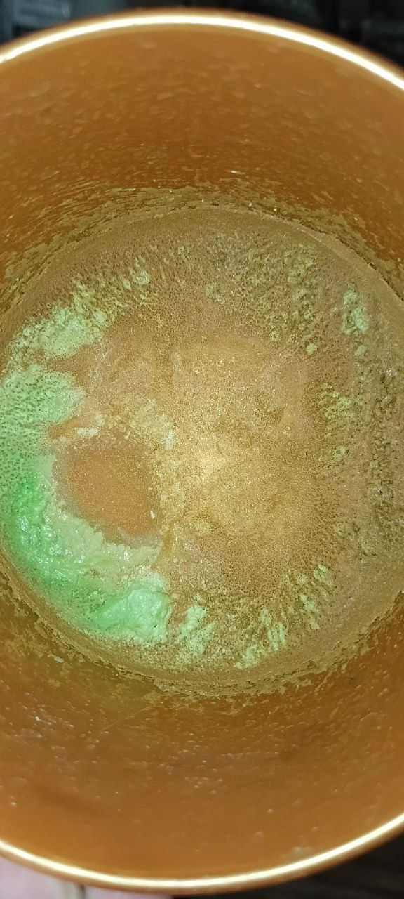
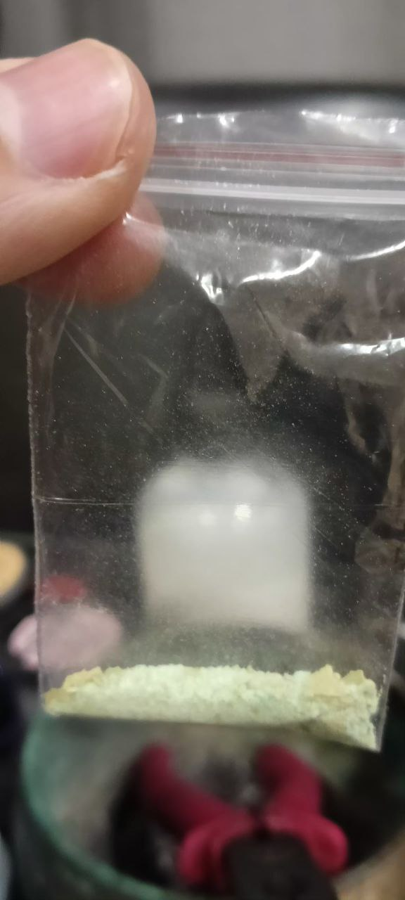
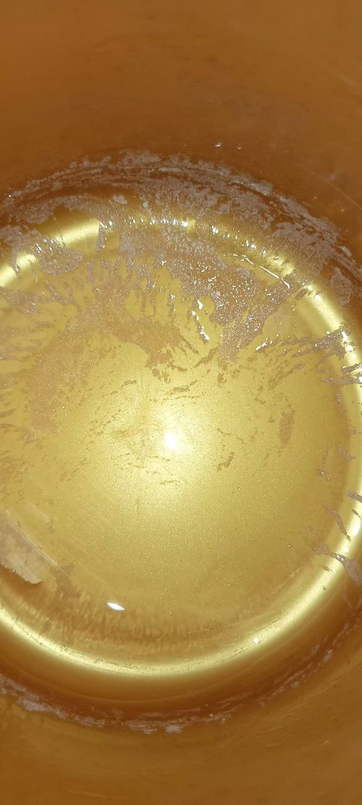
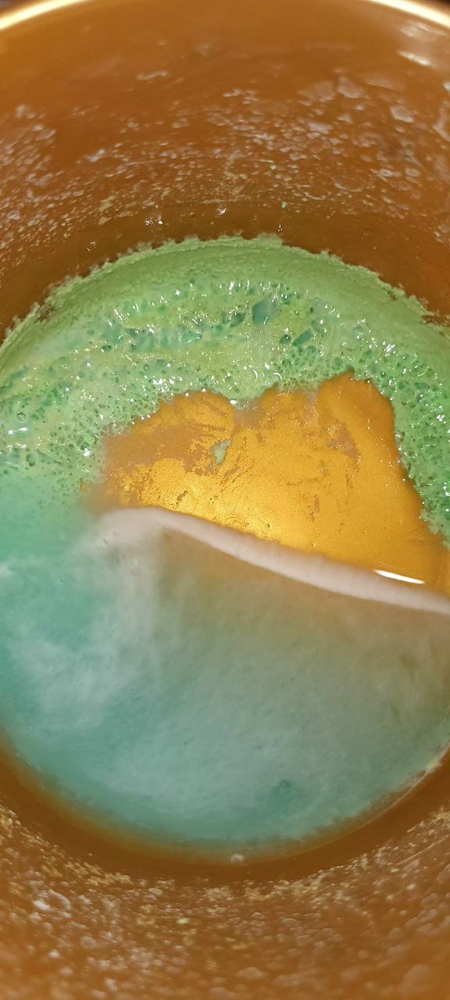
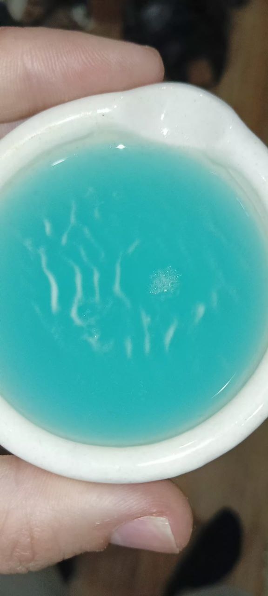

# Кристаллогидрат сульфата меди

## Частично обезвоженный

## Через множество дней гидратированный в обычных комнатных условиях (прошло 14 дней)

# Кристаллогидрат нитрата меди

## После микроволновки (снова растворил и профильтровав засунул в микроволновку на кристаллизацию, 1:30 минут)

Можно увидеть, что часть побелело, а часть вообще пожелтело. После прибавлении воды сама жидкость стала не зеленой, а синей! Хотя первоночально, раствор был зеленым до микроволновки. А ещё после микроволновки чувствуется кислотный запах. Возможно получилась основная даже соль частично. Потому-что появился остаток, что не растворяется:

После добавление воды:

Варианты - нитрат меди, свеже приготовленный, из азотной кислоты. Концетрированный, раствор зеленый. После разрушения кристаллогидрата, видимо другая форма кристаллогидрата, который дает зеленый цвет сложнее получить. Остаток не растворившийся - возможно, продукты взаимодействия с пластиком или примеси или просто раньше не замечал, но это вряд-ли. Кислотный запах, скорее всего окислы азота. Но чем-то напоминало соляную кислоту по жжению, но там не могло быть соляной кислоты. Тогда это окислы азота. Но тогда, куда делся оксид меди. А желтое, возможно примеси какие-то, что были в серебре. Так как нитрат меди получен из 925 пробы серебрянной. Но до того как я сушил в микроволновке всё зеленное было. А сейчас кристаллы кристаллизуются в зеленый цвет. При этом, я долил синий прозрачный раствор в выпаренную часть на автоупарыватиле (батарее) и он стал гуще. Менее голубым-прозрачным, а более темно-ярким насыщеным цветом. Просто улучшил свет. А сильно разбавленные почти что как сульфат меди раствор, синий, только голубой. Чем более насыщенный, тем сильнее меняется цвет. Буду наблюдать. Сами кристаллы кристаллизуются зелёные. 

# Ацетат Серебра (по краям)

