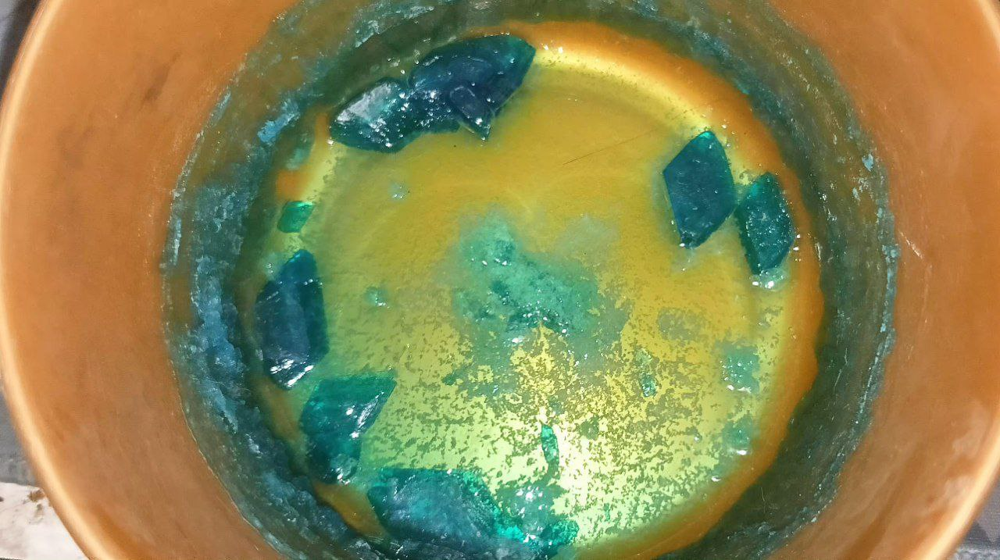
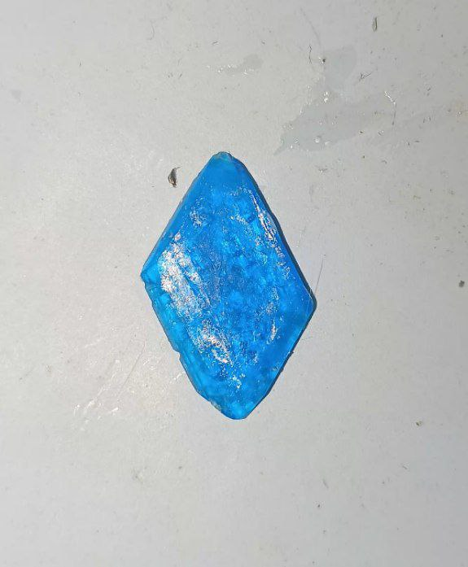
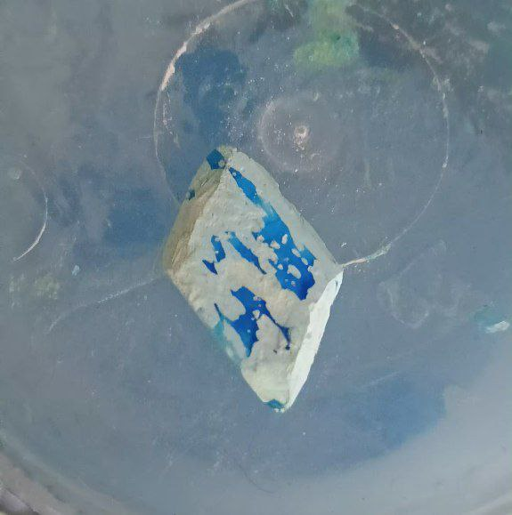
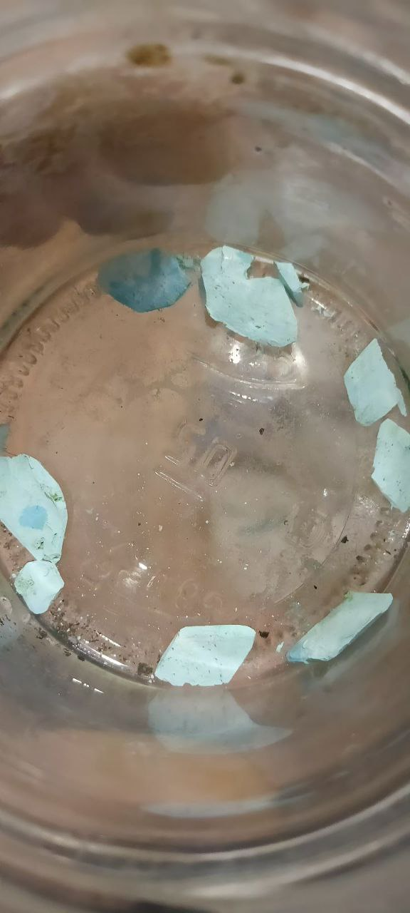
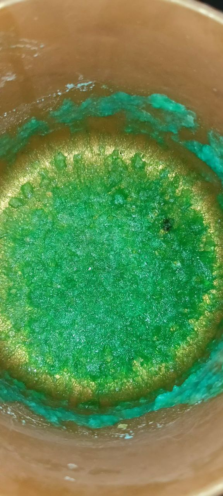
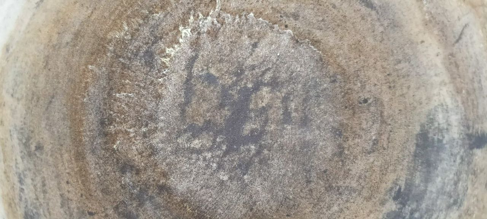

# Кристаллогидрат сульфата меди

## Частично обезвоженный

## Через множество дней гидратированный в обычных комнатных условиях (прошло 14 дней)

# Кристаллогидрат нитрата меди

# Ацетат Серебра (по краям)

