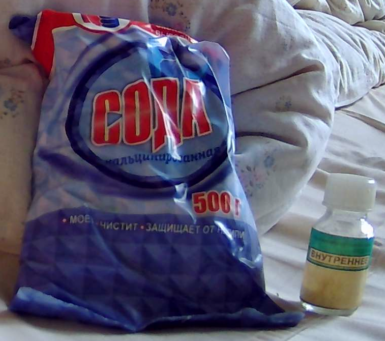
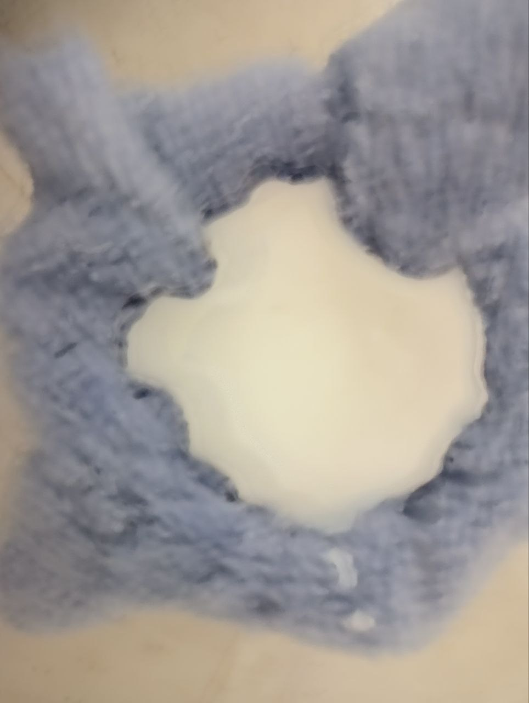
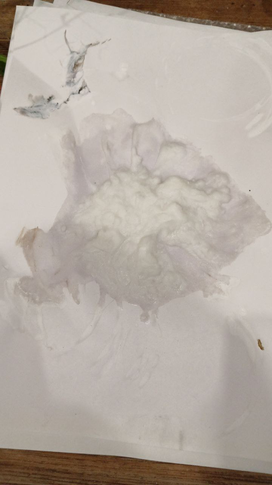
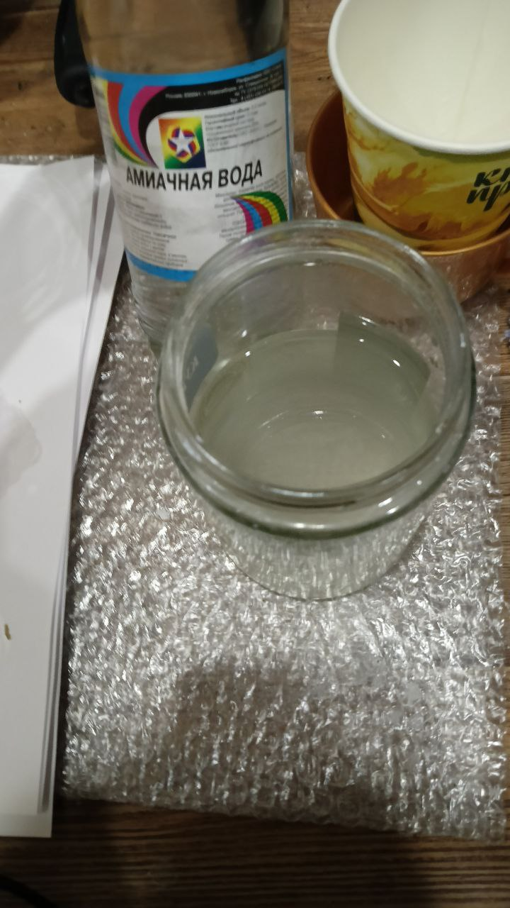
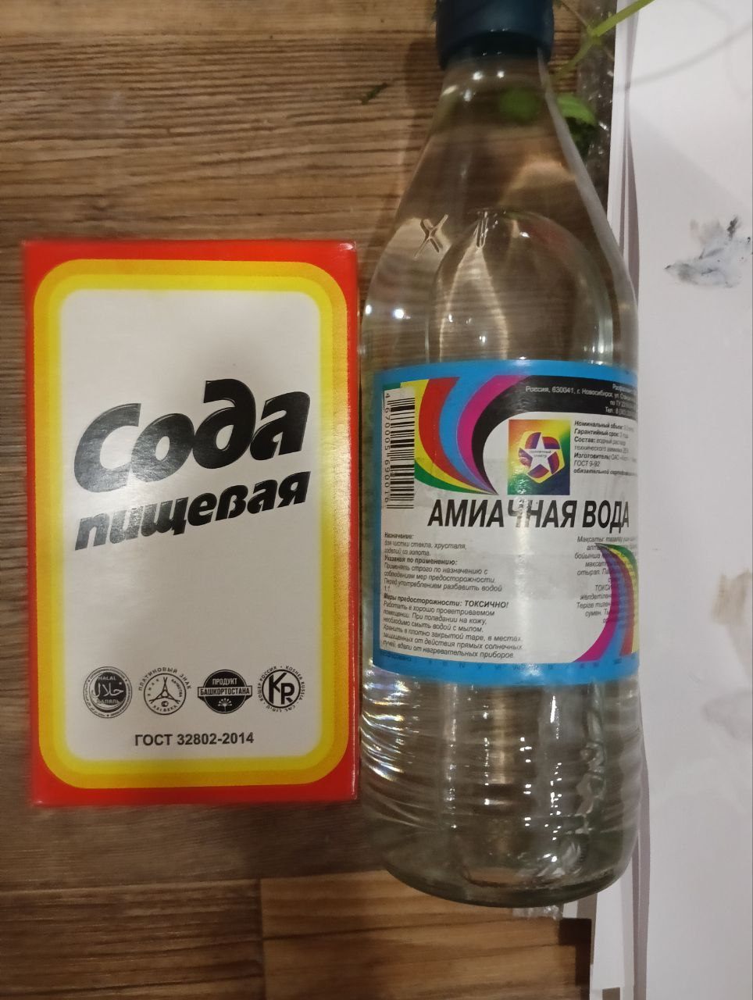
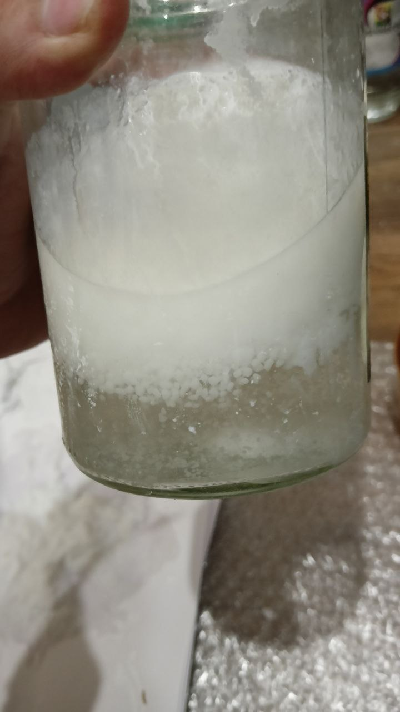
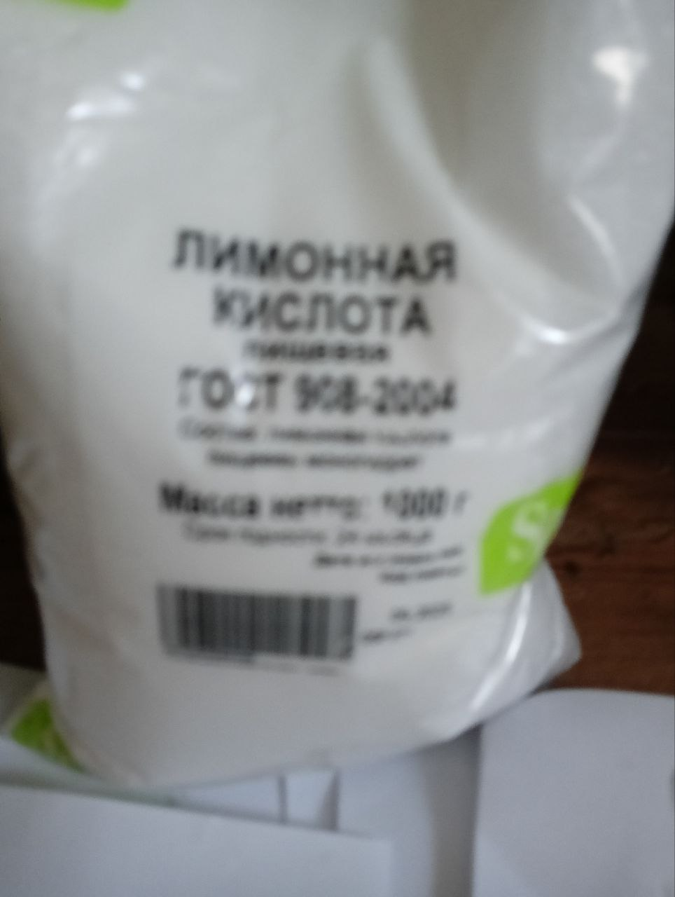
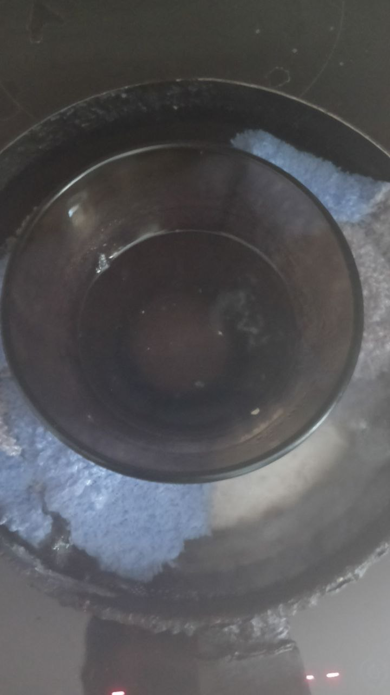
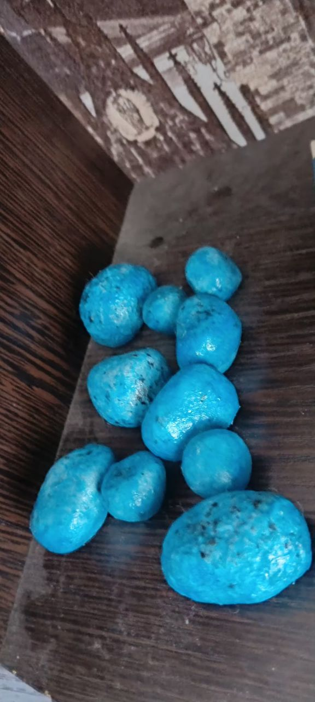

# Попытка получения через карбонат
Не было времени, но по таблице видел, что CO3(-^2) ион магния не растворим. Всё же решил попробовать, в прошлой части была попытка через углекислый натрий.
Я мог предположить, что сода за такое время слежилась и превратилась в гидрокарбонат натрия, то есть банально впитала воду. Но по идее, она была закрыта.
Поэтому я проверял её слабый раствор на вкус и с помощью раствора черного чая. Раствор чёрного чая поменял окраску и выпал осадок. Без лакмуса было сложно понять точно.
Когда я совсем не стал ничего понимать, как и чего, я написал Авак Авакяну и получил ответ:
"
 А про магний и кальций — кликнул Вашу страничку; Вы какой–то ужас творите… 😳🥶😱 Во–первых, мне видится, что Ваш камень с улицы — не известняк, а бетон. В нём до чёрта чего. Карбонат кальция там, конечно же, присутствует. А раствор окрасился ЖЕЛЕЗОМ, которое в Земной природе вообще «вездесущее».

Идея получать так цитрат магния вообще непонятна. Во–первых, цитрат кальция почти нерастворим в воде и значительно менее растворим, чем цитрат магния. Сульфат кальция (гипс) растворим лучше цитрата кальция. Так что даже если бы Вам удалось получить цитрат кальция — его реакция с сульфатом магния не пойдёт (равновесие смещено к исходным реагентам, потому что цитрат кальция в этом уравнении самый нерастворимый). Растворять мел в лимонной кислоте — реакция идёт, но весьма медленно и с замедлением, потому что продукт — цитрат кальция — почти нерастворим и ещё и пассивирует мел, покрывая его плёнкой.

Если не охота покупать готовый цитрат магния, то я бы поступил так:
1) реакцией сульфата магния с СОДОЙ (любой) я получил бы осадок карбоната магния (растворы брал бы крепкие, чтобы реакция лучше шла).
2) Отфильтровал бы полученный осадок карбоната магния (и ещё воду через него на фильтре лил бы, чтобы убрать водный раствор сульфата натрия) и затем положил бы этот карбонат магния в водный раствор лимонной кислоты. Реакция пойдёт достаточно не медленно, и Вы получите цитрат магния.
"

Добавил, что пробовал, но не вышло и попробую ещё раз.
Не успев попробовать мне пришёл ответ:
"
➾ Попробовал: оказывается, да, действительно, ГИДРОкарбонат натрия (пищевая сода) НЕ даёт осадок с сульфатом магния, причём при любом соотношении реагентов. В справочниках об этом не говорится, но это факт. Судя по всему, гидрокарбонат даёт слишком кислую среду, и в ней устойчивыми оказываются растворимые двойные сòли типа MgSO4×2NaHCO3.

Зато кальцинированная сода Na2CO3, которую можно получить, нагрев на спиртовке пищевую соду (а можно и купить, она продаётся), — она мгновенно даёт осадок карбоната магния с сульфатом магния.

Раз дело в щёлочности, я поступил так: смешал в примерно равных объёмных количествах сульфат магния и пищевую соду, полностью растворил их в воде и затем накàпал туда нашатырный спирт (водный раствор аммиака; в роли подщелочителя). И — ура: мгновенно полностью выпал карбонат магния.

То есть в раствор сульфата магния и пищевой соды, взятых в примерно равных объёмных количествах, — накàпайте водный раствор аммиака. И всё получится (весь магний выпадет в виде карбоната магния).

Мораль: даже самые «элементарные» реакции в реальности могут идти НЕ ТАК, КАК В УЧЕБНИКАХ. И вот так «на ровном месте», начав пробовать на практике «элементарные» «азы», — мы делаем открытия. И, как минимум, создаём новые технологии.
"
По поводу соды, что добавить - [reddit](https://www.reddit.com/r/chemistry/comments/1e46xwg/mgso4_nahco3_na2so4_mgco3_co2/) такое пишут и в интернетах. Якобы должно разлагаться, но я на ночь оставлял раствор ничего в осадок НЕ падало. Может быть если и нагреть, то будет реакция, но это нужно проверять, а сульфат магния заканчивается... Поэтому потом как-нить

## Реакция Авака, которую Он мне прислал (Na2CO3 + MgSO4)




<video width="640" height="360" controls>
  <source src="{{ '/experimets/AceMg/2/Avak/Na2CO3_and_MgSO4_web.mp4' | relative_url }}" type="video/mp4">
  Ваш браузер не поддерживает видео.
</video>

## Мои наблюдения

Решил всё же я получить точно карбонат натрия, а не верить буковкам на бумажке.
Купил соду и проколол её на сковороде, что бы не дышать сильно пылью и углекислым газом включал вытяжку.


<video width="640" height="360" controls>
  <source src="{{ '/experimets/AceMg/2/NaHCO3toNaCO3H2OCO2_web.mp4' | relative_url }}" type="video/mp4">
  Ваш браузер не поддерживает видео.
</video>

Сама реакция:

<video width="640" height="360" controls>
  <source src="{{ '/experimets/AceMg/2/Na2CO3andMgSO4_web.mp4' | relative_url }}" type="video/mp4">
  Ваш браузер не поддерживает видео.
</video>

Дальше фильтрование и сушка




## Попытка получить через гидрокарбонат

Наполнил дно банки содой и магния сульфата 25 грамм пакетика. По отдельности их растворил в воде и после чего смешал. Оставил до утра. Реакция не прошла.



В арсенал пошёл аммиачный раствор 25%



<video width="640" height="360" controls>
  <source src="{{ '/experimets/AceMg/2/MgSO4NaHCO3NH4OH_web.mp4' | relative_url }}" type="video/mp4">
  Ваш браузер не поддерживает видео.
</video>

И о чудо, даже лучше осадок чем при карбонате. При быстром разделение его проще будет отделить, потому-что расствор становится не коллоидным, а прям навверху остаются куски прям
Потом они становятся как паста и если как-то по особому фильтровать, то даже проще
Вот как выглядит в начале:



## Сушка

Сошкрябал с тряпки куски и положил их сначала в стаканчик бумажный, потом высыпал на бумагу. От реакции с аммиаком просто ножом сошкрябал, но эффективнее я так понимаю будет какой-то другой способ отделения от воды. Возможно, какие-то коагулянты могут понизить коллоидность. Можно проверить с хлоридом аммония.

Взял лимонную кислоту и добавил к высохшему, оно в воде не растворялось, но вода немного становилось белой. То есть, образовывать коллоид, кажется может, но слабо.

## Получение самого цитрата



<video width="640" height="360" controls>
  <source src="{{ '/experimets/AceMg/2/AcidAndMgCO3_web.mp4' | relative_url }}" type="video/mp4">
  Ваш браузер не поддерживает видео.
</video>


Поставил на водяную баню, до состояния, когда начало появляться стеклышко на вверхней части и выпадать что-то аморфное



Пришлось понизить на ~1/3 объем что бы началась хоть какая-то кристаллизация

## Кристаллизация

С кристаллизацией проблема вышла, как у меня, так и у Авака. Оставляя на 2 дня после выпаривания не дало результатов дальше тягучей жижы.


Спросил на форуме [xumuk](https://forum.xumuk.ru/topic/314673-%D0%BA%D0%B0%D0%BA-%D0%BA%D1%80%D0%B8%D1%81%D1%82%D0%B0%D0%BB%D0%BB%D0%B8%D0%B7%D0%BE%D0%B2%D0%B0%D1%82%D1%8C-%D1%80%D0%B0%D1%81%D1%82%D0%B2%D0%BE%D1%80-%D1%86%D0%B8%D1%82%D1%80%D0%B0%D1%82%D0%B0-%D0%BC%D0%B0%D0%B3%D0%BD%D0%B8%D1%8F/)


Посоветовали сушку в вакууме, сделал подобие вакуума - тоже без результатно, тягуая жидкость лишь стала жидкостью.


Сообщения Авака на эту тему:

```
Ещё раз здравия. 😊
Глянул на форуме: совет с вакуумом не поможет. 😊 Я обнаружил, что этот сироп очень гигроскопичен: за считанные часы он увеличивается в объёме и делается всё жиже, поглощая влагу из воздуха. Даже если положить его в эксикатор над 94% серной кислотой, — да, он обезводится, но останется АМОРФНЫМ (НЕ кристаллизуется), и как только мы его достанем из эксикатора — он тут же вновь расплывётся в сироп, впитывая влагу из воздуха. Такая проблема НЕ уникальна. То же самое демонстрирует кальциевая селитра. Термически она устойчивее и её можно смело выпарить и прокалить (она НЕ разложится); при этом получается сухая белая АМОРФНАЯ пористая масса, но как только мы выключаем нагрев — она впитывает влагу из воздуха, превращаясь в не кристаллизующийся гигроскопичный сироп. Как её кристаллизовать? — Достаточно сконцентрировать до НУЖНОЙ концентрации, ДО превращения в сироп, и — она кристаллизуется в тетрагидрат. Этот тетрагидрат — НЕ гигроскопичен, устойчив на воздухе (НЕ расплывается); это красивые кристаллы.

Цитрат магния, я уверен, тоже удастся кристаллизовать. Есть куча приёмов. Просто сейчас я «подтормаживаю», потому что 1) чиню свои компьютеры, 2) разработал новый тест на СТИРОЛ и 3) сегодня у меня получилось ОТКРЫТИЕ: в растворе, полученном после фильтрования карбоната магния, синтезированного с применением аммиака, — в этом растворе у меня кристаллизовался АРТИНИТ!!! По английски «Artinite», формула MgCO3•Mg(OH)2•3H2O. Это тригидрат гидроксокарбоната магния, природный минерал, он НЕрастворим в воде. Выглядит — сферолиты (шарики–ёжики из игольчатых кристаллов), очень похожие на сферолиты питьевой соды. Вот он в природе:
https://www.mindat.org/gm/377
Искусственное выращивание водоНЕрастворимых минералов из водных растворов — классная штука. Изучу подробности условий его кристаллизации, и — это будет моим очередным докладом в Пермский научный геолсборник. 👍
...
И Вам здравия!
Личные сообщения цитируйте сколько угодно — это даже хорошо.
Поглядел Вашу страничку, рад, что с аммиаком у Вас получилось. Кстати, мощная у Вас электроплитка: это шикарно, как у Вас питьевая сода обезвоживалась в кальцинированную (я все Ваши видео и глядел и скачал, классно). Прекрасно, что результат с кальцинированной содой тоже получился.

А вот с лимонной кислотой — что–то у Вас не то. Я отфильтровал тот карбонат магния, синтез которого прислал Вам на видео. Затем приготовил водный раствор лимонной кислоты и — этот карбонат магния мгновенно (БЕЗ всякого нагрева!) «зашипел», выделив углекислый газ, и растворился в лимонной кислоте, образовав идеально прозрачный раствор. Он повёл себя, как если бы я бросил в лимонную кислоту питьевую соду. Даже ещё быстрее и охотнее растворился, чем сода.

К слову, я придумал «лайфхак»: дело в том, что на обычных фильтрах, представляющих собой воронку из туалетной бумаги или тряпки, — ТЕРЯЕТСЯ много и раствора (оставаясь впитанным в фильтре), и осадка (прилипшего к фильтру). Я стал делать иначе: запихивать В НОСИК воронки или шприца, из которого убран поршень, кусочек ваты (или туалетной бумаги, но бумага — хуже). Потери на этом крошечном кусочке ваты — незначительны. Шлю Вам ВИДЕО, где я фильтрую раствор, полученный в моём предыдущем видеоролике (можете положить это видео на Ваш блог). В носик шприца (из которого убран поршень) вставлен крошечный кусочек ваты (нужно только, чтобы он легко НЕ выпадал). Заметьте, что это ничтожное количество осадка полностью бы «въелось» в фильтры из промокашки или тряпки, а тут — потерь вообще нет, и осадок НЕ загрязняется бумагой.

А далее, я решил получить цитрат магния в виде кристаллов, и — вот тут оказалась «проблемка». Я попробовал его выпарить, но по краям выпаривающегося раствора получается темнеющая корка — такая органика при нагревании разлагается. Та же часть, которая не потемнела, стала крайне вязким не кристаллизующимся сиропом (как вязкая бесцветная смола). В воде она идеально растворяется (даже в капле воды), превращаясь в не вязкий прозрачный раствор. Попытка осадить из этого раствора цитрат магния приливанием изопропилового спирта НЕ привела к успеху: маленькое количество спирта ничего не меняет; если же спирта больше — при перемешивании раствор мутнеет, но в микроскоп видно, что это НЕ кристаллы цитрата магния, а микрокапельки водного раствора в окружении спирта (то есть эмульсия). То есть: греть нельзя; выпаривание не даёт результат (получается смолообразный не кристаллизующийся бесцветный сироп); спиртом не осаждается. Надо будет попробовать другие пути: в первую очередь, попробовать ВЫМОРОЗИТЬ (положить водный раствор цитрата магния в морозильник). В ряде подобных случаев, когда вода становится льдом, растворённое в ней вещество становится кристаллами. Есть и другие пути. «Высаливание» можно делать не только спиртом; можно, подобрать таую соль, которая НЕ среагирует с цитратом магния, но будет более водорастворимой. Добавление таких соединений заставляет наш продукт выпадать из раствора. Будем’с пробовать. 🤔
```

Видео Авакяна с фильтрацией:

<video width="640" height="360" controls>
  <source src="{{ 'experimets/AceMg/2/Avak/Фильтрование_web.mp4' | relative_url }}" type="video/mp4">
  Ваш браузер не поддерживает видео.
</video>


## Бонус (искуственные камни из цитрата кальция)
Камни делал так:
Взял ~2 ложки лимонной кислоты, сделал раствор. добавлял к раствору карбонат кальция и так пока реакция не затихала, иногда мешал
В один момент всё выпало в осадок, когда уже реакция толком и не шла
Потом слепил формы, поставил в печь на 3 часа при 50 градусов, на бумаге. Потом поставил на 100 градусов на полтора часа. После оставил охлаждаться в печи.
Потом сделал смесь акрилового лака с люминофором и покрасил.





## Какие варианты кристаллизации перепробованы
- Добавление спирта в раствор
- Полу вакуум
- Добавление чего-то в раствор (органика, лимонная кислота)
- Замораживание
## Весточка от Авака
```
Здравствуйте!

ПОЛУЧИЛ Все Ваши письма. Компьютерную и видеотехнику ПОЧИНИЛ. С цитратом магния исследования продолжаю. Выморозить не получилось: раствор идеально становится льдом в морозилке, но при этом не разделяется на кристаллы цитрата и кристаллы льда. Высолить тоже пока не получилось. Зато я нашёл полезную информацию о ПОДОБНЫХ соединениях: цитрате железа2 и цитрате свинца2:

https://ru.crystalls.info/%D0%A6%D0%B8%D1%82%D1%80%D0%B0%D1%82_%D0%B6%D0%B5%D0%BB%D0%B5%D0%B7%D0%B0%28II%29

https://ru.crystalls.info/%D0%A6%D0%B8%D1%82%D1%80%D0%B0%D1%82_%D1%81%D0%B2%D0%B8%D0%BD%D1%86%D0%B0%28II%29

Про цитрат железа сказано: «Избыток лимонной кислоты замедляет испарение раствора, вплоть до полной остановки.». Про цитрат свинца сказано: «Избыток лимонной кислоты приводит к загустеванию раствора, вплоть до полной остановки испарения». Таким образом, с этой проблемой химики уже сталкивались: и, оказывается, получение не испаряющегося вязкого гигроскопичного сиропа происходит от ИЗБЫТКА ЛИМОННОЙ КИСЛОТЫ.

К слову, сама лимонная кислота кристаллизуется из воды прекрасно; и ещё, она ОЧЕНЬ растворима. При интенсивном помешивании в капле воды можно растворить несколько объёмов (равных капле) твёрдой лимонной кислоты. Ещё. Я обнаружил, что из питьевой соды и аммиака получается более пассивная форма карбоната магния, чем из кальцинированной соды. Реагирует с лимонной кислотой медленнее, но при перемешивании реакция всё равно быстро заканчивается.

Я сделал насыщенный водный раствор лимонной кислоты и положил в него избыток карбоната магния (из кальцинированной соды); раствор оставил на сутки. Через сутки отфильтровал от не среагировавшего избыточного карбоната магния. Получился прозрачный не вязкий раствор. Я налил его в миску и положил эту миску на батарею отопления. И — он высох! Получилось прозрачное сморщенное нечто. Уже больше часа как я убрал миску с радиатора, но этот продукт влагу воздуха пока не впитал (то есть, надеюсь, гигроскопичности нет). ➡️ То есть твёрдым цитрат магния я уже получил. Но буду ещё экспериментировать. Попробую получить его из лимонной кислоты и избытка ГИДРОКСИДА магния (не карбоната). 👉🏼 Возможно, что с карбонатом реакция до идеала не доходит, и некоторый избыток лишней лимонной кислоты остаётся. Так что возможно, что с избытком ГИДРОКСИДА магния результатом станет не прозрачная сморщенная корка, а кристаллы цитрата магния.
```
## Что дальше?
 ** Продолжение будет позже **
