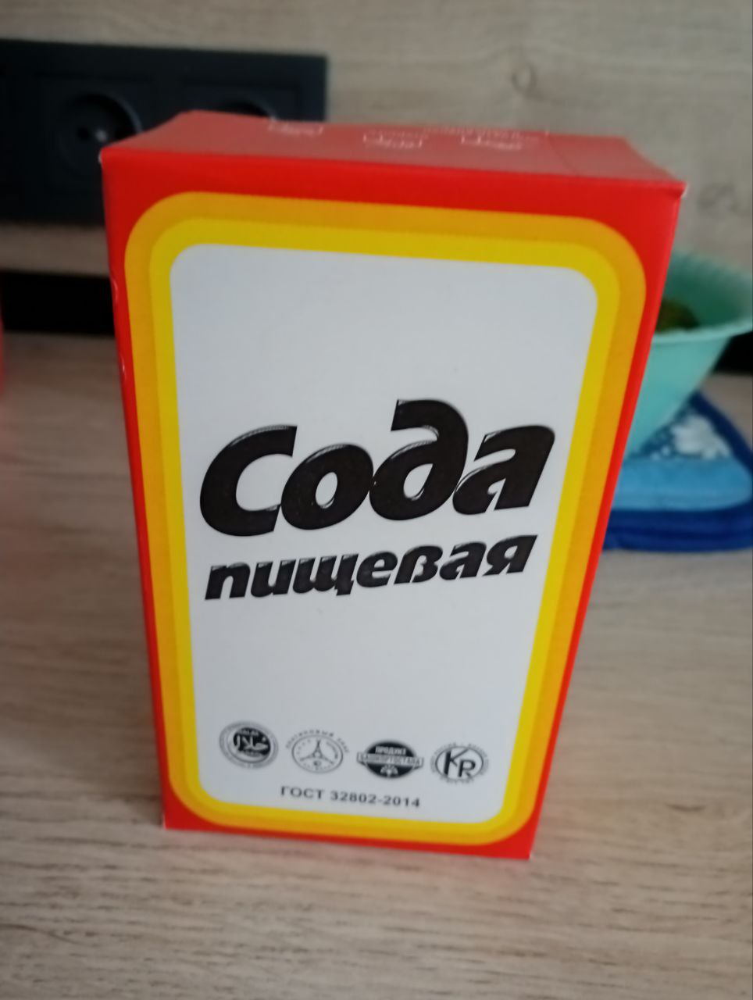

# Попытка получения через карбонат
Не было времени, но по таблице видел, что CO3- ионе магний не растворим. Всё же решил попробовать, в прошлой части была попытка через углекислый натрий.
Я мог предположить, что сода за такое время слежилась и превратилась в гидрокарбонат натрия, то есть банально впитала воду. Но по идее, она была закрыта.
Поэтому я проверял её слабый раствор на вкус и с помощью раствора черного чая. Раствор чёрного чая поменял окраску и выпал осадок. Без лакмуса было сложно понять точно.
Когда я совсем не стал ничего понимать, как и чего, я написал Авак Авакяну и получил ответ:
"
 А про магний и кальций — кликнул Вашу страничку; Вы какой–то ужас творите… 😳🥶😱 Во–первых, мне видится, что Ваш камень с улицы — не известняк, а бетон. В нём до чёрта чего. Карбонат кальция там, конечно же, присутствует. А раствор окрасился ЖЕЛЕЗОМ, которое в Земной природе вообще «вездесущее».

Идея получать так цитрат магния вообще непонятна. Во–первых, цитрат кальция почти нерастворим в воде и значительно менее растворим, чем цитрат магния. Сульфат кальция (гипс) растворим лучше цитрата кальция. Так что даже если бы Вам удалось получить цитрат кальция — его реакция с сульфатом магния не пойдёт (равновесие смещено к исходным реагентам, потому что цитрат кальция в этом уравнении самый нерастворимый). Растворять мел в лимонной кислоте — реакция идёт, но весьма медленно и с замедлением, потому что продукт — цитрат кальция — почти нерастворим и ещё и пассивирует мел, покрывая его плёнкой.

Если не охота покупать готовый цитрат магния, то я бы поступил так:
1) реакцией сульфата магния с СОДОЙ (любой) я получил бы осадок карбоната магния (растворы брал бы крепкие, чтобы реакция лучше шла).
2) Отфильтровал бы полученный осадок карбоната магния (и ещё воду через него на фильтре лил бы, чтобы убрать водный раствор сульфата натрия) и затем положил бы этот карбонат магния в водный раствор лимонной кислоты. Реакция пойдёт достаточно не медленно, и Вы получите цитрат магния.
"

Добавил, что пробовал, но не вышло и попробую ещё раз.
Не успев попробовать мне пришёл ответ:
"
➾ Попробовал: оказывается, да, действительно, ГИДРОкарбонат натрия (пищевая сода) НЕ даёт осадок с сульфатом магния, причём при любом соотношении реагентов. В справочниках об этом не говорится, но это факт. Судя по всему, гидрокарбонат даёт слишком кислую среду, и в ней устойчивыми оказываются растворимые двойные сòли типа MgSO4×2NaHCO3.

Зато кальцинированная сода Na2CO3, которую можно получить, нагрев на спиртовке пищевую соду (а можно и купить, она продаётся), — она мгновенно даёт осадок карбоната магния с сульфатом магния.

Раз дело в щёлочности, я поступил так: смешал в примерно равных объёмных количествах сульфат магния и пищевую соду, полностью растворил их в воде и затем накàпал туда нашатырный спирт (водный раствор аммиака; в роли подщелочителя). И — ура: мгновенно полностью выпал карбонат магния.

То есть в раствор сульфата магния и пищевой соды, взятых в примерно равных объёмных количествах, — накàпайте водный раствор аммиака. И всё получится (весь магний выпадет в виде карбоната магния).

Мораль: даже самые «элементарные» реакции в реальности могут идти НЕ ТАК, КАК В УЧЕБНИКАХ. И вот так «на ровном месте», начав пробовать на практике «элементарные» «азы», — мы делаем открытия. И, как минимум, создаём новые технологии.
"
По поводу соды, что добавить - [reddit](https://www.reddit.com/r/chemistry/comments/1e46xwg/mgso4_nahco3_na2so4_mgco3_co2/) такое пишут и в интернетах. Якобы должно разлагаться, но я на ночь оставлял раствор ничего в осадок НЕ падало. Может быть если и нагреть, то будет реакция, но это нужно проверять, а сульфат магния заканчивается... Поэтому потом как-нить

Решил всё же я получить точно карбонат натрия, а не верить буковкам на бумажке.
Купил соду и проколол её на сковороде, что бы не дышать сильно пылью и углекислым газом включал вытяжку.

Сама реакция:

