# Супер дисклеймер
**внимание, соли меди являются тяжёлым металлом. коррозионным и вообще соблюдайте все ТБ и не повторяйте опыт, если ничего не понятно. автор публикует как личный эксперимент и отказывается нести риски за ваши действия**
# Эксперимент по получению основных солей

Лазия по просторам ютьюба, я обнаружил некоторые видео

Автор ролика посчитал, что у него зеленый осадок это сульфат натрия, но я ему написал, что сульфат меди не должен давать окраски. 
По Рэми, окраску дают ионы побочной подруппы и собственно, предположил, что у него там нитрат меди или малахит (нужно проверять).
Сами видео вдохновили идеей попробовать получить основные соли той же меди

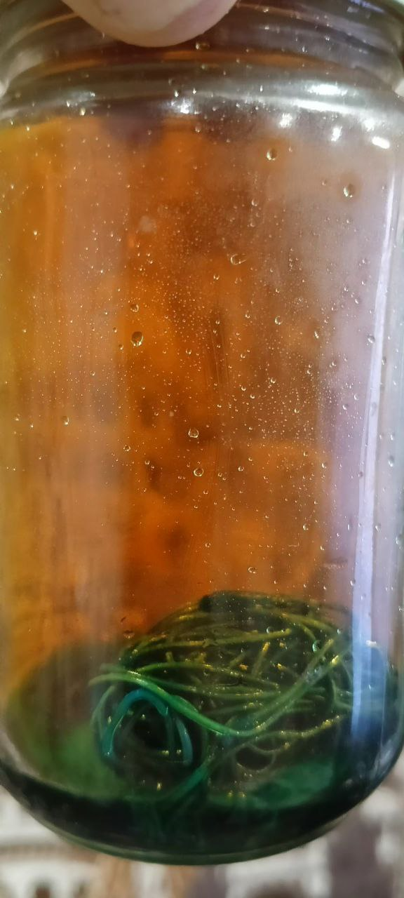
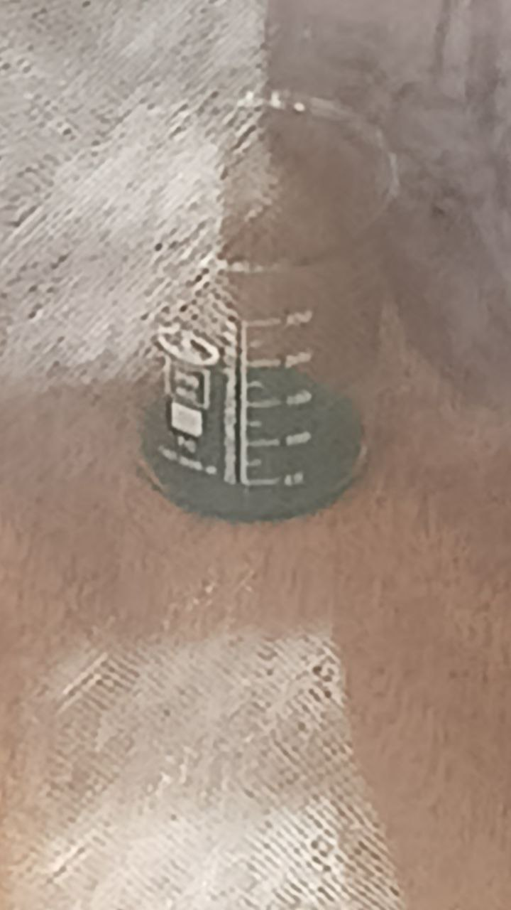

Взял гидроокись калия

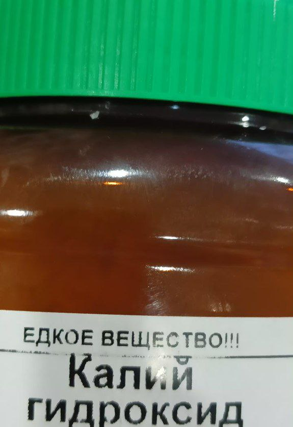

Кристаллики похожи на некие поломанные квадратики
Сначала у меня выпадал синий осадок, сам раствор стал вместо зеленого синим. Я подумал, что мне очень уж видите ли жалко кислоту переводить и мне нужен больше выход (раствор при этом нагревался). Я добавил больше - выпал черный осадок. (как после я убедился это окись меди)

Добавлял кислоту лимонную до pH 7, осадок упал и был зеленый раствор. Помешал - снова появился этот осадок-коллоид. Профильтровал

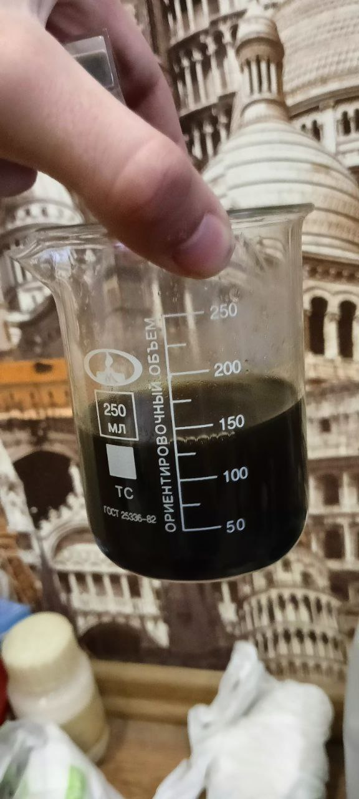
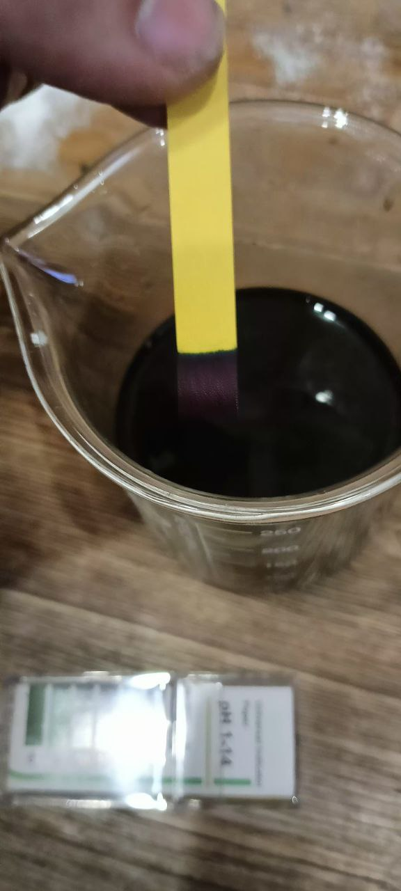

Сам раствор при этом был зеленым

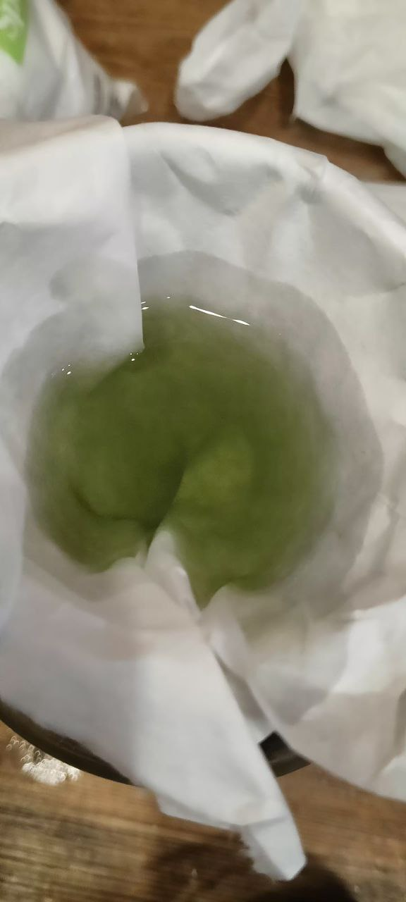
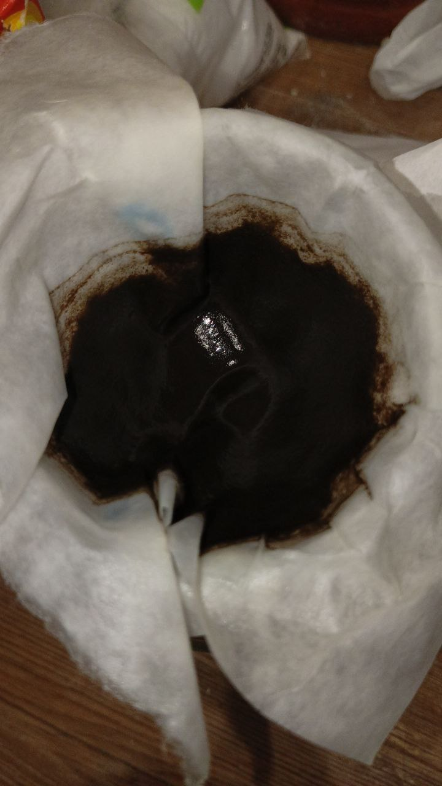


Проверил осадок электролитом, получился синий цвет голубоватый (сульфат меди, мало безводный, серная кислота почти 40% и в переизбытке): 

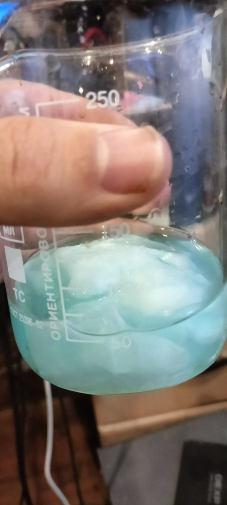


Отлил свой раствор уже в первый раз полученный в пробирку

## Само получение Cu(OH)2

<video width="640" height="360" controls>
  <source src="{{ '/experimets/BasicSalts/Ca(OH)2.mp4' | relative_url }}" type="video/mp4">
  Ваш браузер не поддерживает видео.
</video>

Осадок профильтровал, закинул фильтрат в колбу и залил 6% уксусом в следовом кол-ве

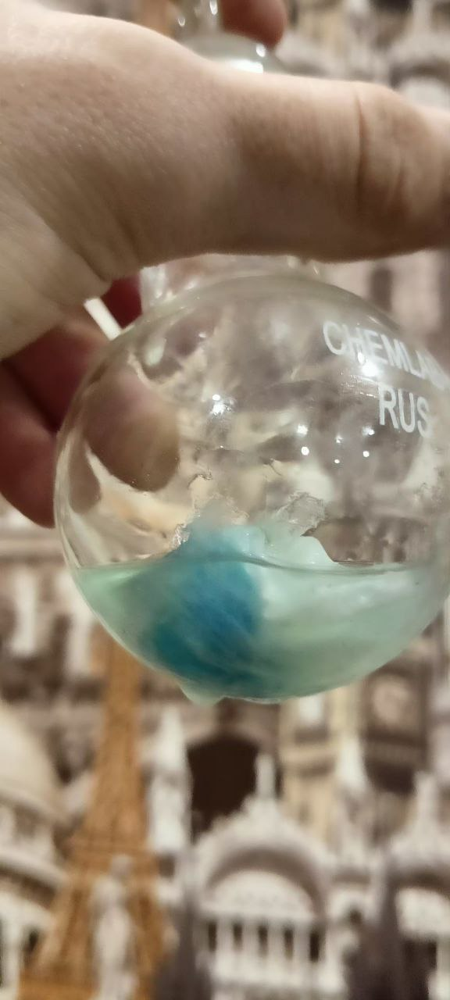

## Результат

Полупрозрачные зеленовато-синие кристаллы и полупрозрачный синеватый раствор в пробирке (возможно основная соль меди, гидрокси-ацетат)

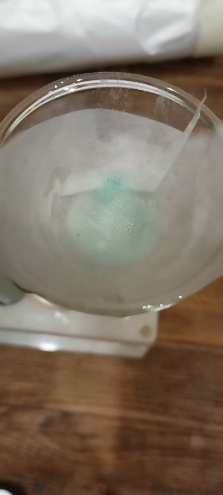
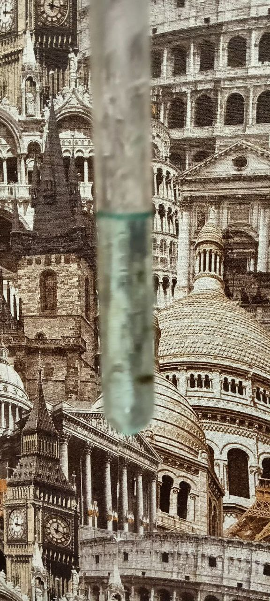


## Те самые видео

1 - https://www.youtube.com/watch?v=70mLVytWdNk
2 - https://www.youtube.com/watch?v=MZwYG6dG8CY

# Попытка получения малахита

Уточнил у Авак Аваковича про основные соли меди и получил весточку:

```
 Про оснòвные сòли меди — тема предельно «пакостная»: медь ПРЕЖДЕ ВСЕГО реагирует на ПОДЩЕЛАЧИВАНИЕ среды ГИДРОЛИЗОМ, давая гидроксоИСХОДНУЮ соль меди. Ионный обмен с другими солями при этом может вообще не происходить. Например, добавляя в водный раствор медного купороса щёлочи, либо тринатрийфосфат, либо питьевую соду, либо другие реактивы, ПОДЩЕЛАЧИВАЮЩИЕ среду, — выпадает ОДИН И ТОТ ЖЕ голубоватый осадок гидроксоСУЛЬФАТА меди. Из дихлорида меди в этих условиях выпадает гидроксоХЛОРИД меди. Даже получение гидроксида меди оказывается не лёгкой задачей: выпадают гидроксоИСХОДНЫЕ сòли меди. В школе нам смешивают медный купорос с содой, и говорят, что «выпал малахит»; из купороса и тринатрийфосфата ждут фосфат меди, но реально ионный обмен практически не происходит, и выпадает ОДИН И ТОТ ЖЕ голубоватый осадок гидроксоСУЛЬФАТА меди.
```
 
И собственно правда, при гидролизе медного купороса образуется серная кислота, которая обратно возвращается в сульфат. Примерно так:

```
Аквакомплекс:
CuSO4 + 6HOH <=> [Cu(HOH)6]+2 + SO4^-2 <=> [Cu(HOH)5(OH)]+ + H+
Гидролиз примерно таков <=>
Cu^2+ + HOH <=> Cu(OH)+ + H+ 
SO4^-2 + H+ <=> HSO4^-
HSO4^-1 + H+ <=> H2SO4
Среда будет кислой из-за того, что серная кислота сильная кислота
При добавление бикарбоната натрия
NaHCO3 => Na+ + HCO3- (соединение устойчивое)
HCO3- + H2SO4 = HSO4- + H2CO3 => HSO4- + H2O + CO2^
HSO4- + HCO3- + H+ => SO4^-2 + H2CO3 => SO4^-2 + H2O + CO2^
Или в ионном виде
HCO3- + H+ => H2CO3 => HOH + CO2^
HSO4- + H+ <=> H2SO4
Тогда в растворе остается CO2 и Cu(OH)+, HCO3- цепляется к этому соединению
2Cu(OH)HCO3 и сразу же разлагается => Cu2(OH)2CO3 + HOH + CO2
Последнее падает в осадок
Таким образом мы получаем основную соль (малахит)
В растворе остается Na+ + SO4^-2
```

Высохший осадок с прошлого эксперимента:

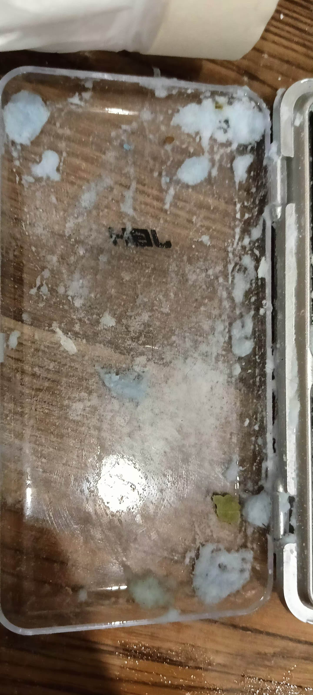

Реакция получения малахита:

<video width="640" height="360" controls>
  <source src="{{ 'experimets/BasicSalts/Malahit/Реакция получения малахита.mp4' | relative_url }}" type="video/mp4">
  Ваш браузер не поддерживает видео.
</video>

Странный синий осадок, возможно азурит:

<video width="640" height="360" controls>
  <source src="{{ 'experimets/BasicSalts/Malahit/Странный осадок синий.mp4' | relative_url }}" type="video/mp4">
  Ваш браузер не поддерживает видео.
</video>

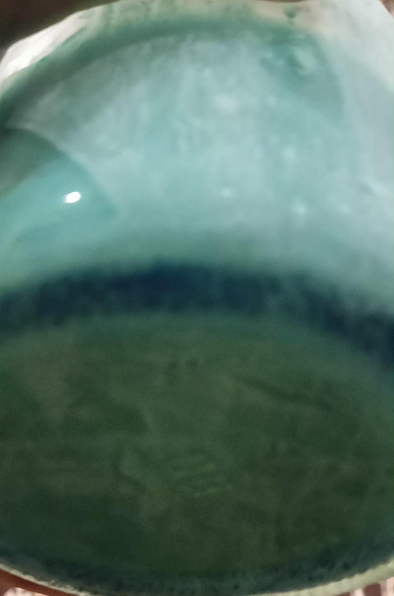

Мокрый осадок малахита:

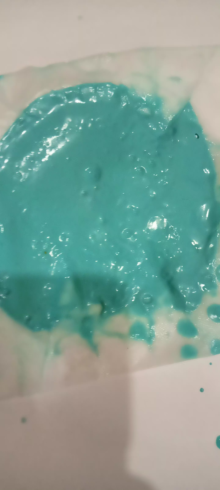

Раствор сульфата натрия (чистый, следовательно в видео ошибочно автор считал сульфат натрия солью, которая зеленого цвета)

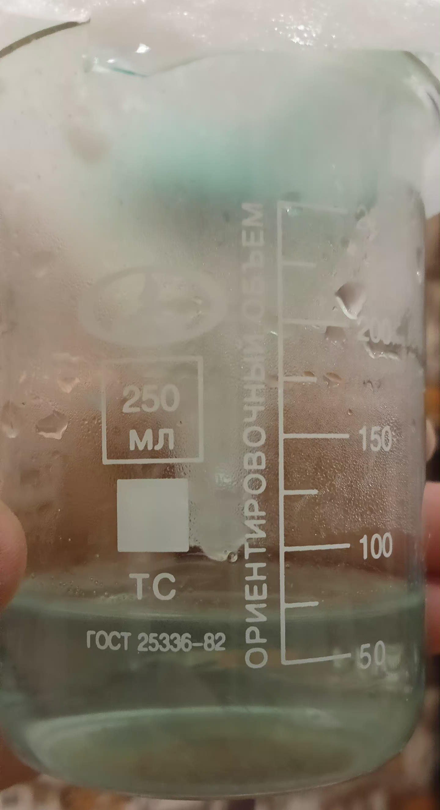


Готовый малахит, после промывки, фильтрации на фильтрованной бумаге и сушке в печи при 100С:

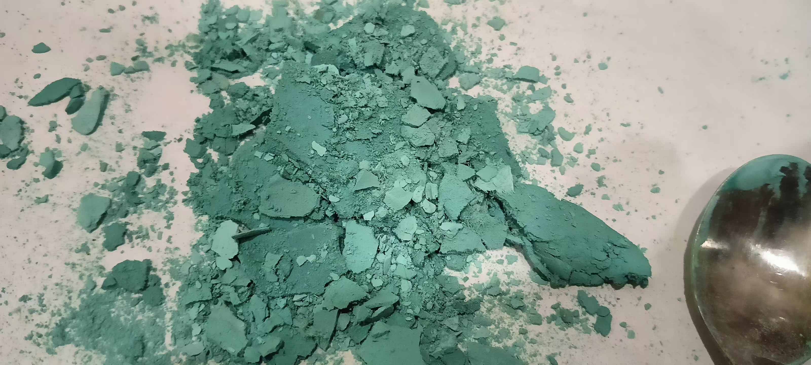

Сам малахит себя ведет как коллоидный раствор и долго коагулирует, поэтому приходилось декантацией удалять воду. При нагревании раствора быстрее оседает. Для промышленного производства нужен какой-то хороший фильтр, что фильтрует мелкодисперсные коллоидные растворы, что бы не тратить время на очистку.


Так как CuSO4 продается в виде кристаллогидрата CuSO4 * xHOH, то вес полученный с 50 грамм у меня с учетом потерь составил ~15 грамм. (при первой очистке больше ожидаемоего на 40%)

при комнатной температуре получается что-то, больше похожее на азурит:

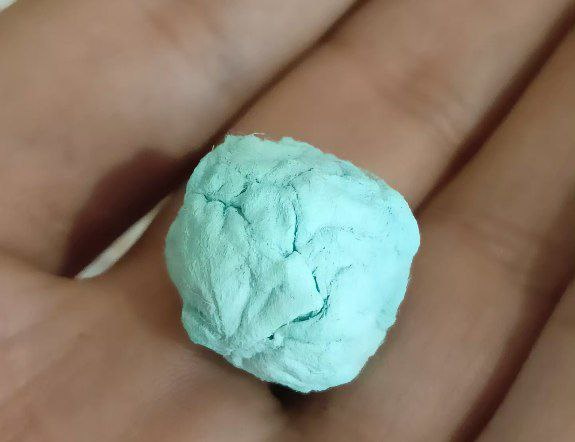


## Следующий этап 

Тоже самое, но взять для экспериментов уже готовый хлорид железа 3
