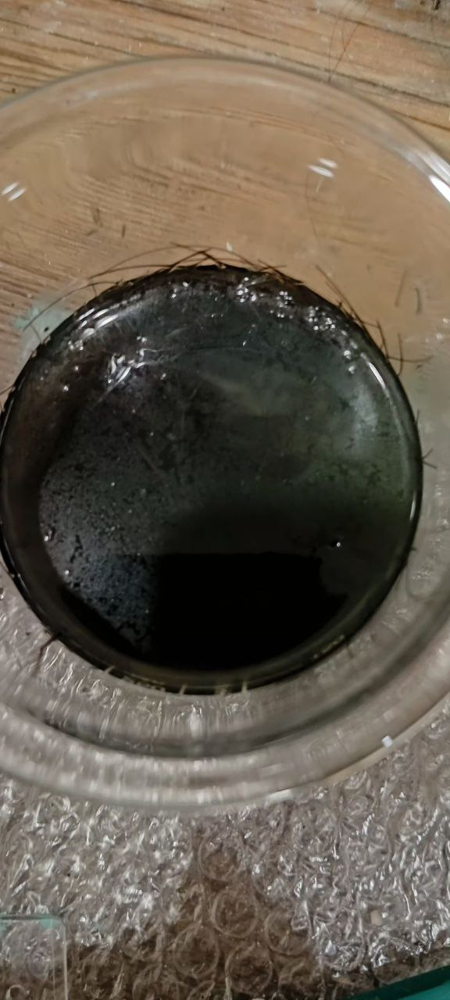
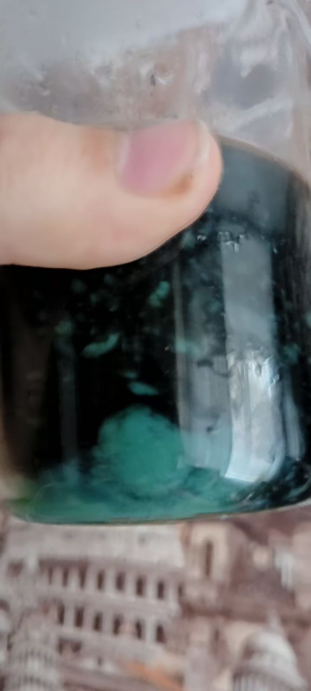
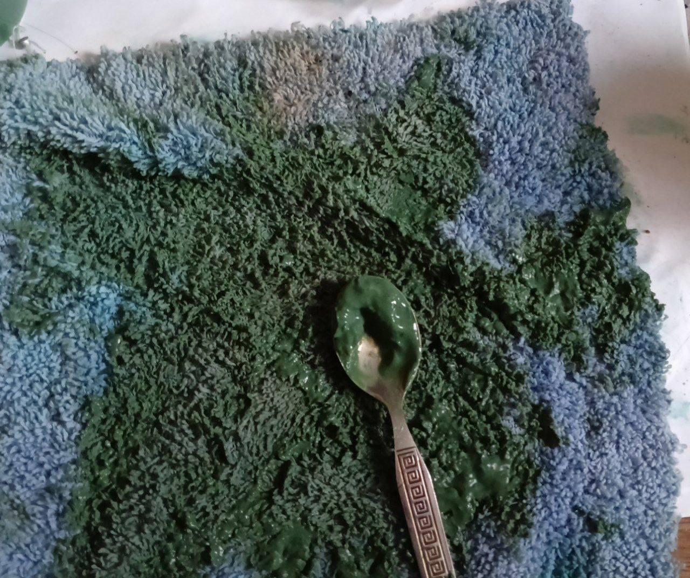
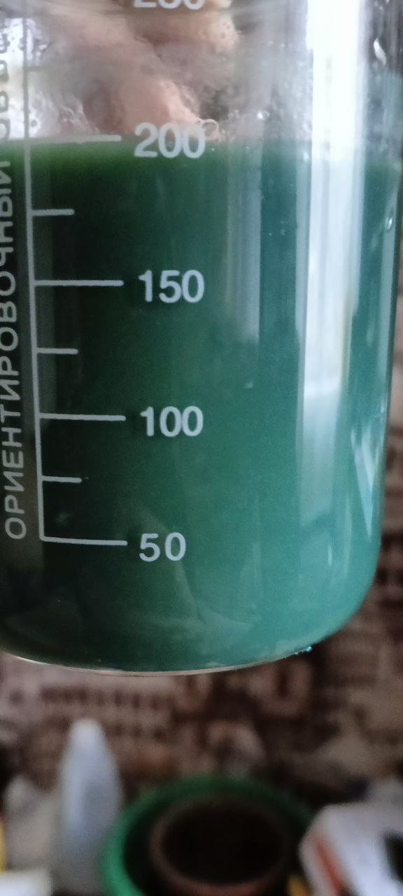
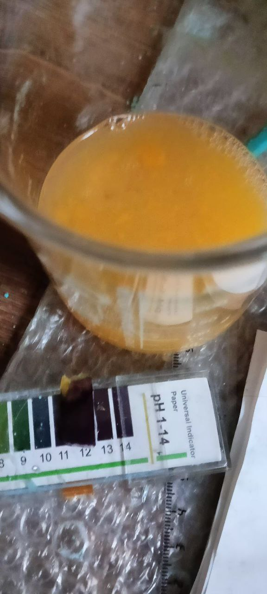
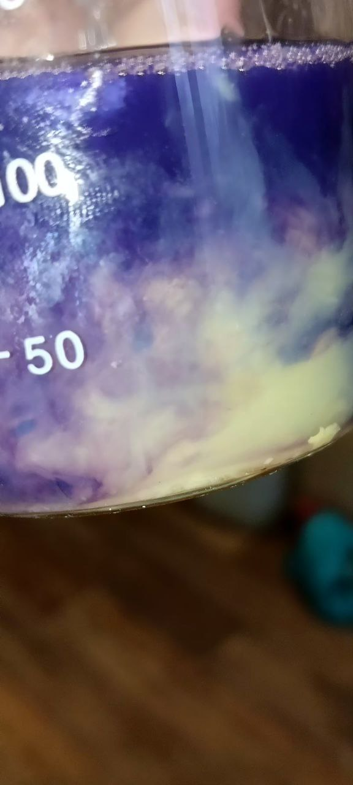
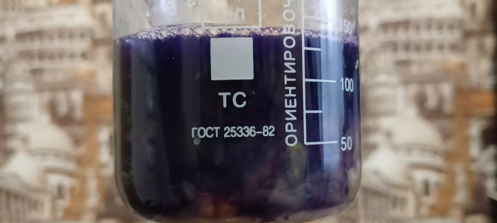
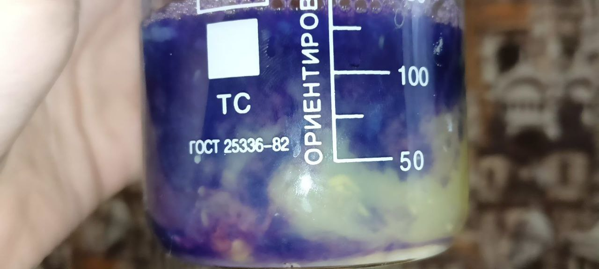
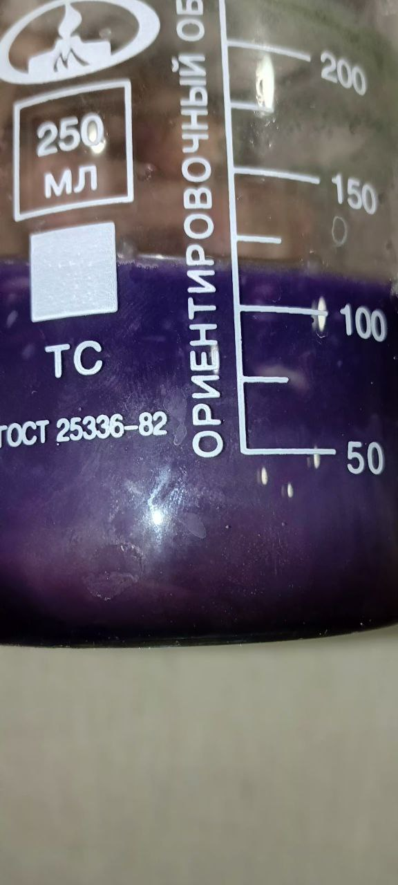
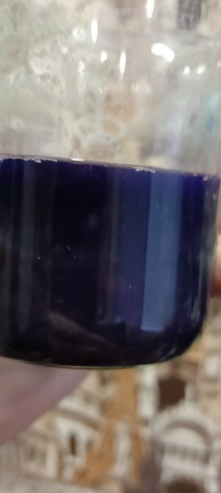

# Цель

Проверить, возможно ли разрушить белковые связи в волосах щелочью без нагревания

Реагенты: KOH в количестве, обеспечивающем pH 14. Даже немного в переизбытке.
Сульфат меди (CuSO4*nH2O) в следовых кол-вах. С волосами пытался добавлять до максимума ожидая фиолетовый оттенок, лишь реакция похожая на получения малахита.

# Сами волосы

Положил волосы с головы и немного не с головы в раствор щелочи (едкого кали). Оставил на дня 3.

Через 3 дня отделил волосы по максимум от раствора и залил туда немного раствора сульфата меди, как результат вообще не биуретовая реакция, а зеленый осадок (возможно малахита)
При этом, pH за несколько дней поменялся, а сам раствор на ложке был желтоватым. Запах не из приятных

Как видно, никакой биуретовой реакции вообще нет. Следовательно, либо реакция гидролиза белков не идет без агрессивной реакции (нагревания, энергия активации), либо настолько сильна связь в волосах. Стоит учесть, что волосы не с головы всё же вроде растворились или стали жижой. 

# Биуретовая реакция с яйцом

Биуретовая реакция с белками, пептидами, это такая реакция, при которой белки дают фиолетовый оттенок в щелочной среде с солями меди. Эта реакция имеет только практическое применение в аналитической химии.

Как пример биуретовой реакции взял яйцо и размешал его до массы однородной (с желтком). Добавил щелочи до pH 14

Прилил немного раствора сульфата меди

Через время

Видно явное образование фиолетовго оттенка - биуретовая реакция, а в конце вообще весь раствор почти что фиолетового-синий. Можно увидеть на фотографиях

# Вывод

Волосы очень устойчивы к щелочам при комнатной температуре. В начале реакции pH была 14, когда начинал добавлять сульфат меди, pH была между 11 до 13.
