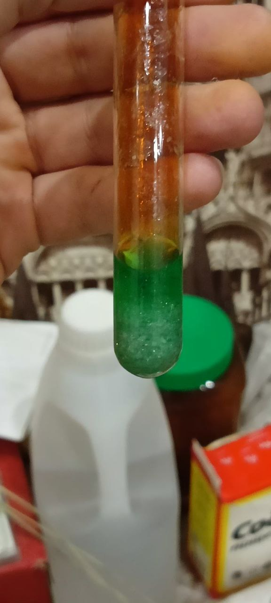
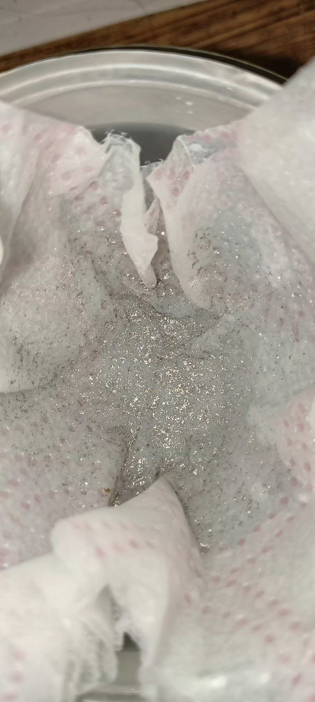
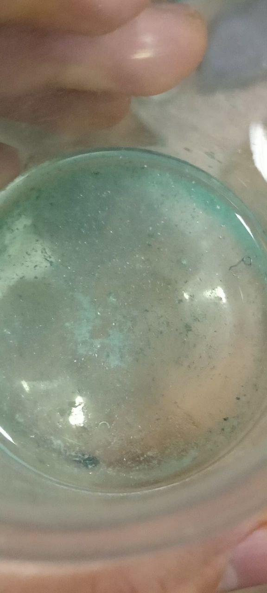
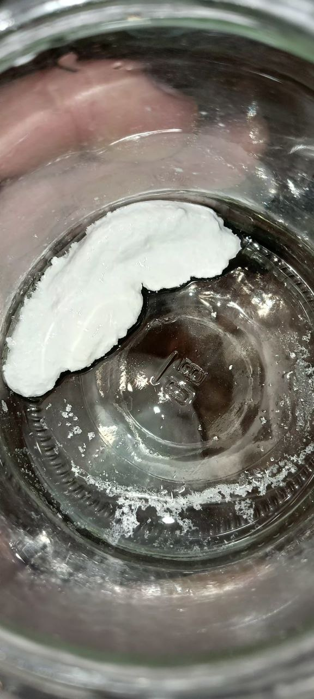
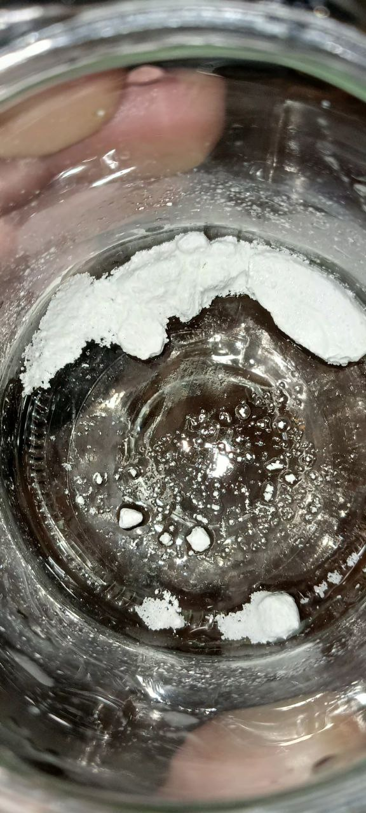
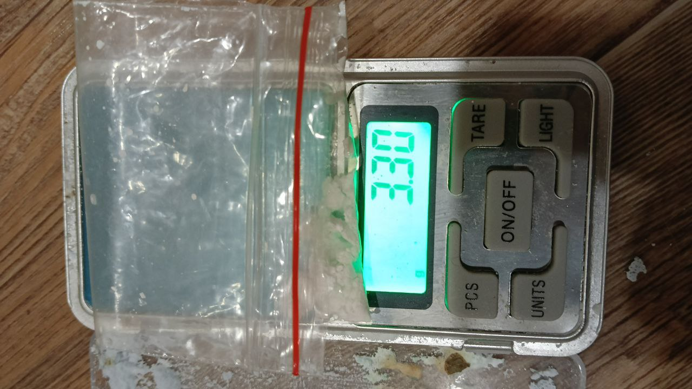
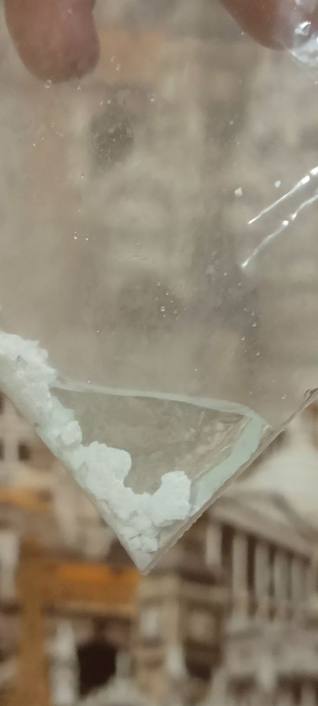
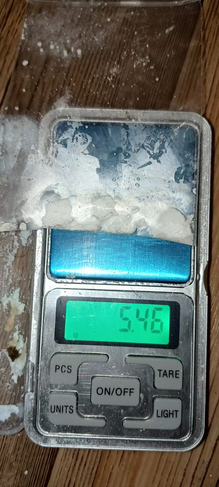

# Супер дисклеймер
**Автор всё делал на свой страх и риск и публикует данный материал как личный опыт, отказывается нести риски за возможные травмы при повторение опытов. работа производилась в малых объемах. потеряно больше половины при очистке. это не является методичкой по растворению. лить кислоту надо в воду, а не наоборот из-за гидратации. понимая объемы и что кислота уже гидратирована это правило было нарушено в материале, но так делать нельзя. кислота может вскипеть. если дышать аммиаком, парами азотки можно получить оттек лёгких, ожоги. при дыхания аэрозолей хлорида аммония тоже можно получить ожог. статья является экспериментом; цель автора было разобраться наглядно в химизмах и дальше уже понимать, как можно работать с серебром; если и собираетесь использовать данный материал как гайд, то разберитесь хотя бы в базовой химии. изучите сначала риски и купите средства защиты. делайте в контролируемых условиях, под вытяжкой. автор же просто привык к рискам и уже работал и с аммиаком и вдыхал его в больших количествах. кто не знает, может быть шокирован и не знать что делать. кислотой можно покрасить свои легкие и кожу, это индикаторная реакция в химии. короче, этот дисклеймер для тех, кто потом может побежать делать иски на меня - ДАННЫЕ ЭКСПЕРИМЕНТЫ ОПАСНЫ БЕЗ ПОНИМАНИЯ. В СТАТЬЕ НАРУШЕНЫ СИЗ И ЦЕЛЬ БЫЛА НЕ ПОЛУЧИТЬ 100% ВЫХОД, А ПРОСТО РАЗОБРАТЬСЯ**

## ещё один дисклаймер

То что выше <s>можно не вычитывать</s>, ну вы всё равно это читать не будете, то что снизу можно сразу с 2-ой части читать, кому нужен результат. 

# Растворение серебрянного украшения 925 пробы


Взял несколько миллитров азотной кислоты 65% и серебрянное украшение, кинул в раствор и закупорил пипетку обычной хлопковой ватой


Без нагрева реакция вообще не шла никак (пассивация)

При слабом нагреве идет образование окислов и всё же реакция идет, но всё ещё слабо


В сильном нагреве ярко видно окислы азота


Разбавил раствор и засунул в тепло, реакция пошла лучше

<video width="640" height="360" controls>
  <source src="{{ 'experimets/Ag/rastvorenijevrazbavlenom.mp4' | relative_url }}" type="video/mp4">
  Ваш браузер не поддерживает видео.
</video>

# udp Методика Авакяна по получению серебра из зеркал

```
 1). Ножом соскребаем покрытие с зеркал; получается порошок, содержащий серебро и примеси (краску, например).

2). В фарфоровой миске растворяем много аммиачной селитры в акумуляторном электролите (концентрировать его НЕ нужно) и в этот раствор всыпаем полученный порошок с зеркал. При комнатной температуре реакция не начинается; греем электроплиткой до закипания азотной кислоты; реакция должна идти до полного прекращения выделения бурых клубов нитрозного газа. Появится немало белого осадка малорастворимого сульфата серебра.

3). Всыпаем питьевую соду до ПОЛНОГО прекращения выделения углекислого газа; этим мы нейтрализуем кислòты и превращаем сульфат серебра в тёмно–жёлтый осадок карбоната серебра. Он в воде нерастворим, и всё серебро оказывается в виде этого тёмно–жёлтого осадка.

4). Вливаем (всё в этой фарфоровой миске) избыток нашатырного спирта. Он растворяет весь карбонат серебра с образованием тёмно–жёлтого (цвет мочи) прозрачного раствора карбоната диамминсеребра. Фильтруем этот раствор через бумажный фильтр (из двух слоёв туалетной бумаги).

5). Полученный тёмно–жёлтый прозрачный раствор, выглядящий как моча, можно попросту выпарить (серебро в нём, как правило, оказывается ужè достаточно чистым). На продукт выпаривания нальём азотную кислоту, и получится у нас нитрат серебра (являющийся исходным реагентом для большинства нужных нам химсинтезов). А можно влить в этот раствор насыщенный водный раствор аскорбиновой кислоты, чтобы серебро выпало в виде металла. Но тут есть «НЮАНС»: если раствор с серебром слишком разбавленный, процесс выпадения серебра может растянуться на неделю: потемнение при вливании раствора аскорбиновой кислоты будет слабым, чёрным раствор станет лишь через сутки, а выпадет на дно серебро лишь за несколько дней.
```

# Далее

Пока серебро растворялось, мне отписал Авак

```
Если у Вас появился нитрАТ серебра (если растворили серебро в азотной кислоте), — смешайте его крепкий водный раствор с насыщенным водным раствором нитрИТа натрия: выпадет нитрИТ серебра (выглядит эта реакция вот так):
https://www.youtube.com/watch?v=h07uf93Y0ng
```

Но так вышло, что я передержал раствор на батарее и у меня получилось такое:


Как можно видеть, довольно много меди, очень много меди.
Растворил данный осадок в воде. После чего прилил соляную кислоту и получил осадок хлорида серебра (сначала нужно было бы профильтровать, но что-то тупанул)


Он получается довольно большим, скорее всего цепляет воду(?)

# Растворение аммиаком

Дальше, понимая что мой хлорид довольно грязный, я его растворил аммиаком. Вот что осталось после растворения аммиаком (будьте осторожны при работе с аммиаком, может обжечь глаза, легкие и всё такое. Даже в респираторе и в очках. Лучше делать под вытяжкой или на открытом воздухе)

<video width="640" height="360" controls>
  <source src="{{ '/experimets/Ag/DymachijsaAmmiak.mp4' | relative_url }}" type="video/mp4">
  Ваш браузер не поддерживает видео.
</video>

Остаток (это до фильтрации, после аммиака сразу. То есть белый тот аморфный осадок, который не сразу, но растворяется в аммиаке. Много не лейте, ему просто время нужно):


После чего я профильтровал через туалетку и кстати так потерял наверное половину раствора. (скорее всего, не стоит делать 100 слоев бумаги; ну, я точно слоев так 10 сделал) Сам раствор стал синим, что можно увидеть на видео. Это медь.


Окей, после чего на балконе (так как я устал ждать когда уже аммиак испарится весь) я добавил солянной кислоты в раствор

<video width="640" height="360" controls>
  <source src="{{ 'experimets/Ag/OsahdenijeSKompleksaAmmiaka[Ag(NH3)2]Cl.mp4' | relative_url }}" type="video/mp4">
  Ваш браузер не поддерживает видео.
</video>

<video width="640" height="360" controls>
  <source src="{{ 'experimets/Ag/OsahdenijeSKompleksaAmmiaka[Ag(NH3)2]Cl_2.mp4' | relative_url }}" type="video/mp4">
  Ваш браузер не поддерживает видео.
</video>

Выпал осадок, причем в этот раз он получился более массивным (скорее всего, это больше хлорид аммония, а большая часть серебра вообще осталась в растворе):


# Получение коллоидного хлорида серебра

Я сразу же прилил водички 250 мл... Получаем коллоид


Седиментировать не хочет, более того фильтровать его через шприц с микрофиброй безтолковое занятие...


Тогда я нагревал данный раствор импульсами в микроволновой печи и медленно у меня происходила коагуляция (кстати, хлорид аммония сам должен быть коагулянтом, но в данном случае он наоборот всё сделал)

После нагрева происходит медленное осаждение


После многократного нагрева (вплоть до кипения, в микроволновой печи вообще перегрев жидкости) у меня раствор стал почти что прозрачным и выпала большая часть. Наверное, если кипятить, то это ещё быстрее будет, но в микроволновой печи тоже норм (микроволновка не сгорела)
Дальше я деконтацией откачал 250 мл, а после промывал 20мл где-то 3-4 раза и на последний раз залил 20мл и нагрел в микроволновке. После чего пока горячее откачал шприцом. Шприц хорошо высасывает маленькие объемы


И таким образом мы получили вот такие кристаллики


# Сколько получилось?

Получилось 0.04 грамма примерно

И остатки:


## Можно ли лучше?

Да, абсолютно можно! Например, если не про*ть раствор и сразу фильтровать полученную жижу, а только потом добавлять раствор той же поваренной соли. Сразу же нагревать что бы коагулировать всё и потом делать декантацию и немного прилевать воды для промыва. Ну, оно вместе с водой всё равно вытягивается в виде коллоида (я так думаю)
А ещё можно попробовать растворять через электролиз. Я так пытался получить цитрат свинца и дальше его осадить соляной кислотой, но на практике оно сразу восстанавливается и вот так выглядит:


То есть, так можно растворить сразу же в разбавленной азотке или даже в другой любой кислоте (главное что бы не было пассивация и эта соль бы растворялась. Наверное в лимонной кислоте электролиз будет идти с очень большими затратами. Нужно проверять) и получать на выходе готовые порошки серебра и меди. Ну и в растворе ещё будет нитрат меди и серебра. Порошки уж растворить будет в множество раз проще. Да и этот порошок чисто теоритечки можно потом растворить так, что бы растворилась медь, но серебро осталось в осадке. Например, соляная кислота с катализатором (окислителем). Все эти теории нужно проверять, ну а серебра не так много чистого. Хватит ли 0.04 г хлорида серебра для аналитики? Думаю, для маленьких экспериментов хватит. Но выход довольно низкий у меня вышел.


### Комментарий Авакяна

```
И Вам здравия!

Прочитал всю Вашу страничку https://wipedlifepotato.github.io/experimentsrastvorenieag.html

Во–первых, вот на этом фото:
https://wipedlifepotato.github.io/experimets/Ag/Ostatki.jpg
— это у Вас, случайно, не РОДИЙ?! Эта блестящая «фольга», похожая на никель? Когда я растворял ювелирное серебряное изделие, у меня точно такая «фольга» осталась из РОДИЕВОГО ПОКРЫТИЯ. Очень надеюсь, что Вы сие НЕ выкинули!! К слову, Ваше ювелирное изделие визуально выглядит, как покрытое родием.

Во–вторых, хлорид серебра в крепкой соляной кислоте немного растворим; и ИЗБЫТОК поваренной соли, как и хлорида аммония, повышают растворимость хлорида серебра за счёт образования комплексов: HAgCl2, NaAgCl2, NH4AgCl2. И, понятное дело, что нашатырный спирт идеально растворяет хлорид серебра.

Далее. Вот ЭТО: https://wipedlifepotato.github.io/experimets/Ag/AutoUparivanijeResult.jpg
— очень хороший продукт. Очистить от МЕДИ можно предельно просто: растворить в НЕБОЛЬШОМ количестве воды и добавить НЕМНОГО водного раствора поваренной соли (НЕ избыток!). ВСЁ серебро выпадет в виде белого осадка, а медь останется в растворе. Второй путь: растворив этот продукт (с Вашей фотографии) в НЕБОЛЬШОМ количестве воды, влить в него насыщенный водный раствор аскорбиновой кислоты: раствор сразу почернеет, и вскоре всё металлическое серебро выпадет в осадок (Вы видели это на моём видео). Аскорбиновая кислота отделит серебро от меди: медь останется в растворе.
...
Про РОДИЙ — да, он азотной кислоте «не по зубам». 🙂 Именно поэтому когда я сунул серебряное украшение из ювелирного магазина в азотную кислоту, реакция НЕ пошлà. Лишь когда я нагрел пробирку, и кислота начала кипеть, — она нашла ТРЕЩИНКИ в родиевом покрытии, влезла в них. И — пошли струйки пузырьков из этих мест. А затем кислота выела всё серебро с медью, оставив родиевое покрытие в виде ТОЧНО ТАКИХ как у Вас лохмотьев «фольги». То есть родий не «отклеивается»/«плавится», а просто в покрытии имеются микротрещинки.

Помимо ЯВНЫХ потерь серебра, связанных с нашатырным спиртом и комплексами, — Вы фильтры делаете ОГРОМНЫЕ из МНОЖЕСТВА слоёв промокательной бумаги. В таком фильтре чуть ли не полстакана раствора остаётся (впитанного в фильтр). Именно поэтому я пытаюсь и фильтры делать поменьше, и слоёв бумаги меньше, а иногда применяю «ухищрения» вроде шприца с ваткой в носике, — чтобы МИНИМУМ раствора терялось. Осадки тоже к бумаге «приставать» умеют — это опять же ПОТЕРИ.

Вкушать соединения серебра и золота БЕЗ чёткой медицинской причины, мягко говоря, НЕ советую. Ядовиты они, накапливаться умеют, «долгоиграющие» пакости в организме умеют делать.
```

# 2 Часть, попытка 2

Прилил азотную кислоту, 65%. Чуть больше в переизбытке. Где-то на четверть больше объема самой цепочки 1.7 грамм. 
Положил в водяную баню 100С. Резко пошла реакция и сначала была слабая, но резко начали выделятся NO/NO2. Вату выбило и вытащил с кипятка на воздух

<video width="640" height="360" controls>
  <source src="{{ '/experimets/Ag/2/rastvorenije.mp4' | relative_url }}" type="video/mp4">
  Ваш браузер не поддерживает видео.
</video>

Можно предположить, что так как был сильный нагрев было и разложение азотной кислоты
То есть кроме реакции HNO3 + Ag => AgNO3 + HOH + NO (без учетов индексов и стехиометрии), ещё шла и реакция HNO3 + t -> HOH + NO2 + O2 (без учетов стехиометрии и индексов)
Ну и так как была медь ещё шла реакция с медью Cu + HNO3 => Cu(NO3)2 + HOH + NO2. Но мне кажется, от такого нагрева просто шло и O2 и NO и NO2. Это всё условно на практике мне кажется.
Так вот, У меня получился сильный осадок (перенасыщенный раствор)

(Да, если работать без перчаток и без вытяжки, то можно покрасить себе пальцы, легкие. Немного даже от самого газа покрасилась кожа. Пронитровалась. Может даже вата пронитровалась, так алканы нитруют радикальной атакой. UDP. Проверил, поднес огонь от зажигалки к вате, она вспыхнула и хорошо горела. Остальная часть не вспыхивает при поднесении зажигалки. Жаль не заснял)



Профильтров и получил осадок не растворившегося






Приливал по чуть-чуть раствор поваренной соли в кипятке, в переизбытке (где-то 2 ложки) пока не стал не выделяться осадок. Потом проверил оставшуюся жижу синию - там нет осадка если прибавлять.

<video width="640" height="360" controls>
  <source src="{{ '/experimets/Ag/2/chloridnatriaandnitrateag.mp4' | relative_url }}" type="video/mp4">
  Ваш браузер не поддерживает видео.
</video>

Отлил жижу получил хлорид серебра, сушил в микроволновке, но из-за странного звука пошёл другим путем и засунул в зиплок, и выдавливал жидкость, а потом отливал. По итогу открытый зиплок оставил в темном месте что бы сушился







Как итог



# Что дальше?

Дальше мне нужен оксид серебра, как и медь оно выпадает в переизбытке щелочи. Дальше можно будет цеплять в осадок почти любые кислоты, что дают растворимые соли и дальше восстанавливать той же аскорбинкой (альдегидами/сахарами) или использовать для других целей получая другие соли серебра. Если таким образом вы хотите получить чистое серебро на перепродажу, то будьте осторожны, могут быть проблемы по супер-крутым правилам. Очень уж важным, из-за которых серебро, цена которому 56 рублей продают по 350р, так ещё и грязное. Мне именно нужен оксид серебра, для дальнейших всевозможных опытов. В той же самой органической химии (в будущем)

## Это законо?

Да, из учета закона ФЗ, растворение своего собственного имущественного серебра является абсолютно законным для исследовательских/научных целей

### P.S
На саму операцию ушло (во второй части), примерно, час. Вместо специальной фильтровальной бумаги, которую продают по жлобской цене использовалась туалетная бумага из 2 квадратных кусочков. Хорошая, мягкая туалетная бумага, не твердая! Предыдущая часть была экспериментальной для понимания всех механизмов в живую, правда на этот раз, уже в переизбытке азотной кислоты и большом весе реакция пошла ОЧЕНЬ БУРНО. Будьте осторожны при больших весах, не пронитруйтесь.
