# Растворение серебрянного украшения 925 пробы

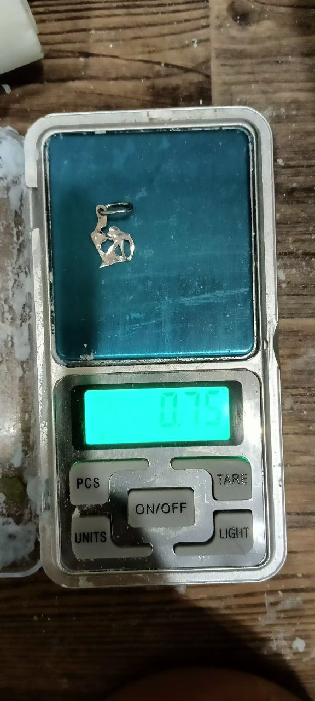

Взял несколько миллитров азотной кислоты 65% и серебрянное украшение, кинул в раствор и закупорил пипетку обычной хлопковой ватой

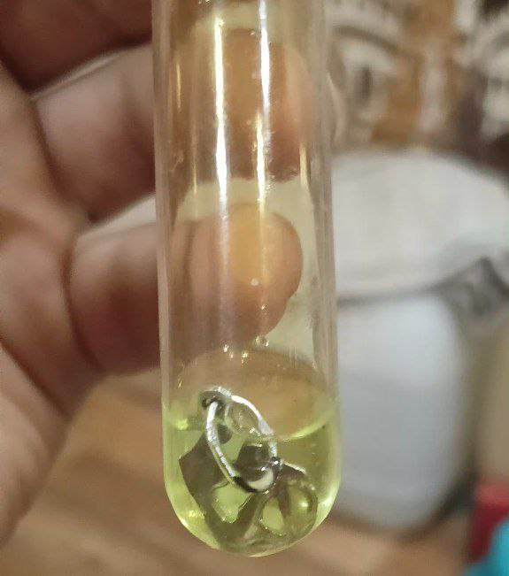

Без нагрева реакция вообще не шла никак (пассивация)

При слабом нагреве идет образование окислов и всё же реакция идет, но всё ещё слабо

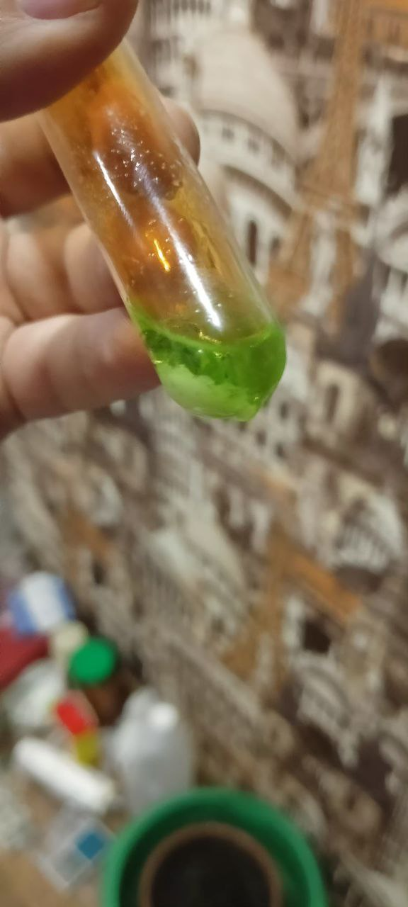


В сильном нагреве ярко видно окислы азота

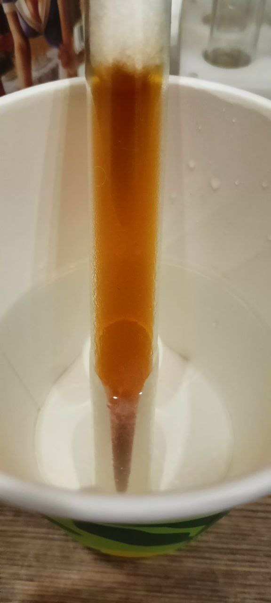

Разбавил раствор и засунул в тепло, реакция пошла лучше

<video width="640" height="360" controls>
  <source src="{{ 'experimets/Ag/rastvorenijevrazbavlenom.mp4' | relative_url }}" type="video/mp4">
  Ваш браузер не поддерживает видео.
</video>

# udp Методика Авакяна по получению серебра из зеркал

```
 1). Ножом соскребаем покрытие с зеркал; получается порошок, содержащий серебро и примеси (краску, например).

2). В фарфоровой миске растворяем много аммиачной селитры в акумуляторном электролите (концентрировать его НЕ нужно) и в этот раствор всыпаем полученный порошок с зеркал. При комнатной температуре реакция не начинается; греем электроплиткой до закипания азотной кислоты; реакция должна идти до полного прекращения выделения бурых клубов нитрозного газа. Появится немало белого осадка малорастворимого сульфата серебра.

3). Всыпаем питьевую соду до ПОЛНОГО прекращения выделения углекислого газа; этим мы нейтрализуем кислòты и превращаем сульфат серебра в тёмно–жёлтый осадок карбоната серебра. Он в воде нерастворим, и всё серебро оказывается в виде этого тёмно–жёлтого осадка.

4). Вливаем (всё в этой фарфоровой миске) избыток нашатырного спирта. Он растворяет весь карбонат серебра с образованием тёмно–жёлтого (цвет мочи) прозрачного раствора карбоната диамминсеребра. Фильтруем этот раствор через бумажный фильтр (из двух слоёв туалетной бумаги).

5). Полученный тёмно–жёлтый прозрачный раствор, выглядящий как моча, можно попросту выпарить (серебро в нём, как правило, оказывается ужè достаточно чистым). На продукт выпаривания нальём азотную кислоту, и получится у нас нитрат серебра (являющийся исходным реагентом для большинства нужных нам химсинтезов). А можно влить в этот раствор насыщенный водный раствор аскорбиновой кислоты, чтобы серебро выпало в виде металла. Но тут есть «НЮАНС»: если раствор с серебром слишком разбавленный, процесс выпадения серебра может растянуться на неделю: потемнение при вливании раствора аскорбиновой кислоты будет слабым, чёрным раствор станет лишь через сутки, а выпадет на дно серебро лишь за несколько дней.
```

# Далее

Пока серебро растворялось, мне отписал Авак

```
Если у Вас появился нитрАТ серебра (если растворили серебро в азотной кислоте), — смешайте его крепкий водный раствор с насыщенным водным раствором нитрИТа натрия: выпадет нитрИТ серебра (выглядит эта реакция вот так):
https://www.youtube.com/watch?v=h07uf93Y0ng
```

Но так вышло, что я передержал раствор на батарее и у меня получилось такое:

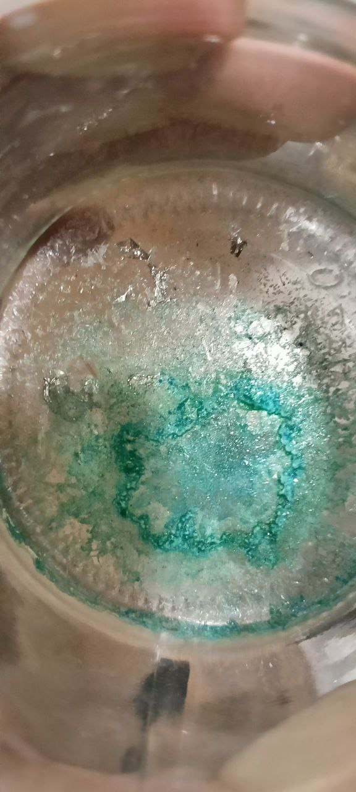

Как можно видеть, довольно много меди, очень много меди.
Растворил данный осадок в воде. После чего прилил соляную кислоту и получил осадок хлорида серебра (сначала нужно было бы профильтровать, но что-то тупанул)

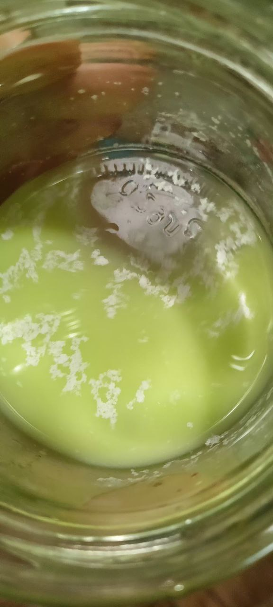
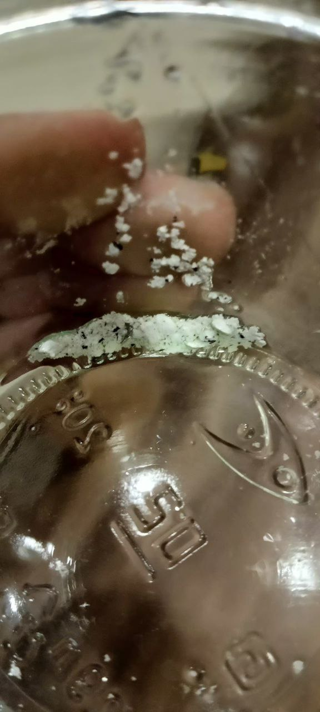
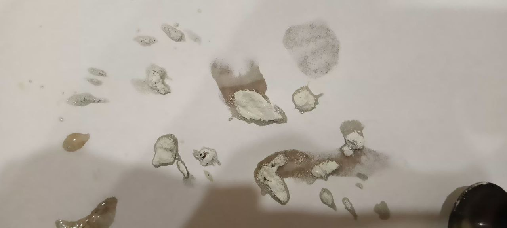
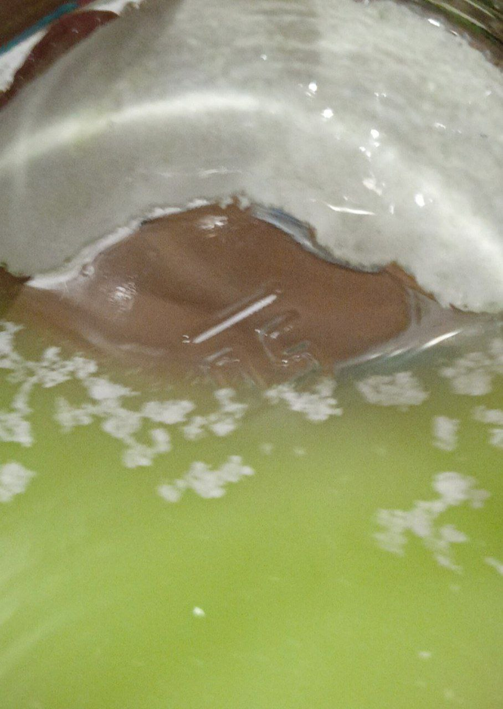

Он получается довольно большим, скорее всего цепляет воду(?)

# Растворение аммиаком

Дальше, понимая что мой хлорид довольно грязный, я его растворил аммиаком. Вот что осталось после растворения аммиаком (будьте осторожны при работе с аммиаком, может обжечь глаза, легкие и всё такое. Даже в респираторе и в очках. Лучше делать под вытяжкой или на открытом воздухе)

<video width="640" height="360" controls>
  <source src="{{ '/experimets/Ag/DymachijsaAmmiak.mp4' | relative_url }}" type="video/mp4">
  Ваш браузер не поддерживает видео.
</video>

Остаток (это до фильтрации, после аммиака сразу. То есть белый тот аморфный осадок, который не сразу, но растворяется в аммиаке. Много не лейте, ему просто время нужно):

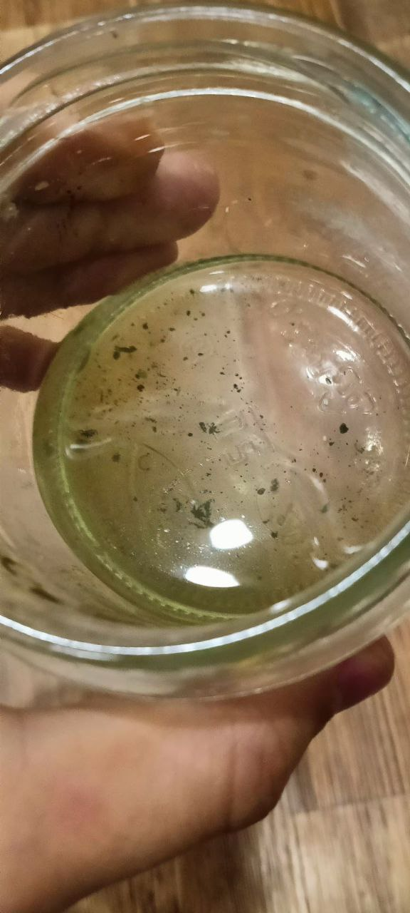

После чего я профильтровал через туалетку и кстати так потерял наверное половину раствора. (скорее всего, не стоит делать 100 слоев бумаги; ну, я точно слоев так 10 сделал) Сам раствор стал синим, что можно увидеть на видео. Это медь.

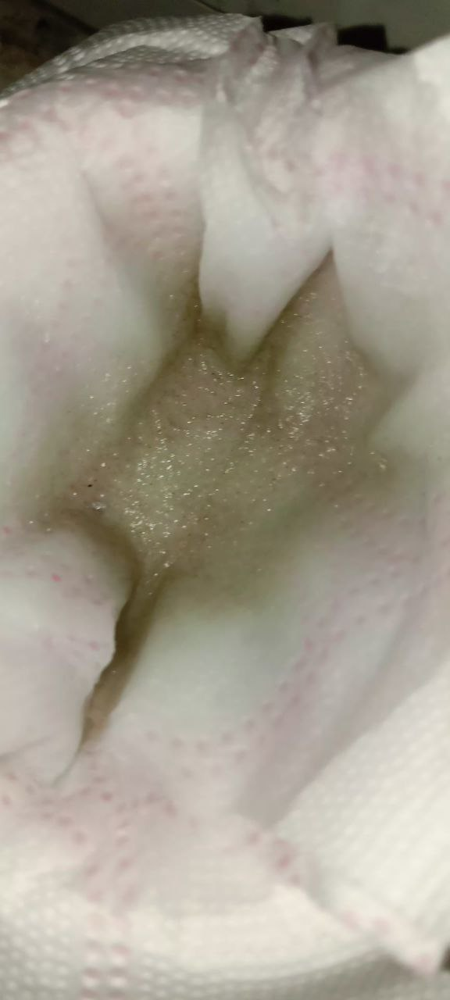


Окей, после чего на балконе (так как я устал ждать когда уже аммиак испарится весь) я добавил солянной кислоты в раствор

<video width="640" height="360" controls>
  <source src="{{ 'experimets/Ag/OsahdenijeSKompleksaAmmiaka[Ag(NH3)2]Cl.mp4' | relative_url }}" type="video/mp4">
  Ваш браузер не поддерживает видео.
</video>

<video width="640" height="360" controls>
  <source src="{{ 'experimets/Ag/OsahdenijeSKompleksaAmmiaka[Ag(NH3)2]Cl_2.mp4' | relative_url }}" type="video/mp4">
  Ваш браузер не поддерживает видео.
</video>

Выпал осадок, причем в этот раз он получился более массивным (скорее всего, это больше хлорид аммония, а большая часть серебра вообще осталась в растворе):


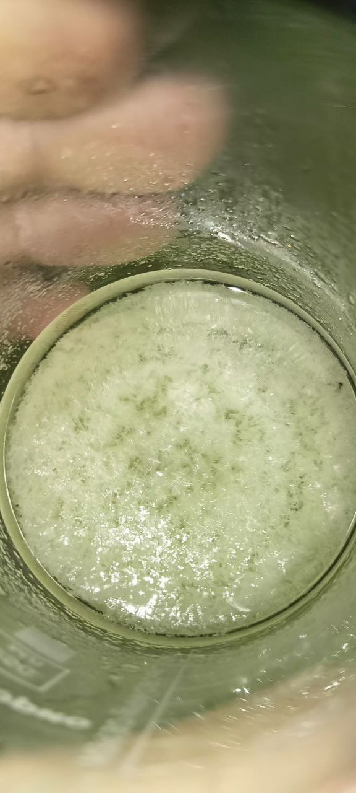

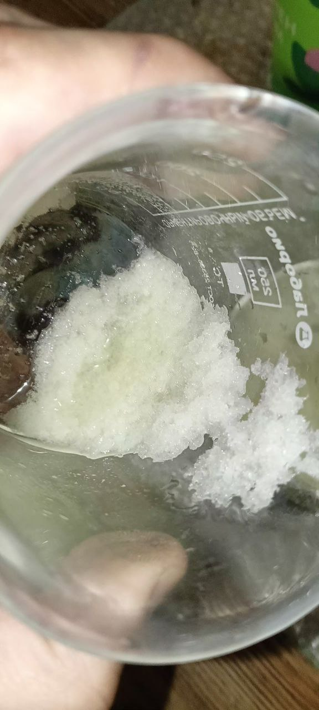


# Получение коллоидного хлорида серебра

Я сразу же прилил водички 250 мл... Получаем коллоид

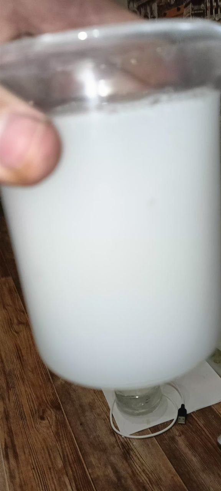


Седиментировать не хочет, более того фильтровать его через шприц с микрофиброй безтолковое занятие...

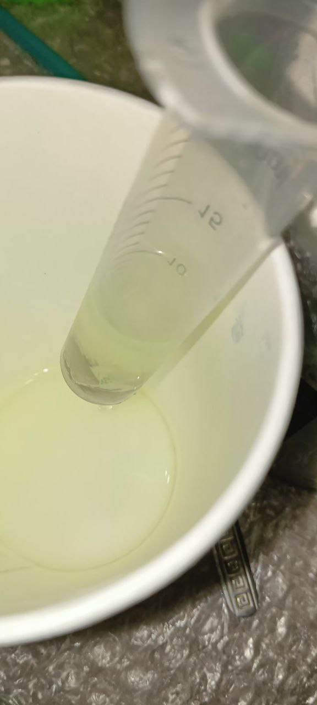
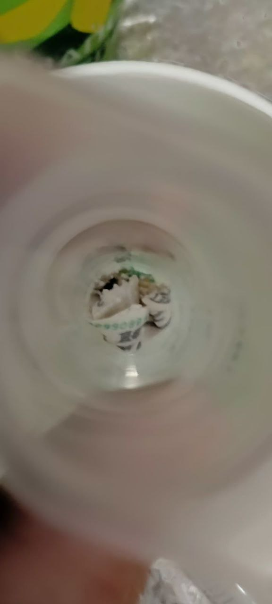

Тогда я нагревал данный раствор импульсами в микроволновой печи и медленно у меня происходила коагуляция (кстати, хлорид аммония сам должен быть коагулянтом, но в данном случае он наоборот всё сделал)

После нагрева происходит медленное осаждение

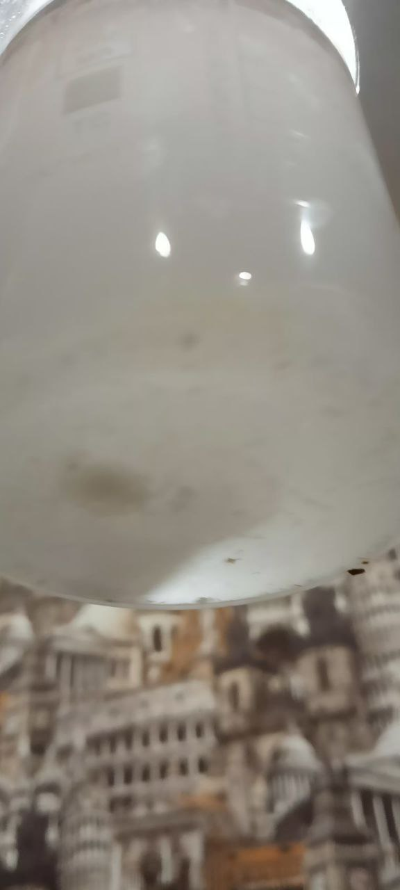
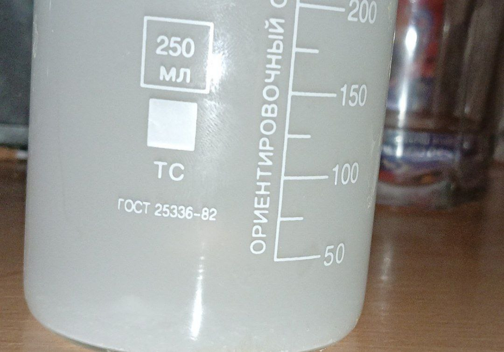

После многократного нагрева (вплоть до кипения, в микроволновой печи вообще перегрев жидкости) у меня раствор стал почти что прозрачным и выпала большая часть. Наверное, если кипятить, то это ещё быстрее будет, но в микроволновой печи тоже норм (микроволновка не сгорела)
Дальше я деконтацией откачал 250 мл, а после промывал 20мл где-то 3-4 раза и на последний раз залил 20мл и нагрел в микроволновке. После чего пока горячее откачал шприцом. Шприц хорошо высасывает маленькие объемы

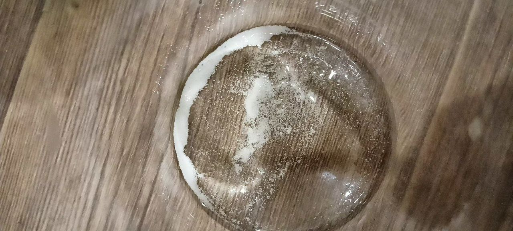

И таким образом мы получили вот такие кристаллики

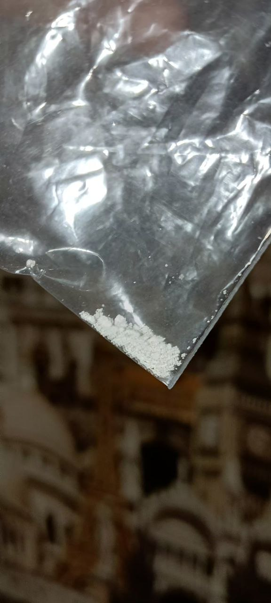
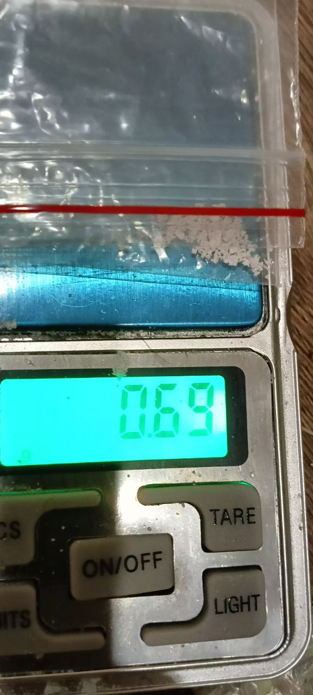

# Сколько получилось?

Получилось 0.04 грамма примерно

И остатки:

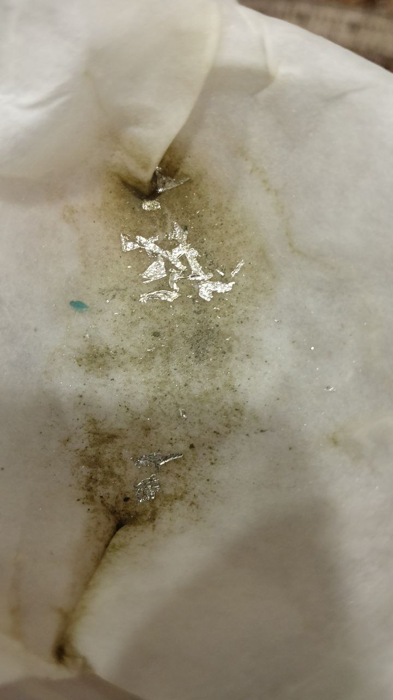


## Можно ли лучше?

Да, абсолютно можно! Например, если не про*ть раствор и сразу фильтровать полученную жижу, а только потом добавлять раствор той же поваренной соли. Сразу же нагревать что бы коагулировать всё и потом делать декантацию и немного прилевать воды для промыва. Ну, оно вместе с водой всё равно вытягивается в виде коллоида (я так думаю)
А ещё можно попробовать растворять через электролиз. Я так пытался получить цитрат свинца и дальше его осадить соляной кислотой, но на практике оно сразу восстанавливается и вот так выглядит:

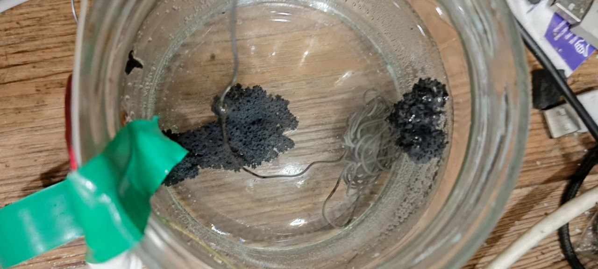

То есть, так можно растворить сразу же в разбавленной азотке или даже в другой любой кислоте (главное что бы не было пассивация и эта соль бы растворялась. Наверное в лимонной кислоте электролиз будет идти с очень большими затратами. Нужно проверять) и получать на выходе готовые порошки серебра и меди. Ну и в растворе ещё будет нитрат меди и серебра. Порошки уж растворить будет в множество раз проще. Да и этот порошок чисто теоритечки можно потом растворить так, что бы растворилась медь, но серебро осталось в осадке. Например, соляная кислота с катализатором (окислителем). Все эти теории нужно проверять, ну а серебра не так много чистого. Хватит ли 0.04 г хлорида серебра для аналитики? Думаю, для маленьких экспериментов хватит. Но выход довольно низкий у меня вышел.


