# Важно

⚠️ ВНИМАНИЕ: Описанные растения и методы не являются медицинской рекомендацией. 
Информация носит исключительно исследовательский/литературный характер. 
Не повторяйте описанные действия без консультации с врачом. 
Автор лично не испытывал все дозировки и не несет ответственности за последствия.

# Предыстория

Какое-то время я изучал всеразличные методы вызова осознанных/люцидных снов. Для этого я делал свои дневники снов, иногда карты сновидений. Лучше всего у меня получалось получить осознанный сон через поиск руки во сне и настройки себя перед сном на то, что я выйду в ОС. Проблема лишь заключалась в том, что когда появляется понимание, что я находился во сне, то либо резко переключался сон, либо через какое-то время я терял контроль или терял возможность управлять сном. То есть, есть какая-то защита во снах, что бы не нарушать эти процессы. Из моих исследований, мне показали во сне, что сон заранее имеет сюжет и описание всего чего должно происходить. Что сны своего рода это последовательные функции вызывающие сами себя. Так же, когда появляется осознанность сна можно убивать и воскрешать "NPC" с помощью даже рук, но вот сгенерировать телефон словами у меня не получалось. То есть, словами на сон можно влиять, например, для воскрешения "NPC", а вот создать таким образом телефон, который нужен был мне по сюжету не получится. Ещё я заметил, что в зеркале совсем другая личность во снах и что выключатели света в большинстве случаев не работают. Очень интересно, что открыв глаза во сне, когда осознаешь сон, можно проснуться внутри сна ещё одного сна. И думать что не спишь.

## Примеры моих снов:
На 10 сентяря 2025 года они всё ещё окрепают и в ближайшее время я собираюсь испытать и дополнить эту страницу данными.
При этом, за последние несколько дней я снова делал записи сновидений и мне пришли некоторые мысли, во снах: 
- что атропин при приеме ВВ может вызывать глаукому.
- что должны существовать икс-/ух- формы мышьяка где он стоит комплексным содинением то ли в три-форме, то ли 4 O и Me по середине. и должен вызывать сильное разрушение организма до инвалидизации как и производные "трихрома" и "трифосфора"
- Какой-то ядовитый орех дерева, наверное то было про стрихнин
Из осознанных снов, было лишь так, что я куда-то с кем-то бежал по лестнице, забежал в какой-то отель, потом все пропали и мне нужен был телефон. Я просто осознал что я во сне и начал пытаться создать телефон, но он не появлялся и мен тянуло в белый коридор, я решил сопротивляться этому и открыл ближайшую дверь. Была просто пустая комната квадратная с диваном и тумбой. На тумбе была кошка и почему-то когда я её увидел, то перестал иметь возможность произносить звуки во сне. Я решил открыть глаза от слабого страха и оказался у себя в квартире и думал что проснулся. Включаю свет и он не включается. В банке Вульфа была кислота, которая дымила и я обжогся. В какой-то момент я стал понимать, что я и не просыпался и в комнату вбегает собака и ругается на меня. Я ещё раз открыл глаза и снова оказался в ещё одном сне и стал спрашивать что нужно от меня. Голос во сне сказал мне просто проснуться и после чего я проснулся.
Ещё один люцидный сон мне снился, когда я ходил по каким-то катакомбам и просто понял что я во сне и начал стрелять из рук. Но сон быстро переключился
Имеется ещё множество других снов где я через поиск руки во сне осознавал себя во сне и даже сон где я проживал опыт паралелльных жизней самого себя и общался непонятно с кем весь сон. И все эти сны понимал что я во снах. Проспал тогда меньше 4 часов, а казалось, когда я сказал во сне что всё мне хватит и проснулся, буд-то все 16 часов.
Мне снятся и обычные сны где я просто разрабатывал Big Math библиотеку методом не байтовым, а неким геометрическим и непонятным мне до конца способом и даже про новый трек одного музыката про яхты.

## Мухоморы для ОС
Мухоморы для ОС не принесли мне пользы, в микро и макродозах он улучшает мыслительные способности и вызывает повышенную агрессивность и чувство энергии. В чуть больших вызывает галлюцинации. В одной галлюцинации я ощущал себя грибом и соединялся в гексы и ощущал левое и правое полушарие. В ещё чуть больших дозах я ощущал петлю смерти и видел прошлые и будущи жизни и сколько вообще я жизней прожил. Состояние от галлюцинаций этого гриба такие, что приходится смеряться со смертью и это очень страшно. Годятся больше, в неправильном пользовании, для вызова смерти (реальной), чем ОС.

## Психоделики для ОС
Психоделики такие как 2C-, Амиды лизергина и псило не давали осознанных сновидений, под ними почт нереально уснуть, а с закрытыми глазами происходит просто потеря связи с реальностью и галлюцинации всеразличные. Следовательно, они годятся больше для вызова психоза и разрушения психики в неправильном пользовании, чем вызов ОС.

## Предыстория
Я делился своими опытами с Авак Авакяном, иногда мы находили в моих снах связь с Марой и другими мифологиями. Я пытался использовать множество средств, которые должны вызывать осознанные сновидения. Вот некоторые из них:

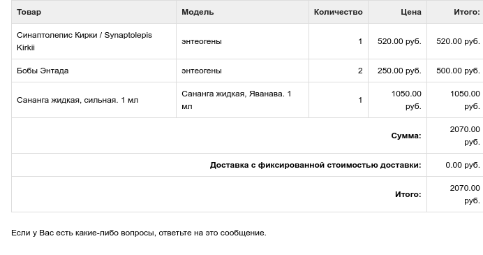

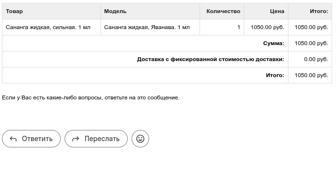
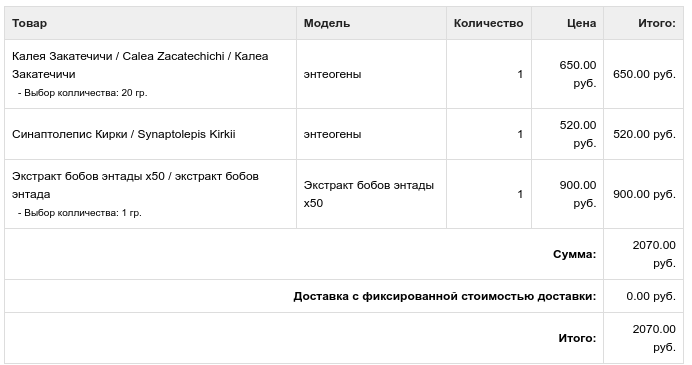

Все они не дали какого-то волшебного результата. В один день, Авак Авакян, известный мне как выдающийся химик, религиовед, исследователь мира, композитор, программист, ботаник, композитор... короче говоря, выдающийся ученый выслал мне сообщение, что нашёл средство для внетелесных путешествий. Всё разом я копировать не буду, скопирую суть (рассаду мне выслал Авак по почте РФ очень умно, тк за лето я не смог найти самостоятельно эти растения):

> ПРИМЕНЕНИЕ:
> ➡️ ПАСЛЁН СЛАДКО−ГОРЬКИЙ: ПЕРВУЮ пробу ОБЯЗАТЕЛЬНО нужно взять квадратик со стороной 7мм из свежего листа (вырезать маникюрными ножницами), растереть в фарфоровой ступке с 8 каплями растительного масла и втереть в запястья (наносим пальцем на запястье одной руки и С СИЛОЙ ДО РАЗОГРЕВА втираем трением запястья одной руки о запястье другой руки, будто желаем получить огонь трением; от разогрева поры кожи раскрываются, и мазь лучше впитывается). Первую пробу нужно брать квадратик со стороной 7мм (НЕ БОЛЬШЕ!), потому что ОТ ПЕРВОЙ пробы будет немного СЕРДЦЕБИЕНИЕ (от дулькамарина). Последующие пробы НЕ дают сердцебиения, потому что получается привыкание. БАЗОВАЯ ДОЗА: — ДВА КВАДРАТНЫХ САНТИМЕТРА свежего листа с 11 каплями растительного масла. Я беру оливковое (это аутентично — так делали ведьмы Италии 16 века), но подсолнечное тоже сгодится. В ступке нужно ДОЛГО тереть до тех пор, пока частицы растения не станут визуально незаметными, то есть пока продукт не станет выглядеть как «зелёное масло». Некачественно разотрёте — НЕ будет результатов! РЕЗУЛЬТАТ начинается через полтора часа и становится сильным через два часа после втирания — это СНОТВОРНЫЙ эффект. Ведьмы добавляли паслён сладко–горький в качестве СНОТВОРНОГО компонента в свои мази. Этот паслён даёт именно здоровый качественный эффект и заменит Вам мириады психотропов. Если НЕ ПРЕВЫШАТЬ дозу в 2 квадратных см, то токсических эффектов НЕ будет вообще.
> ➡️ ПОРУЧЕЙНИК ШИРОКОЛИСТНЫЙ:
ДОЗА — два его «ивовых» листочка, каждый длиной 10см, с 40 каплями растительного масла. Растираем и втираем так же, как описано выше. Эффект включается через полтора часа (становится легко войти в сон); максимальный эффект (выход в Астрал) получается через 2 часа после втирания. Две недавно родившихся метёлки бутонов с 15 каплями растительного масла дают эффект радикально БОЛЕЕ сильный.

> ⚠️⚠️⚠️ АНТИДОТ (ОБЯЗАТЕЛЬНО!!!). Утром ПОСЛЕ паслёна ОБЯЗАТЕЛЬНО необходимо съесть таблетку или капсулу с солью магния; я рекомендую цитрат магния ВОТ ЭТОТ на ОЗОНЕ:
https://www.ozon.ru/product/turamin-magniy-kapsuly-0-5g-90-943948875/
Он самый дешёвый и, главное, ЛУЧШИЙ (это цитрат магния под коммерческим названием «Турамин магний»).
Утром ПОСЛЕ поручейника ОБЯЗАТЕЛЬНО необходимо съесть таблетку АСПАРКАМА, вот он на ОЗОНЕ (это самый лучший от УБФ!!):
https://www.ozon.ru/product/asparkam-ubf-tabletki-175-mg-175-mg-50-sht-1618970282/
Это вообще «дешёвка», но он НЕОБХОДИМ после поручейника!
Дело в том, что паслён убирает из кровотока МАГНИЙ, а поручейник даёт МОЧЕГОННЫЙ эффект, от которого уходят и магний, и калий. Если НЕ восполнять оные, как я указал выше, — будут побочки: от паслёна со временем начнёт страдать СЕРДЦЕ, а от поручейника — начнёт скакать давление и периодически ускоряться пульс, что может со временем дать инфаркт.

> ➡️ КАК САЖАТЬ:
ПОРУЧЕЙНИК ШИРОКОЛИСТНЫЙ посадите в аквариум либо в пищевой контейнер в землю; затем налейте воду так, чтобы над землёй было полтора сантиметра воды. Когда он ещё подрастёт, делайте 2 см постоянно стоящей над землёй воды. Ему необходимо такое «болото» с постоянно стоящей водой. Я послал растения на разных стадиях: есть и совсем крошечные, есть и крупные.
> ПАСЛЁН СЛАДКО−ГОРЬКИЙ просто посадите в землю. Ёмкость нужна не маленькая: он растёт быстро и корней даёт очень много. Болота из стоящей воды ему делать НЕ НУЖНО, но поливать его необходимо ОЧЕНЬ ОБИЛЬНО, чтобы почва всегда была как грязь. Избыток солнца он НЕ любит (от жары на солнцепёке будет «опускать голову», привядать несмотря на полив). Он ЗАВИВАЕТСЯ как вьюнок. Когда пойдёт в рост, натяните ему шпагаты; он будет ветвиться и завиваться как фасоль (это многолетняя ЛИАНА). И паслён, и поручейник МОЖНО круглый год держать в квартире.
> By Авакян Авак Авакович 

[Avak Avakyan Avak Avakovich на Rulit.me](https://www.rulit.me/authors/avakyan-avak-avakovich)

## Растения
- В ближайшее время я должен приступить к изучению этих растений и дополнить эту страницу данными

# ПАСЛЁН СЛАДКО−ГОРЬКИЙ 
## Соланум Сомниферум, Соланум Сомнификум, Гипнотикум, Аполлинарис Минор
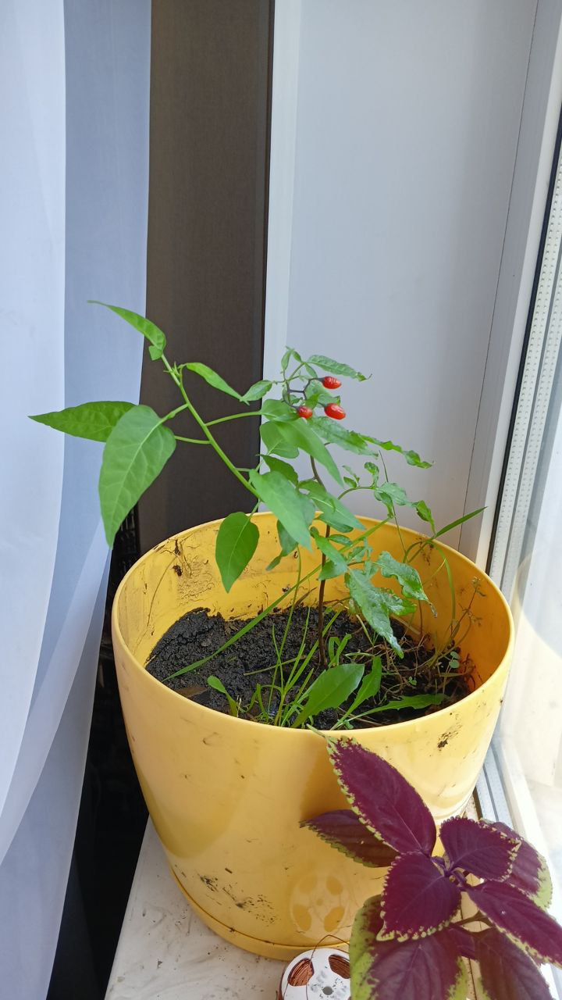
### 10 сентября опыт 2 маленьких листиков, примерно 7 мм
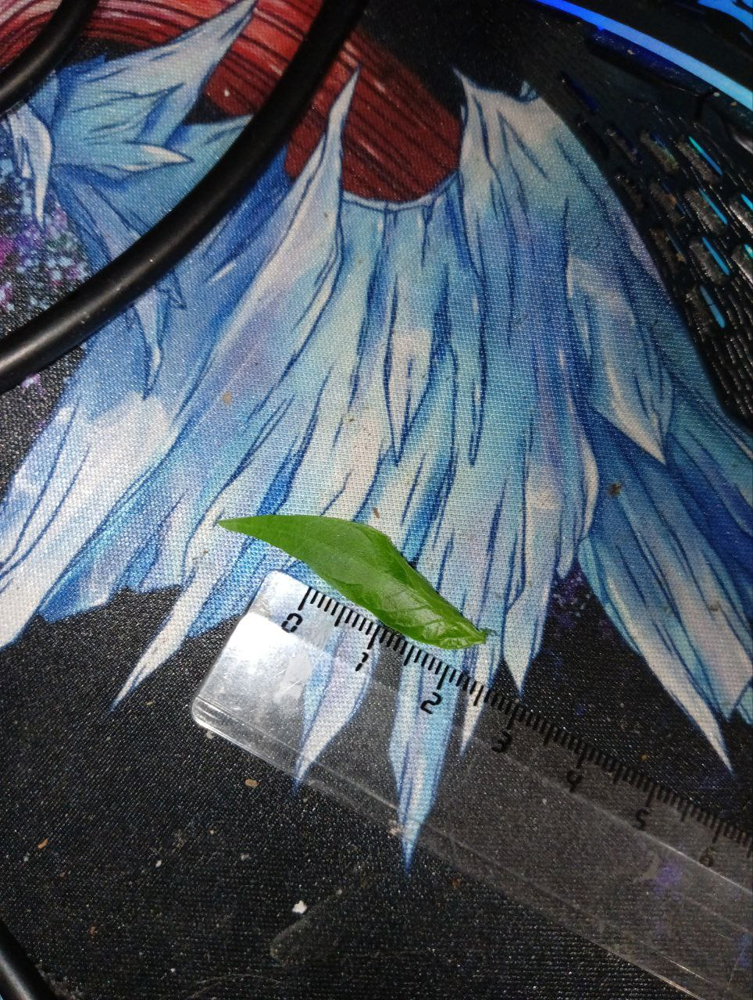
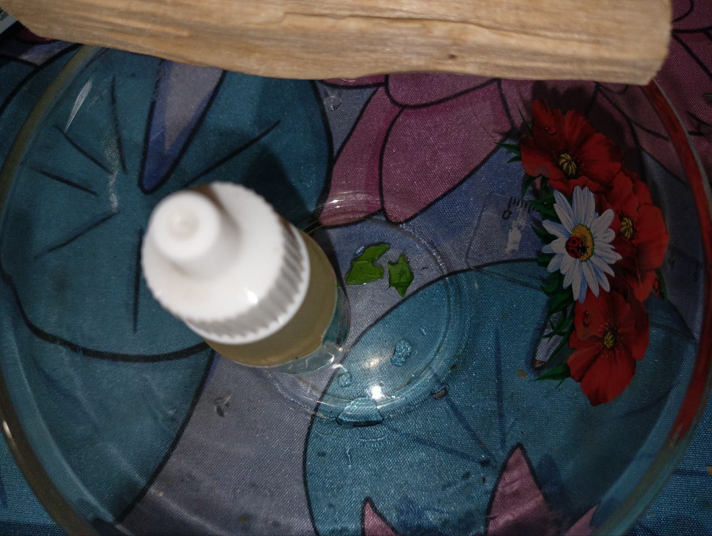
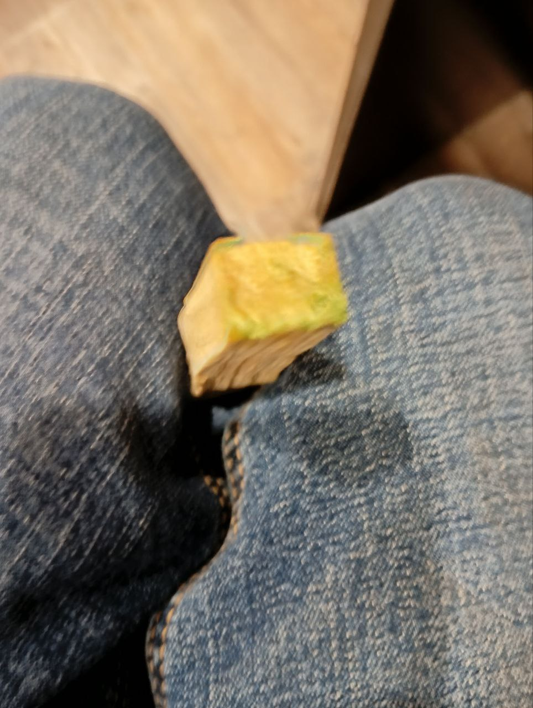
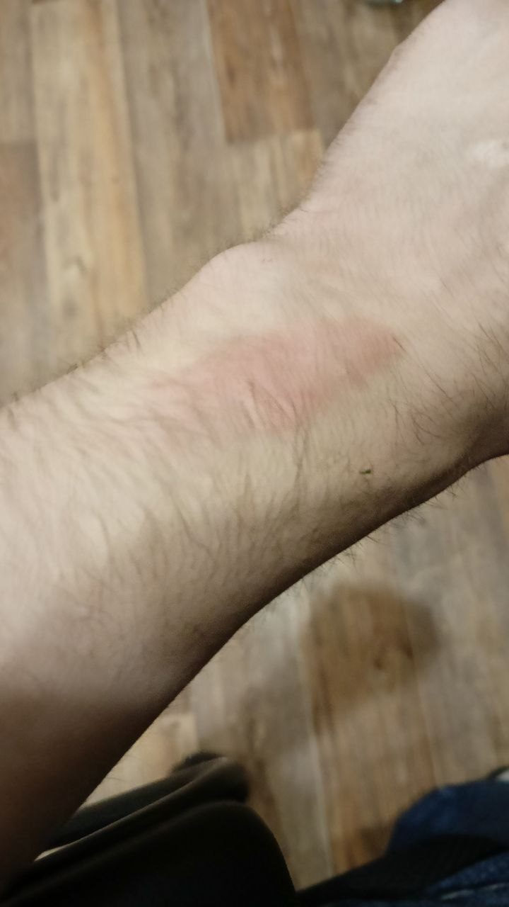
- Взял чашку из стекла и палку пало санто. Масло налил в пустую емкость для капель для клаз. Откапал 12 капель и 2 маленьких листика растер по 7 мм примерно в ширину. Не квадрат. Большая часть масла впиталась палкой пало санто. Растер остаток масла об запястья и потер палкой пало санто. Через некоторое время у меня появилась сухость во рту и было ощущение, что зрачки сужены и не увеличиваются в размере. Было слабое давление в сердце, возможно, эффект плацебо. Усилились мыслительные образы. Уснуть не смог и проспал меньше 4 часов. Следующий эксперимент собираюсь делать с ягодой или листиком полноценным и вместо палки пало санто использовать камень и растирать лучше. Все эффекты могут быть плацебо из-за неправильного приготовления масла или довольно маленького листика.
# ПОРУЧЕЙНИК ШИРОКОЛИСТНЫЙ
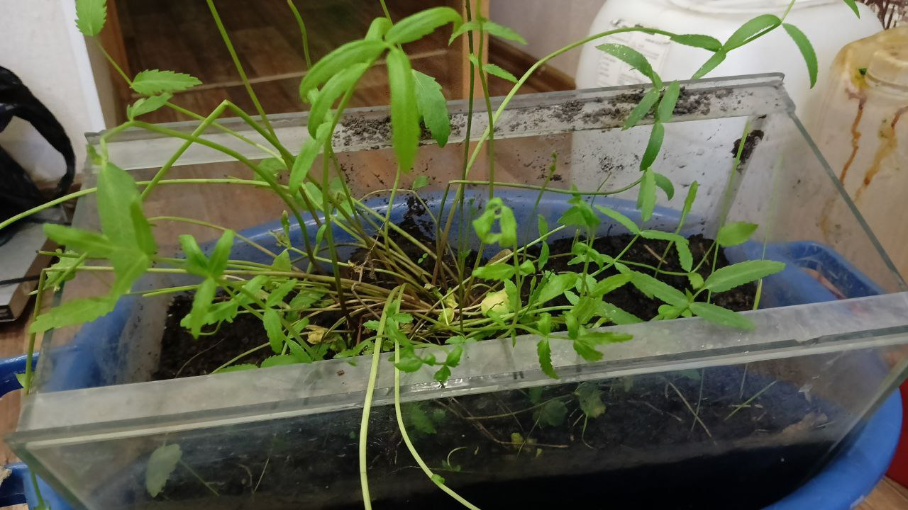
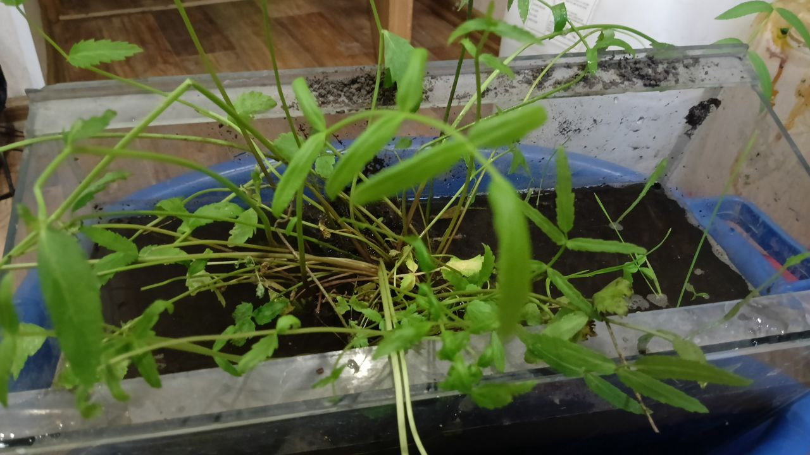

# Опыт и сны (14 сентября 2025)
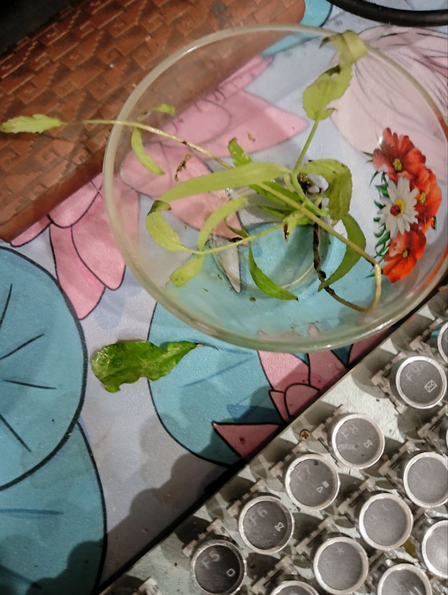
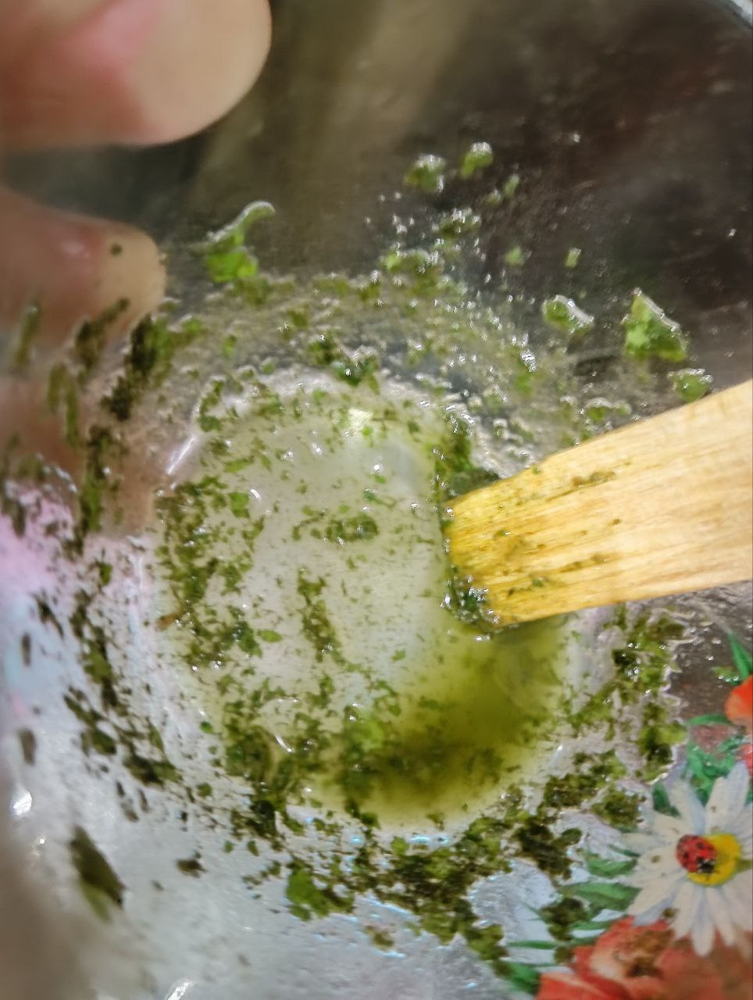

---
**22:41** — начал растирание рук. Появились головокружение, усталость, боль в руке. На левой руке ощущалось тепло от интенсивного растирания. Лёгкое головокружение, возможно, от усердия.
Сделал раствор: *2 капсулы аспаркама + 250 мг сульфата магния*. Время будто замедлилось, восприятие яркости усилилось (или казалось).

**22:45** — сухость во рту.
**22:46** — пошёл курить сигарету.
**22:50** — тяжесть в груди, сильное желание в туалет. Сходил по-маленькому.
**22:57** — общая усталость.
**01:34** — сухость прошла полностью.

После этого проспал **13 часов**.

## Сны

### Полёт и посохи

Приснилось, что я летал. Нужно было ехать на маршрутке, но я выбрал другой транспорт. В какой-то момент мне нужно было создать посох, который передавался бы родственникам в случае чего.
Я сделал **тёмный посох** и убивал змею, вылезавшую из ботинка. Потом создал **каменный посох**. Было путешествие на лодке (или корабле) на «остров спящих». Проспал чуть больше обычного. Убивал всех подряд во сне.

### Больница и диггеры

Дальше снилось, что мою одежду где-то, я оказался в больнице. Потом с детьми и диггерами лазил по постройкам, пели песни.

## Эксперимент на 14 сентября

Принял:

* **1 листик паслёна**
* **несколько листиков поручейника широколистного**
  — всё в подсолнечном масле.

Следующий этап: **проверка с оливковым маслом**.

P.s Было ещё множество моментов снов, которые я не записал или не запомнил. Например, в конце мне кто-то говорил, что проснулся и уснул (про мое состояние). Я и правда не мог проснуться. Как только я сразу же засыпал. При этом какой-либо седатации так таковой не было. Стоит перепроверить состояние без растирания и состояние ещё раз после растирания. Если повторится - не плацебо. Последние дни спал намного меньше и максимум при всем усилии 4-6 часов. P.S.p.s без данных мазей более слабый сон или отсутствует вообще. 

---
