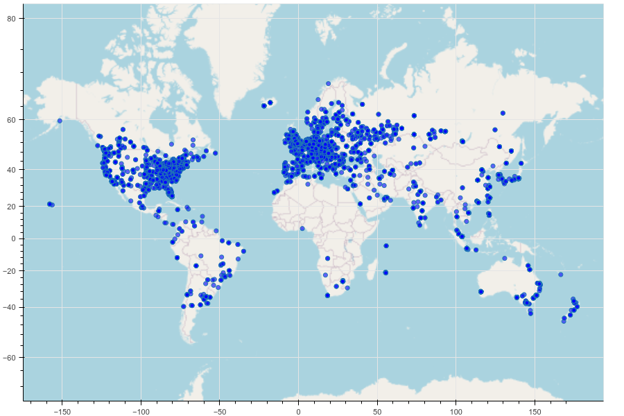
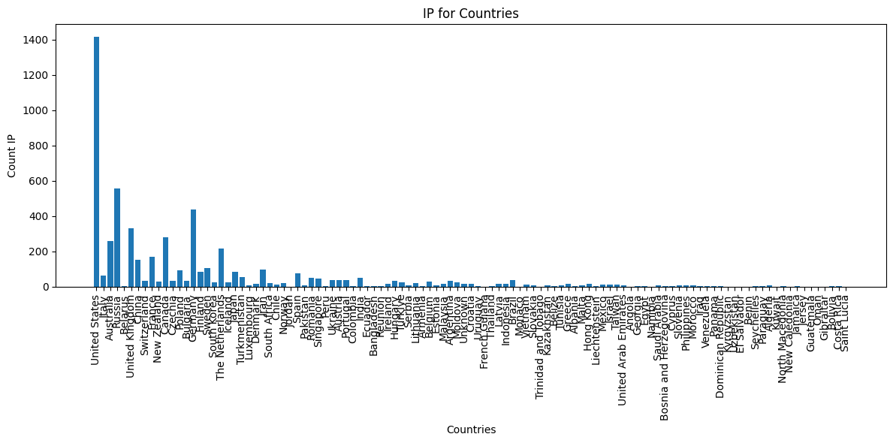
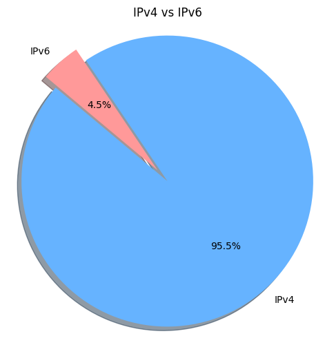
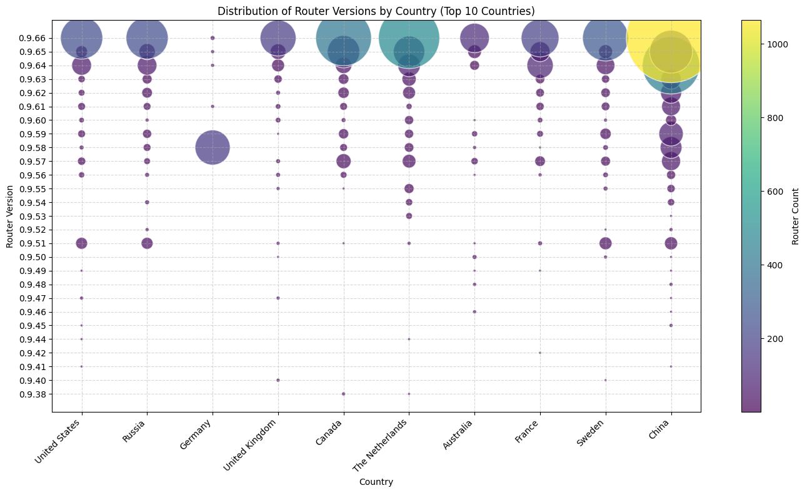
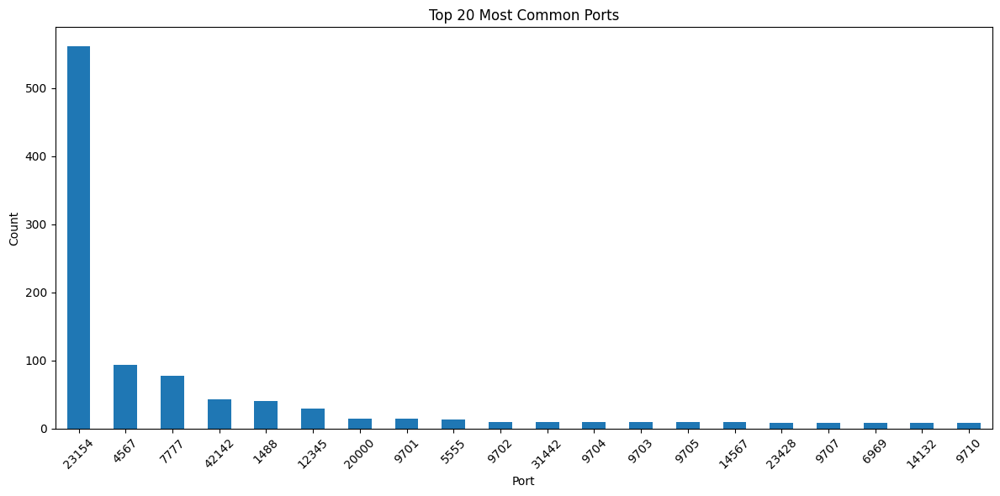
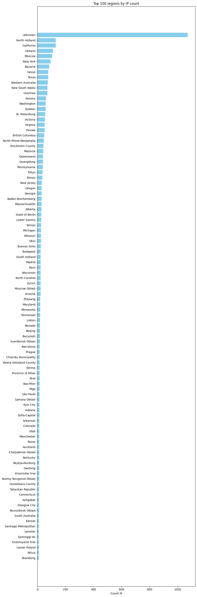
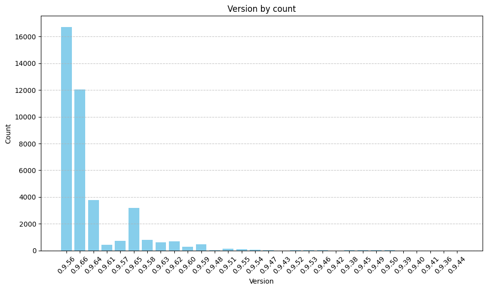
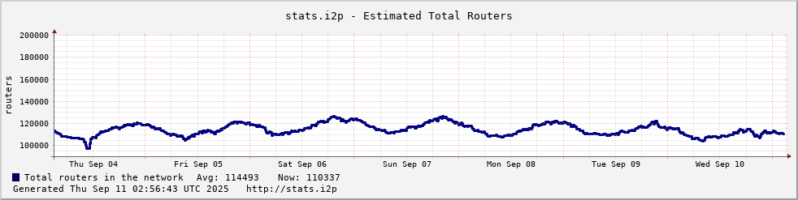
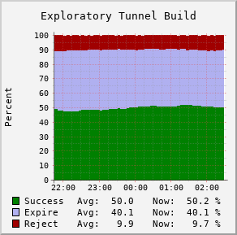
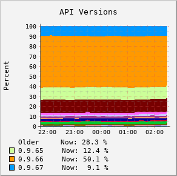

# Исследования сети I2P

## Визуализации сети I2P

В рамках анализа сети I2P были созданы следующие визуализации:

### 1. bokeh_plot.png
  
Интерактивная визуализация сети I2P, созданная с использованием библиотеки Bokeh. Позволяет исследовать структуру сети, узлы и их связи.

### 2. IPCountries.png
  
Географическое распределение узлов сети I2P по странам, основанное на IP-адресах и геолокации.

### 3. IPv.png
  
Распределение узлов сети I2P по версиям IP-протокола (IPv4/IPv6), показывает преобладание одной версии.  
**точность данных:** на роутере отключен ipv6, эти данные не точны  

### 4. RouterVersion.png
  
Распределение узлов по версиям маршрутизаторов, помогает оценить распространенность версий ПО в сети.

### 5. Top20MostPorts.png
  
Топ-20 наиболее часто используемых портов в сети I2P, выявляет популярные порты и потенциальные точки внимания.
Скорее всего, это ботнеты. Вот несколько из таких адресов:
- 65.60.185.121
- 90.221.67.166
- 156.34.15.110
- 82.34.85.87
- 86.140.143.39
- 185.219.136.133
- 125.194.88.145
- 76.93.215.156
- 72.39.191.79
- 24.132.50.14

### 6. TopRegion_.png
  
Топ-10 регионов с наибольшим количеством узлов сети I2P, показывает географическую концентрацию.

### 7. VersionByCount.png
  
Распределение узлов по количеству подключений, демонстрирует версии маршрутизаторов с наибольшим числом активных соединений.

---

## Технические детали

- **Инструменты:** Python, Bokeh, Jupyter Notebook  
- **Источник данных:** NetDB, stats.i2p  
- **Метод сбора данных:** Анализ публичных данных сети I2P (NetDB)  
- **Достоверность данных:** так как один источник данных, один роутер сети I2P, то эти данные не предоставляют общей картины всей сети, а лишь часть  

## Дополнительные данные из stats.i2p

### 1. routers2_1w.png
  
Динамика числа роутеров сети I2P за последнюю неделю. Помогает видеть рост или спад активности сети.

### 2. 8-tunnel.exploSuccess.10m_1ddb.png
  
Успешность эксплуатации туннелей за последние 10 минут. Можно использовать для оценки стабильности соединений и нагрузки на сеть.

### 3. 5-versionsm_1ddb.png
  
Распределение версий маршрутизаторов за последний период. Дает понимание актуальности версий в сети и обновляемости узлов.

---

**Примечание:** Эти данные собраны с stats.i2p и дополняют предыдущий анализ NetDB. Динамика по роутерам и туннелям позволяет видеть изменения в сети в режиме реального времени и делать более точные наблюдения.

