Сделал 3 пробирки, 1 пробирку с соляной кислотой для анализа. Вторую изопропиловый спирт в следах основной соли меди и соляная кислота. 3 переизбыток соляной кислоты и изопропиловый спирт.
Сама реакция примерно такая:
```
Где HOH+ пытаюсь показать оксоний-ион. Где R+ пытаюсь показать карбакатион. В последнем обратимость реакции по Sn2 механизму, который в целом может в теории идти и по Sn1 (по некоторым источникам) [ зависит от галлогеналкана, первичный/вторичный/третичный, а так же растворителя. У В первом случае углерод замещенный имеет разную электроотрицательность, во втором механизм может идти по протонированию и без протонирования, как я понял. ]
R-OH + (H+) <=> R-(HOH+); R+ + HOH; R+ + Cl- => RCl; 
RCl + OH => ROH + Cl-

Мог что-то напутать, более подробно и точно про реакцию можно изучить в учебниках по органической химии
```
Это нуклеофильная атака, сначала протонирование, а потом отцепление группы и присоединение к карбакатиону. Это Sn1 механизм.
Стоит учитывать, что из источников, первичные даже с кислотой льюиса ZnCl2 не дают реакции. Только с помощью серной кислоты и сильного нагрева. Скорее всего, требуется то, что смещает реакцию и удаляет воду, либо сильный протонирующий агент. Исходя из того, что ZnCl2 нужен как катализатор, а зная, что хлороводород сложно вступает в реакцию, йодоводород легко, а бромоводород сложнее. Фтороводород вообще не вступает. Что первичный сложнее, вторичный проще и третичный ещё проще (из-за атома углерода, где OH группа. У них разная электроотрицательность). То я предположил, что если взять в переизбытке соляную кислоту и спирт, вторичный, то подождав какое-то время или нагрев я получу галлогеналкил.
[reaction](https://orgchem.ru/chem4/o252_1.htm)

Вот пробирка с соляной кислотой и изопропиловым спиртом:

<video width="640" height="360" controls>
  <source src="{{ '/experimets/Alkylhallogenidfromspirit/hclandizopropylspirit_web.mp4' | relative_url }}" type="video/mp4">
  Ваш браузер не поддерживает видео.
</video>


Вот пробирка с соляной кислотой и изопропиловым спиртом, солью меди:

<video width="640" height="360" controls>
  <source src="{{ '/experimets/Alkylhallogenidfromspirit/withcupper_web.mp4' | relative_url }}" type="video/mp4">
  Ваш браузер не поддерживает видео.
</video>

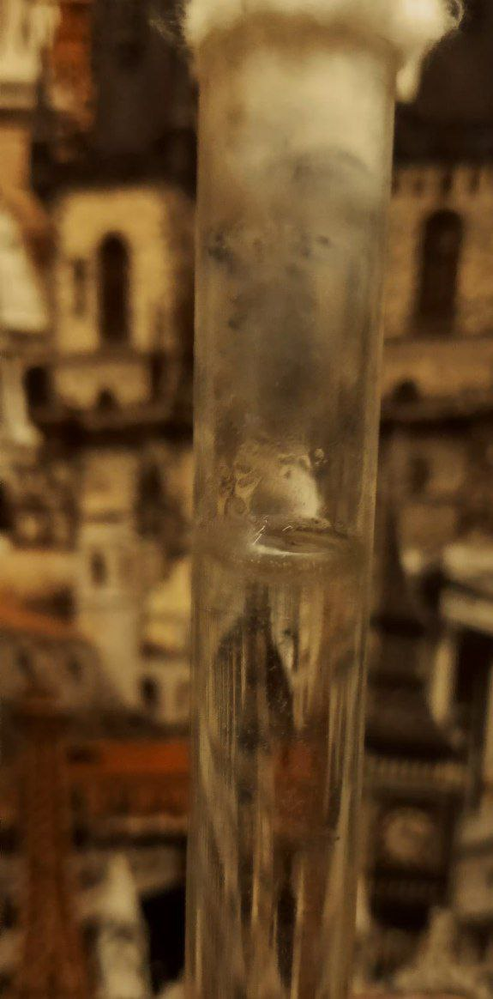


В обычной соляной кислоте, даже если её сувать в кипяток (пробирку) газы не выделяются. Природу газа нужно ещё проверить, но он выделяется. В определенный момент, после долгой реакции газ перестает выделяться даже после нагрева. После чего я оставил пробирку просто на время. 

Имеется какой-то слой, но примерный слой есть и в соляной кислоте у меня. Наверное, от очень долгого хранения в пластике.

Слой после реакции изопропилового спирта и кислоты соляной:

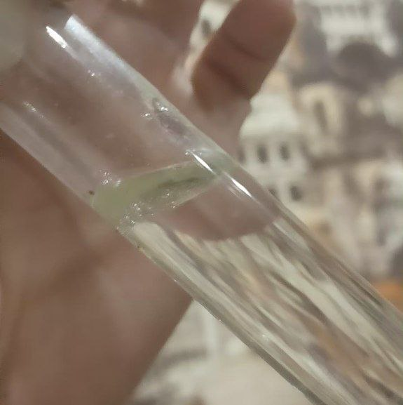

Попробовал заморозить пробирку в морозилке 20 минут, после чего достал и открыл вату. Вата посыпалась, значит либо гидролизовалась, либо к сахару, а это спирты и альдегиды одновременно, прореагировало. Пробовал растворять, получается коллоидный раствор. Скорее всего, разрушается полимерная цепочка.

<video width="640" height="360" controls>
  <source src="{{ '/experimets/Alkylhallogenidfromspirit/vataposlehcl_web.mp4' | relative_url }}" type="video/mp4">
  Ваш браузер не поддерживает видео.
</video>

Сверил слои, слой в пробирке с изопропиловым спиртом и соляной кислотой дает прозрачный, а не желтый слой, который под наглоном не сливается. Соляной же кислоте этот слой сливается

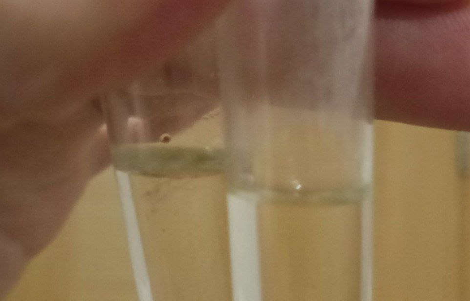

Запах слабо сладковатый, может кажется, нужно больше проверок.

## попытка 2

В планах было залить соляную кислоту и отделить тот слой, но прилив 25 мл примерно у меня слоя не оказалось (возможно, я по запарке и туда влил изопропиловый спирт или это загрязнение видно только при малых объемах. Либо это загрязнение было слито при первом слитии. Либо ещё куча вариантов, вплоть до того что микроскопические примеси на пробирке такое дали, что конечно же гонево.)

Соляная кислота:

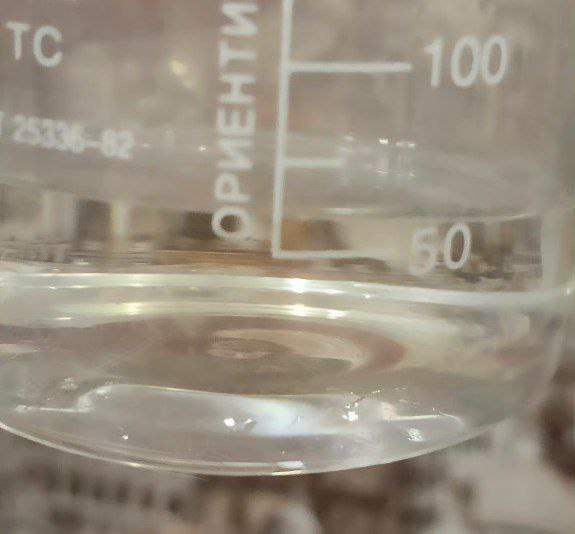

Плюс спирт:

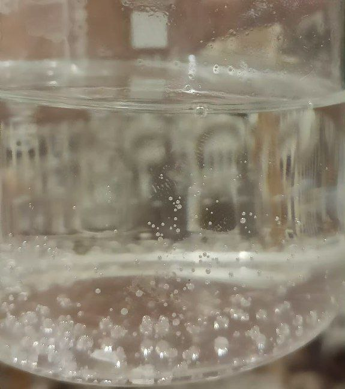

Пробовал греть, закрыв стаканчик стаканчиком бумажным, но не смотря на вытяжку чувствуется толи запах спирта, толи неясно чего. В комнате всё же и при нагревании напоминало что-то сладкое, но мог спутать с изопропиловым спиртом
Выключив нагрев оставил на балконе, получился слой

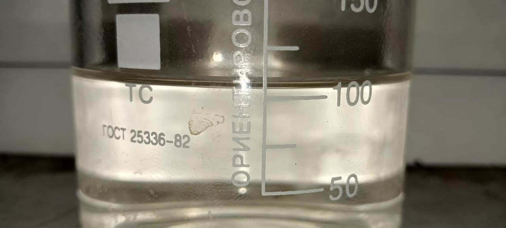

К этому слою я прилил ещё соляной кислоты, слой так же был и даже вроде увеличился. Прилил ещё изопропилового спирта - слой уменьшился. Как вариант, изопропиловый спирт очень хорошо это всё растворяет в себе и что бы отделить нужно разбавлять водой, в которой уже что-то растворенно, что бы уменьшать растворимость и отделять слои

Попробовал добавить водный хлорид железа в следовых количествах и оставить на несколько часов. Слой, кстати, вроде увеличился и уже при нагревании не появляется пузырьков так интенсивно, зато видно как появляются шарики что резко вверх идут.
Наверное, без хлорида цинка или подобной соли это очень плохая затея и стоит всё же достать хлорид цинка, ибо сама по себе соляная кислота даже по литературе, по Тейлору очень плохо вступает в реакцию эту. Да и сама -OH группа плохо замещается, только при протонировании становится основанием сильной кислоты H3O+.

С солянокислым железом
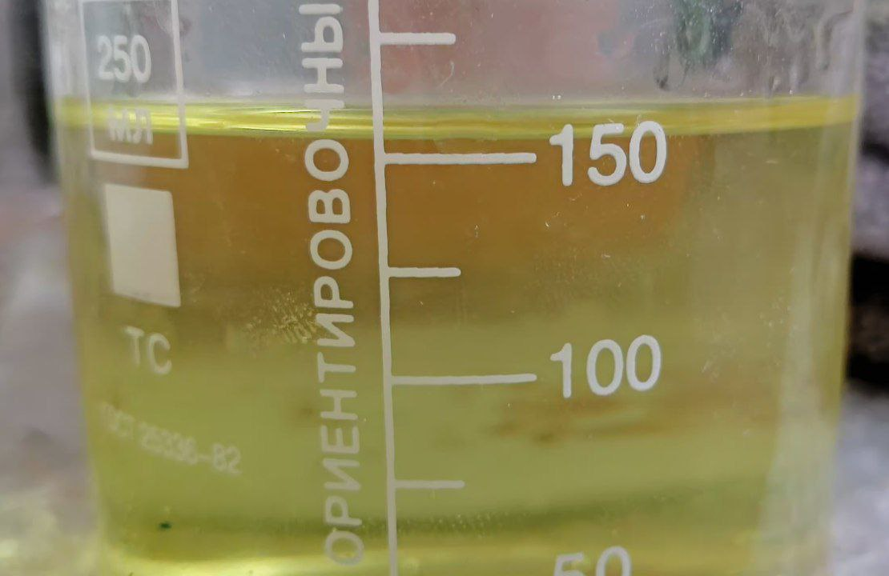

Факт - слой появляется, но он может быть и вызван загрязнением соляной кислоты. Может лучше попробовать получить изопропилбромид. Буду думать со следующей зарплаты
Если взять этот слой и сверить с свежей соляной кислотой, то слой где соляная кислота в таком размере отсутствует или почти не видно, наверное то что кажется слоем вообще приломление света. А вот в правой пробирке, где предположительно изопропил2хлорид как раз есть слой явно выраженный. Тогда в первый раз, не исключено, что сам прилил изопропиловый спирт и забыл. В любом случае, какая разница, если не возобновляется слой с просто приливанием соляной кислоты

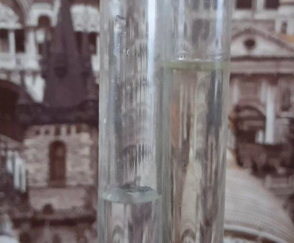


На балконе, тот слой после FeCl3 уменьшается, не увеличивается. Значит если это и полученный алкилгаллогенид, то он испаряется очень легко и даже на холоде. И тогда реакция на холоде не идет. Тогда если и нужно получать, то в закрытом сосуде, но никак не в открытом. Оно банально улетучивается. Кстати, ощущается легкая слабость. То ли из-за изопропилхлорида, толи из-за изопропилового спирта. Перенес смесь в банку, закрытый сосуд. Если реакция не пойдет, то всё что могло прореагировало. Оставлю на день или больше.

UDP. Кажется, слой так-же появляется и при действии соляной кислоты на вату, в закрытой системе, через какое-то время.

# Проверка этилового спирта 99% и бромида натрия

Взял бромид натрия, на краю ложки чайной. Засыпал в пробирку в раствор серной кислоты, примерно 40%. Кстати, газ выделяться начал уже при прибавление спирта к раствору серной кислоты.
При прибавление появлялось розоватое свечение, плюс желтый слой и желтел раствор. это окисление бромоводорода до брома. С ортофосфорной 85% я такого не заметил. В обоих случаях появляется вверхний слой. В случае с серной кислотой, скорее всего это эфир диэтиловый.
В случае с ортофосфорной кислотой 85% это уже этилбромид или этиловый спирт. Но он смешался с ортофосфорной кислотой 85%. Возможно, там ни фига не 99% спирт. Но там по плотности смотрели, но плотность обманчива. Да и воду оно давно могло впитать. Ну не суть. При нагревании слой уменьшается с 2 мм до 1 от силы или вообще пропадает (в растворе  кипятка)
При охлаждении слой увеличивается. Запах лишь может слабо сладковатый, но больший запах вообще непонятно чего. Вообще ни разу таких запахов не чувствовал и вызывает слабый эффект на психику. 
Для первичных спиртов пишут, что нужно добавлять конц. серную кислоту в уже готовый раствор бромоводорода. Который нужно получать ни как я делаю in vitro, а по трубочке газ получаемый пускать в воду. Тем самым насыщая раствор до ~50% бромоводорода. Может и моим способом можно получить, но пока-что не логично вообще что-то получается.
Проверил пробирку, те слои, по большей части это преломление света. Просто если воду влить, тоже будет слой 1мм. Значит реакция не идет без катализаторов/условиях. Стоит попробовать нагреть в микроволновке пробирки

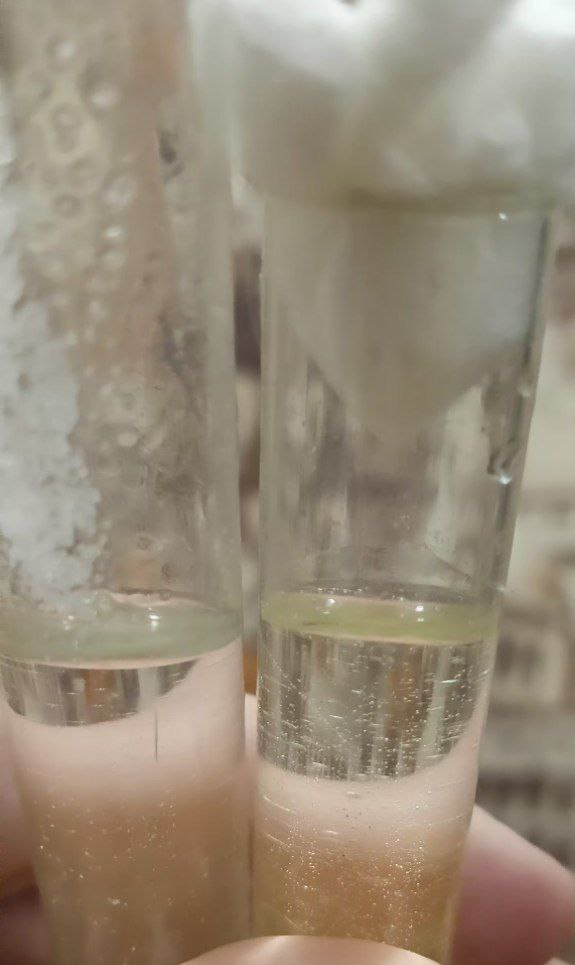
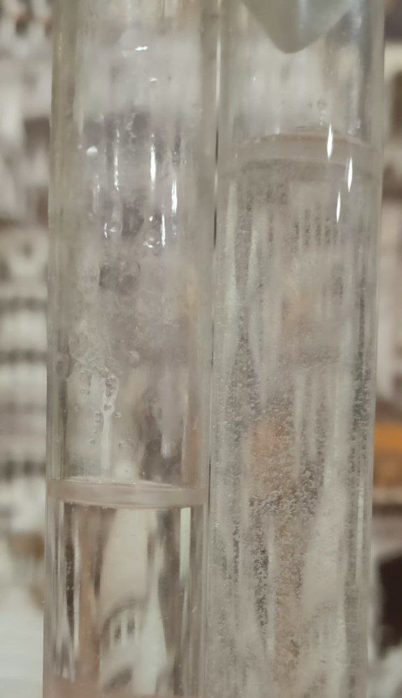
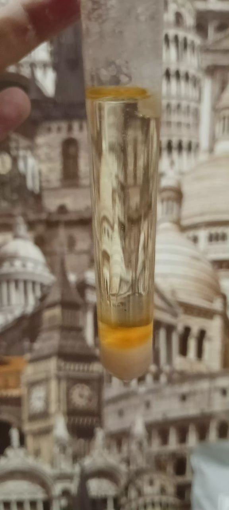

Возможно, лучше способ всё же получать через фосфор производные (нужно пробовать). Но так можно и фосфат органический какой случайно получить.
Скорее всего, без специальной посуды будет очень сложно получать. Вернусь к вопросу позже

Комментарий Авака:
```
https://wipedlifepotato.github.io/experimets/Coffeine/2/crystallization.jpg — это потрясающе; шикарно!!

https://wipedlifepotato.github.io/experimets/Coffeine/2/murexidetest2_web.mp4 — окей.

 Про этилбромид. Я получал этилхлорид, перегоняя водку с аккумуляторным электролитом и поваренной солью. При обычных условиях он газ, так что приёмную пробирку я охлаждал льдом и водой (тогда он получается жидкий). Никаких холодильников, две обычные пробирки: перегонная и приёмная; перегонная заткнута резиновой пробкой с газоотводной стеклянной трубкой формы буквы «Г», которая вставлена в приёмную пробирку, которая заткнута неплотно ватой и помещена в кружку с водой и льдом. Успех был. Я пробовал сделать два–три вдоха запахом этилхлорида, и через несколько секунд нужно было срочно ложиться, потому что тело обмякало, перед глазами получался оранжевый свет, а в ушах сильнейший звон. Состояние практически точно такое, как если на корточках долго дышать очень глубоко и часто а затем резко встать. Это состояние от этилхлорида быстро проходит (длится больше минуты) без последствий. ...
```
 
# UPD:
Попробовал получать этилхлорид, как растворяя цинк в соляной кислоте (бурная реакция с порошком и если кислота концетрированна, аж вскипает). Так же появляется слой, но мне кажется это из-за примесей и я такие же слои стал замечать и с другими веществами. То есть, эти слои не показатель реакции. Брал спирт 96% и серную кислоту 1.4 плотностью, поваренную соль. Во всех случаях появлялся какой-то даже запах, слабый и запах хлороводорода и даже немного расслабляло, но эффект плацебо. Пробовал и с водкой, но реакция так же идет слабо и я не могу убедиться понюхав что я получил. Поняв, что на запах проверять не очень практично я решил поджечь. Возможно, можно и подумать что это этилен, Но если я брал водку, то сначала должно было быть протонирование спирта, а потом присоединение -OSO3H группы, которая при действии с водой снова дала бы спирт, при действии спирта эфир, а если протонировалась бы HSO4-, то этилен. 
Как я делал, я взял смешал 2 четверти ложки соли в пробирку, немного залил капель водки, что она вся в соли растворилась и может миллитров 1-3 серной кислоты. Немного поднагрел до кипения и оставил на долго. А потом попробовал поджечь левую и правую пробирку. Пробовал так же просто с водкой, доведя её до кипения, дав постоять 5+- минут и поджечь - реакции нет. А стояла так пробирка у меня может и пол часа. Пробовал смешивать водку с спиртом и так же греть и оставлять - горения нет. Оставил даже на несколько часов и проверил - горения нет. 
В химии орг. нельзя просто вот взять, и как на бумаге сделано, Так и работает чисто по одному пути. Должны быть условия и всё такое. Получается, это образовался этилхлорид и кажись меня он слабо берет в таких концентрациях. 

<video width="640" height="360" controls>
  <source src="{{ 'experimets/Alkylhallogenidfromspirit/maybechlorethan.mp4' | relative_url }}" type="video/mp4">
  Ваш браузер не поддерживает видео.
</video>

Кто-то может подумать, что горел спирт, но сам спирт больше горит желтым пламенем, вот пример изопропилового спирта:

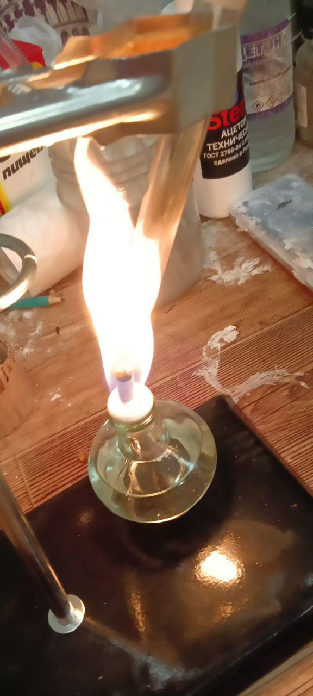

Да и для получения этилена нужно аж сильная концетрация или выход будет настолько маленький...
Кстати, вот про упрощения, вот как пример:
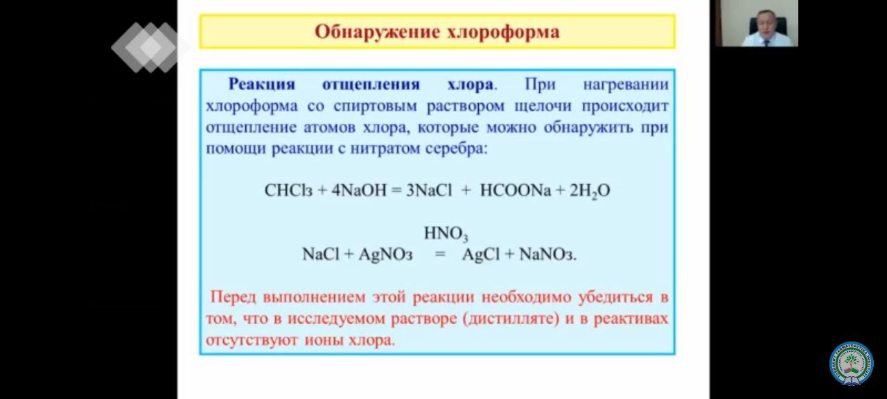

Как бы ок, но он забыл упомянуть, что там образуется дихлоркарбен и что нужна водяная щелочь, а в спирту будет жетское эмилирование. Оно начнет реагировать со спиртом в теории даже.
Забыл упомянуть, что сначала идет гидролиз и нуклеофильная атака на хлор OH- группой давая две OH группы, что дают производное формальдегида с хлором, который сразу реагирует с водой и дает уже карбоновую кислоту и что при неопределенных условиях там и реакция Каницаро, а ещё что будет выделяться и фосген через дихлоркабен, а он уже давать углекислый газ и хлороводород с водой. А в переизбытке азотки может и хлорид серебра раствориться в теории, ведь азотная кислота должна быть сильнее. Это проверять нужно.
Ну и на форум заходим и видим, что растворяется там всё в азотке: [forum](https://forum.xumuk.ru/topic/216314-%D1%85%D0%BB%D0%BE%D1%80%D0%B8%D0%B4-%D1%81%D0%B5%D1%80%D0%B5%D0%B1%D1%80%D0%B0-%D1%81-%D0%BA%D0%BE%D0%BD%D1%86%D0%B5%D0%BD%D1%82%D1%80%D0%B8%D1%80%D0%BE%D0%B2%D0%B0%D0%BD%D0%BD%D0%BE%D0%B9-%D0%B0%D0%B7%D0%BE%D1%82%D0%BD%D0%BE%D0%B9-%D0%BA%D0%B8%D1%81%D0%BB%D0%BE%D1%82%D0%BE%D0%B9/)
А это видео лекция. Поэтому всю инфу нужно всегда проверять и думать. Получается, нужно подобрать условия. С хлоридом цинка идет реакция давая чуть больший слой, но хлорэтан это газ, как там слой образуется не совсем понятно. Это видимо какие-то уже физические явления, а не химические.

Получается, пробовал водку и натрия бромид, серную кислоту и поваренную соль. если уж долго кипятить бромид, то потом появляется перенасыщенный раствор, который ещё окражен в желтый цвет, возможно из-за примеси брома и не льется никуда. А от поваренной соли если слить немного, то появятся игольчатые кристаллы. Интересное явление, в общем в другой пробирке там если просто греть и во льду держать и следить что бы жижа не поднималась дальше трубки (не перетекала, а именно перегонялась), то может капелька так выходит и то может это конденсат, до этого не пробовал поджигать. Получается, делать это на ГОРЕЛКЕ - плохая идея, оно просто начинает так бурно кипеть, что даже если там на самом дне, оно допрыгивает до конца пробирки и всё равно начинает затекать, либо пробирка просто начинает трескаться. Нужно попробовать водянную баню, но проверить зажигалкой было самым правильным решением за последние 2 суток. 

Я заметил, что в жидкости, которой выделяется углекислый газ тоже появляется слой, получается, возможно это газы, но я не уверен. То что на бумаге работает, на практике может быть сложнее, как в плане теории, так и на практике

Запись моя, которую отправлял Аваку:
```
Это электролит, плюс поваренная соль и туда спирта прилил. Появился слой. И я понял почему не конденсиравала жижа, она просто уходила в комнату через отверстия в ПВХ трубке
Цинк, это катализатор, пишут так
Я так понял, это кислота Льюиса и она влияет на реакцию, но я заметил, что электролит тоже реакцию катализирует. Тогда цинк не нужен, сильная конц. Соляная не нужна. Спирт нужен, серная кислота 1.4 плотности сразу дает с поваренной кислотой запах хлороводорода, а при прививание спирта (конц.) ещё и слой
Лёд довольно долго делается, неделю раньше сделал его и его выкинули. Попозже может на улице снег наберу. Сейчас ПВХ трубку склеил изолентой, но чуть не разбил все пробирки, пролил все жидкости. Хорошо что большая часть вода была, нужно ножницами резать изоленту, а не рвать её даже осторожно
И на форуме нашёл, что вода всё же нужна, иначе реакция не идёт (там не написано почему. Я думаю нет протона, кислоты без воды плохо себя как кислоты ведут) 
...
Кажись 96% спирт этиловый плохая идея. Он дает слои и даже немного перегоняется. И даже немного сладкое и даже немного штырит. Но если воду приливать, то там ОЧЕНЬ мало. Кажись нужно больше воды в смеси, как пишут на форуме, что если воды добавить, то реакция мгновенно идет с третичным спиртом. Но если смесь сильно "сухая", то реакция не идёт. Да и так спирт перегоняется мне кажется, нужно водку пробовать
С бромэтаном примерное поведение, спирт в этом не смешивается, а сверху остается, а потом перегнать не выходит, он просто смешивается. Сейчас всё сливать буду в бутылку. Спирт 96% не катит крч, он сильно сушит смесь
```
(предположение, может и катит)
Про слой, что пишу:

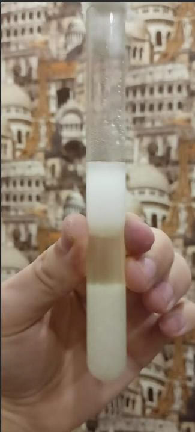
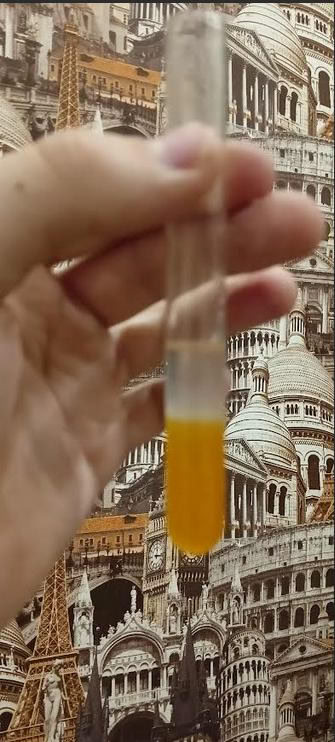

Что бы его повторить, нужно сначала поваренную соль кипятить с серной кислотой, а только потом прилить 96% спирт. Так же с бромидом, получается слой спирта, что сразу не смешивается. Но если оставить, то смешивается. Интересное физическое явление
