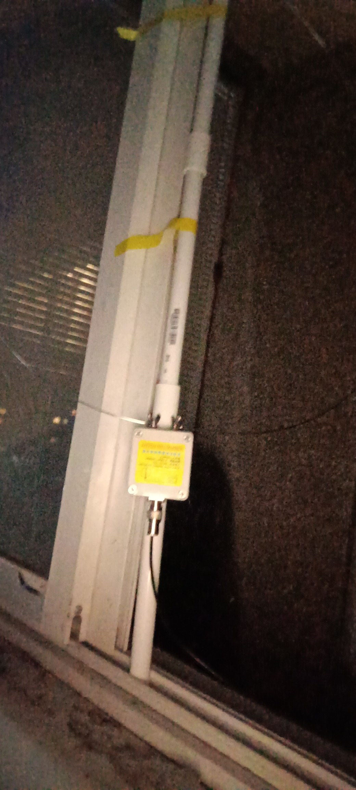
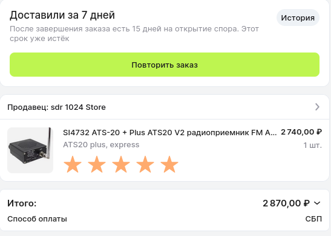

  
  

# K180Wla vs YouLoop 250

**K180Wla** — активная антенна, а **YouLoop 250** — пассивная, собранная из двух SMA-кабелей и устанавливаемая на обруч.  

В моих экспериментах с ATS-20 и RTL-SDR v3 я пришёл к выводу, что для диапазона КВ YouLoop не даёт ощутимых преимуществ — обычная телескопическая антенна, вынесенная подальше от домов, показывает сопоставимые или даже лучшие результаты.  

**K180Wla**, если закрепить её на удочке, вынести за пределы балкона и включить усилитель, обеспечивает заметно более качественный приём ближних станций.  

Отдельно стоит отметить, что вещание BBC можно поймать и на обычную телескопическую антенну — главное отойти подальше от застройки. То есть, k180wla по сравнению с YouLoop лучше, но вот как активная антенна она только для приема.

ATS20+ дает лучшее звучание чем SDR. SDR даже с графитовыми стержнями не сильно гасят шумы от USB.
