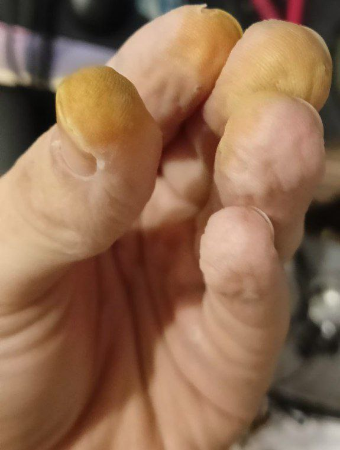
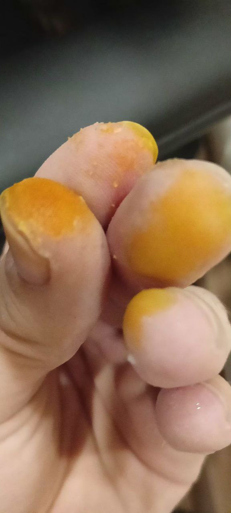
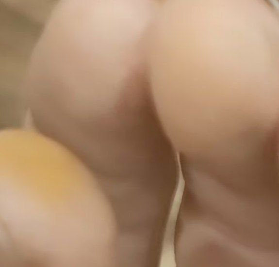

В первый день ожог проявляется слабо, почти незаметен. Даже от кратковременного контакта и быстрого мытья рук всё же он проявляется

Фотография на 2 день

Фотографии на 4 день

На 4 день, толи после работы с известью не гашенной (CaO), то ли само по себе ожог просто посветлел и стал просто удаляться другой рукой, с помощью ногтя. На одном пальце я удалил полностью.
На остальных 2 оставил.

На 7 день

Как видно, сначала ожог слабо проявляется (но уже скоро можно будет заметить его), потом резко повышается его интенсивность, а после просто спадает. Данный ожог слабый, от очень кратковременного контакта. Конц. кислоты 65%, это контакт с её парами и окислами азота.

Из этого следует, что мифы, что ожог остается на множество лет не точен. Это не олеум, от которого на всю жизнь будет дырка в теле или инвалидность (ну вообще зависит ещё и от концетрации и времени действия). А сам ожог напоминает ксантопротеиновую реакцию на белки. Страшнее окислы азота, чем сама эта кислота. И то, оксид азота 2/монооксид в малых дозах очень полезен организму и является важным биохимическим элементом... 
Нужно ли соблюдать технику безопасности работая с этим - однозначно, нужна вытяжка и перчатки, а так же защитные очки и желательно защита дыхания, что бы минимизировать риски. Но сама опасность ожога преувеличена для малых концетраций.

ВНИМАНИЕ, ОПЫТ СУБЬЕКТИВЕН И ЛИЧНЫЙ. ПРИ БОЛЬШИХ КОЦЕТРАЦИЯХ МОГУТ БЫТЬ БОЛЕЕ СЕРЬЕЗНЫЕ ПОВРЕЖДЕНИЯ ЧЕМ 3 ПАЛЬЧИКА КОТОРЫЕ ОКРАСЯТСЯ, но и утверждать что ожог будет на множество лет от маленького контакта - чушь. (а то в майл ру так отвечают)
