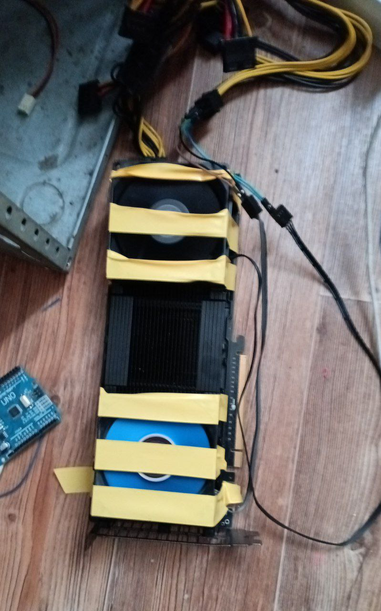

# Tesla k80

- Использование в новых ядрах линукса драйвера Tesla k80, нужен патч - https://gist.github.com/joanbm/d0cb8790ca610fbd2c2e43f30707ce18
- Перевод статьи [reddit](https://www.reddit.com/r/pcmods/comments/nhfwh7/guide_using_an_nvidia_tesla_k80_datacenter_gpu)

---

## Руководство: как использовать NVIDIA Tesla K80 (серверный GPU) для игр на Windows

### Что нужно и как подготовить

1. **BIOS — включите "Above 4G decoding"** (декодирование адресов выше 4 ГБ).

2. **Установите драйвер NVIDIA для Tesla K80 (Windows)** — скачайте официальную версию драйвера с сайта NVIDIA. ([Reddit][1])

3. **Перезагрузите** компьютер.

4. **Правка реестра Windows**:

   * Откройте редактор `regedit`
   * Перейдите по пути:
     `HKEY_LOCAL_MACHINE\SYSTEM\ControlSet001\Control\Class\{4d36e968-e325-11ce-bfc1-08002be10318}\0001`
   * Сделайте резервную копию раздела.
   * Удалите ключ `AdapterType`.
   * Создайте параметр `EnableMsHybrid` (32-бит DWORD) и установите его значение = 1.
   * Снова **перезагрузите**.

5. **Переключитесь из режима compute (TCC) в графический режим (WDDM)**:

   * Запустите командную строку от администратора.
   * Выполните команду `nvidia-smi -L`, чтобы узнать ID твоего GPU.
   * Затем `nvidia-smi -g {ID} -dm 0`, где `{ID}` — номер Tesla K80.

6. **Перезагрузитесь** ещё раз.

7. **Назначьте игру запускаться на Tesla K80**:

   * Откройте параметры экрана (правый клик на рабочем столе → «Параметры экрана» → «Графические параметры»).
   * Добавьте exe-файл игры в список.
   * Выберите игру → «Параметры» → укажите «Высокая производительность» → Tesla K80.

8. **(Опционально) Разгон (Overclocking)** — пользователь упомянул, можно попытаться ускорить работу, но без подробностей. ([Reddit][1])

### Быстрая сводка:

| Шаг | Действие                                                  |
| --- | --------------------------------------------------------- |
| 1–3 | Включение BIOS и установка драйвера                       |
| 4   | Правка реестра: удаление AdapterType + EnableMsHybrid = 1 |
| 5–7 | Переключение режима и назначение игры                     |
| 8   | (Опционально) Разгон                                      |

---

[1]: https://www.reddit.com/r/pcmods/comments/nhfwh7/guide_using_an_nvidia_tesla_k80_datacenter_gpu/?utm_source=chatgpt.com "(Guide) Using an NVIDIA Tesla K80 Datacenter GPU for ..."

### Пояснение
Дальше просто тыкаете правой кнопкой мышки по ярлыку с игрой и выбираете в списке запуск на видеокарте Tesla k80. Либо правый клик мыши и параметры графики нужны и там выбрать производительность для приложения. Точно не помню как оно там выглядит, но при нажатии правой кнопкой мыши по ярлыку будет видно вариант запуска приложения.
